---
## Author
author:
  name: Ко Антон Геннадьевич
  degrees: DSc
  orcid: 0000-0002-0877-7063
  email: antonkosakh@gmail.com
  affiliation:
    - name: Российский университет дружбы народов
      country: Российская Федерация
      postal-code: 117198
      city: Москва
      address: ул. Миклухо-Маклая, д. 6

## Title
title: "Лабораторная работа №1"
subtitle: "Знакомство с Cisco Packet Tracer"
license: "CC BY"
---

## Цель работы

Установить инструмент моделирования конфигурации сети Cisco Packet Tracer и познакомиться с его интерфейсом.

---

## Выполнение работы

В рабочем пространстве разместим концентратор (`Hub-PT-agko`) и четыре оконечных устройства `PC-agko`. Соединим оконечные устройства с концентратором прямым кабелем (рис. #fig:002). После чего, щёлкнув последовательно на каждом оконечном устройстве, зададим статические IP-адреса (рис. #fig:003):

- 192.168.1.11
- 192.168.1.12
- 192.168.1.13
- 192.168.1.14

с маской подсети 255.255.255.0

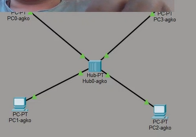{#fig:002 width=100%}

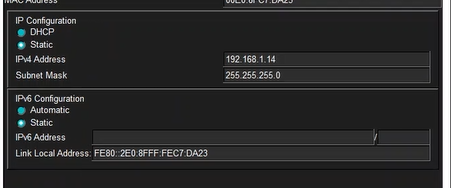{#fig:003 width=100%}

В основном окне проекта перейдём из режима реального времени (Realtime) в режим моделирования (Simulation) (рис. #fig:004). Выберем на панели инструментов мышкой «Add Simple PDU (P)» (рис. #fig:005) и щёлкнем сначала на `PC0-agko`, затем на `PC2-agko`. В рабочей области появились два конверта, обозначающих пакеты (рис. #fig:006), в списке событий на панели моделирования появились два события, относящихся к пакетам ARP и ICMP соответственно (рис. #fig:007). На панели моделирования нажмём кнопку «Play» и проследим за движением пакетов ARP и ICMP от устройства `PC0-agko` до устройства `PC2-agko` и обратно (рис. #fig:008):

{#fig:004 width=100%}

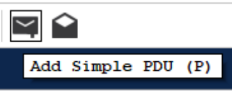{#fig:005 width=100%}

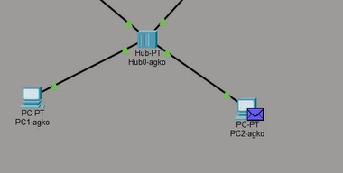{#fig:006 width=100%}

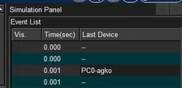{#fig:007 width=100%}

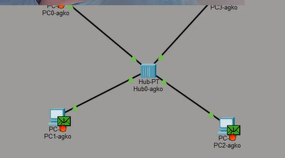{#fig:008 width=100%}

Щёлкнув на строке события, откроем окно информации о PDU и изучим, что происходит на уровне модели OSI при перемещении пакета. Используя кнопку «Проверь себя» (Challenge Me) на вкладке OSI Model, ответим на вопросы (рис. #fig:009):

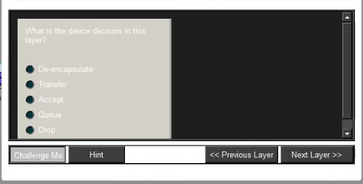{#fig:009 width=100%}

Откроем вкладку с информацией о PDU. Исследуем структуру пакета ICMP. Опишем структуру кадра Ethernet. Какие изменения происходят в кадре Ethernet при передвижении пакета? Какой тип имеет кадр Ethernet? Опишем структуру MAC-адресов (рис. #fig:010).

**Кадр: Ethernet II**
- Преамбула: PREAMBLE
- Контрольная сумма: FCS
- Адрес MAC назначения: DEST ADDR
- Адрес MAC источника: SRC ADDR
- Тип вложения: TYPE
- Длина: DATA

ICMP находится на сетевом уровне.

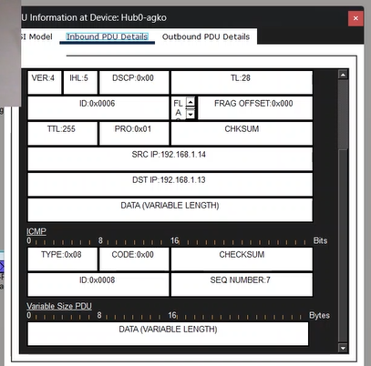{#fig:010 width=100%}

Очистим список событий, удалив сценарий моделирования (рис. #fig:011). Выберем на панели инструментов мышкой «Add Simple PDU (P)» и щёлкнем сначала на `PC0-agko`, затем на `PC2-agko`. Снова выберем на панели инструментов мышкой «Add Simple PDU (P)» и щёлкнем сначала на `PC2-agko`, затем на `PC0-agko` (рис. #fig:012). На панели моделирования нажмём кнопку «Play» и проследим за возникновением коллизии. В списке событий просмотрим информацию о PDU (рис. #fig:013):

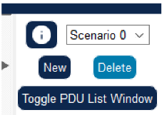{#fig:011 width=100%}

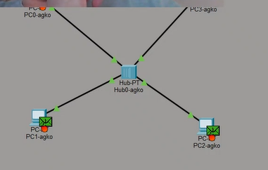{#fig:012 width=100%}

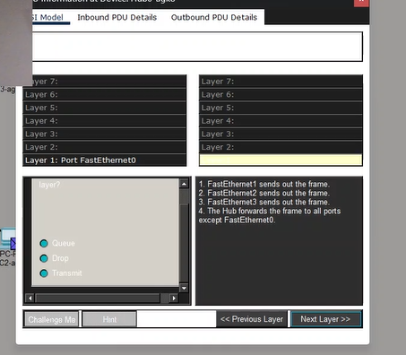{#fig:013 width=100%}

Перейдём в режим реального времени (Realtime). В рабочем пространстве разместим коммутатор и 4 оконечных устройства `PC-agko`. Соединим оконечные устройства с коммутатором прямым кабелем (рис. #fig:014):

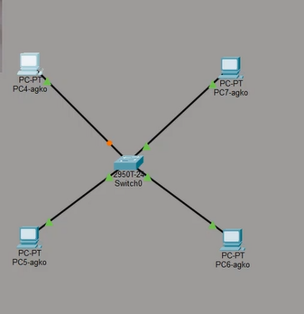{#fig:014 width=100%}

Присвоим статические IP-адреса (рис. #fig:015):

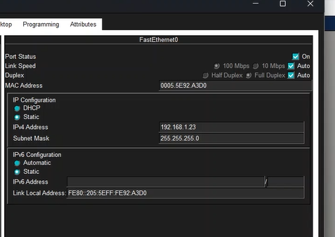{#fig:015 width=100%}

В основном окне проекта перейдём из режима реального времени (Realtime) в режим моделирования (Simulation). Выберем на панели инструментов мышкой «Add Simple PDU (P)» и щёлкнем сначала на `PC4-agko`, затем на `PC6-agko`. В рабочей области появились два конверта, обозначающих пакеты (рис. #fig:016), в списке событий на панели моделирования появились два события, относящихся к пакетам ARP и ICMP соответственно (рис. #fig:017). На панели моделирования нажмём кнопку «Play» и проследим за движением пакетов ARP и ICMP. Отличие заключается в том, что у нас происходит запоминание нужного компьютера, то есть нет рассылки всем, после первой такой отправки.

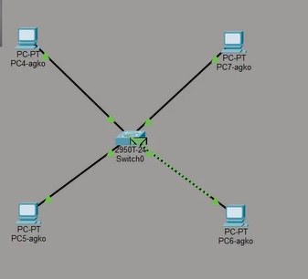{#fig:016 width=100%}

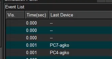{#fig:017 width=100%}

Очистим список событий, удалив сценарий моделирования. Выберем на панели инструментов мышкой «Add Simple PDU (P)» и щёлкнем сначала на `PC4-agko`, затем на `PC6-agko`. Снова выберем на панели инструментов мышкой «Add Simple PDU (P)» и щёлкнем сначала на `PC6-agko`, затем на `PC4-agko` (рис. #fig:018). На панели моделирования нажмём кнопку «Play» и проследим за движением пакетов.

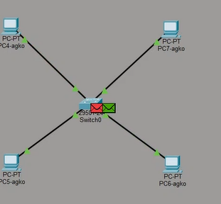{#fig:018 width=100%}

Перейдём в режим реального времени (Realtime). В рабочем пространстве соединим кроссовым кабелем концентратор и коммутатор (рис. #fig:019):

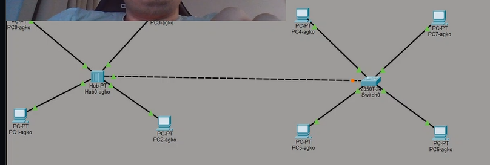{#fig:019 width=100%}

Выполним отправку пакетов: `PC0-agko -> PC4-agko` и `PC4-agko -> PC0-agko` (рис. #fig:020):

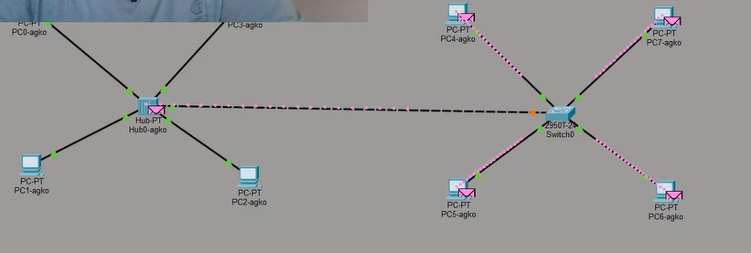{#fig:020 width=100%}

Очистим список событий, удалив сценарий моделирования. На панели моделирования нажмём «Play» и в списке событий получим пакеты STP. Исследуем структуру STP. Опишем структуру кадра Ethernet в этих пакетах (рис. #fig:021):

Работает поверх Ethernet 802.3/LLC
- Преамбула: PREAMBLE
- Контрольная сумма: FCS
- Адрес назначения: DEST ADDR
- Адрес источника: SRC ADDR
- Тип вложения: TYPE
- Длина: DATA

STP находится на канальном уровне.

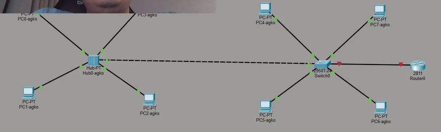{#fig:021 width=100%}

Присвоим статический IP-адрес 192.168.1.254 с маской 255.255.255.0, активируем порт, поставив галочку «On» напротив «Port Status» (рис. #fig:023):

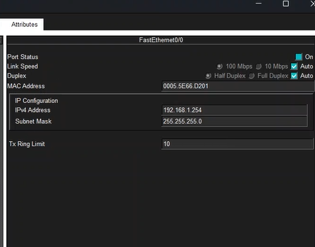{#fig:023 width=100%}

---

## Вывод

В ходе выполнения лабораторной работы мы научились устанавливать инструмент моделирования конфигурации сети Cisco Packet Tracer без учётной записи и познакомились с его интерфейсом.

---

## Ответы на контрольные вопросы

### 1. Дайте определение следующим понятиям: концентратор, коммутатор, маршрутизатор, шлюз (gateway). В каких случаях следует использовать тот или иной тип сетевого оборудования?

**Концентратор (Hub):** концентратор является устройством, которое принимает данные с одного устройства сети и передаёт их всем остальным устройствам в сети. Он работает на физическом уровне модели OSI, просто усиливая сигнал и передавая его по всем портам. Концентратор не имеет интеллекта для анализа данных или управления трафиком. Обычно используется в небольших сетях или для расширения количества портов в сети.

**Коммутатор (Switch):** коммутатор работает на канальном уровне OSI и способен анализировать адреса MAC устройств, подключенных к нему. В отличие от концентратора, коммутатор передаёт данные только тому устройству, для которого они предназначены, что делает его более эффективным. Коммутаторы обычно используются в сетях с высокой пропускной способностью, где требуется эффективное управление трафиком и безопасностью.

**Маршрутизатор (Router):** маршрутизатор работает на сетевом уровне OSI и способен анализировать IP-адреса устройств в сети. Он принимает решения о передаче данных между различными сетями на основе IP-адресации и информации о маршрутах. Маршрутизаторы используются для соединения различных сетей (например, локальной сети и Интернета) и обеспечения маршрутизации данных между ними.

**Шлюз (Gateway):** шлюз — это устройство, которое соединяет различные сети с разными протоколами, форматами данных или архитектурой. В контексте сетей шлюз часто используется как точка доступа к другой сети, например, для доступа к Интернету из локальной сети. Шлюз выполняет преобразование данных и управляет коммуникацией между разными сетями. В зависимости от конкретного применения, шлюз может быть представлен как программное или аппаратное оборудование.

**Выбор типа сетевого оборудования** зависит от конкретных потребностей сети: для простых сетей малого размера без особых требований к управлению трафиком можно использовать концентраторы.

### 2. Дайте определение следующим понятиям: IP-адрес, сетевая маска, broadcast-адрес.

**IP-адрес:** IP-адрес — это уникальный числовой идентификатор устройства в сети, используемый для маршрутизации данных. В IPv4 адрес представляет собой 32-битное число, обычно записываемое в виде четырёх десятичных чисел, разделённых точками (например, 192.168.1.1).

**Сетевая маска:** сетевая маска определяет, какая часть IP-адреса относится к сети, а какая — к хосту. Обычно сетевая маска записывается вместе с IP-адресом, используя формат, подобный "192.168.1.0/24", где /24 указывает на количество битов, отведённых для сети.

**Broadcast-адрес:** broadcast-адрес — это специальный адрес в сети, который используется для отправки данных всем устройствам в этой сети. Когда устройство отправляет пакет данных на broadcast-адрес, все устройства в этой сети получают этот пакет. Broadcast-адрес для IPv4 обычно имеет значение, в котором все биты хоста установлены в 1, например, для сети 192.168.1.0 с сетевой маской /24 broadcast-адрес будет 192.168.1.255. Для IPv6 broadcast-адреса не существует, вместо этого используется multicast для доставки данных на несколько устройств.

### 3. Как можно проверить доступность узла сети?

**Ping (ICMP Echo Request):** Ping — это самый распространённый способ проверки доступности узла. Это делается отправкой ICMP Echo Request пакета на IP-адрес узла и ожиданием ответа. Если узел доступен, он отправит обратно ICMP Echo Reply пакет.

**Traceroute (или traceroute6 для IPv6):** Этот инструмент используется для определения маршрута, который пакеты данных пройдут от отправителя до получателя. Он посылает серию пакетов с увеличивающимся TTL и анализирует ответы для определения промежуточных узлов. Это позволяет выявить места, где возникают проблемы в маршрутизации.

**Проверка порта (Port Scan):** Если нужно не только убедиться, что узел отвечает на пинг, но и проверить, работает ли на нём конкретное сетевое приложение, можно выполнить сканирование портов. Существуют различные инструменты, такие как Nmap, которые позволяют сканировать порты на удалённом узле и определить, какие порты открыты и доступны для подключения.

**Использование специализированных сетевых инструментов:** Существует множество специализированных инструментов для управления сетями, которые предоставляют информацию о доступности узлов, их статусе и производительности. Это могут быть мониторинговые системы, такие как Zabbix, Nagios, Prometheus, или программное обеспечение от производителей сетевого оборудования.

**Использование интерфейсов управления сетевым оборудованием:** Многие сетевые устройства предоставляют интерфейсы управления или CLI, через которые можно проверить доступность узлов в сети, например, используя команды ping или traceroute на маршрутизаторе.

Выбор метода зависит от конкретных требований и характеристик вашей сетевой инфраструктуры.