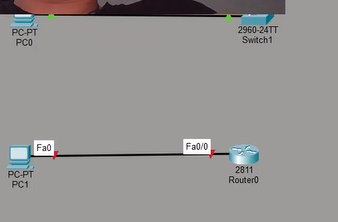
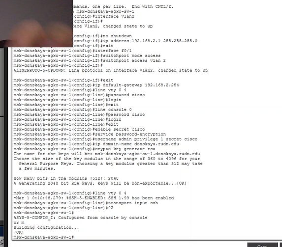
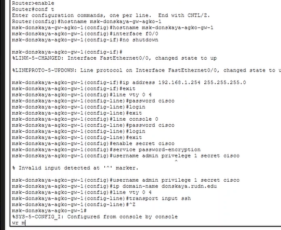

---
## Author
author:
  name: Ко Антон Геннадьевич
  degrees: DSc
  orcid: 0000-0002-0877-7063
  email: antonkosakh@gmail.com
  affiliation:
    - name: Российский университет дружбы народов
      country: Российская Федерация
      postal-code: 117198
      city: Москва
      address: ул. Миклухо-Маклая, д. 6
## Title
title: Лабораторная работа №2
subtitle: Предварительная настройка оборудования Cisco
license: CC BY
date: today
date-format: "YYYY-MM-DD" # Example: 2026-09-04
---

# Информация

## Докладчик

:::::::::::::: {.columns align=center}
::: {.column width="70%"}

  * Ко Антон Геннадьевич
  * студент
  * Российский университет дружбы народов им. П. Лумумбы
  * [1132221551@rudn.ru](mailto:1132221551@rudn.ru)
  * <https://SenDerMen04.github.io/ru/>

:::
::: {.column width="30%"}

:::
::::::::::::::

---

В логической рабочей области Packet Tracer разместим коммутатор, маршрутизатор и 2 оконечных устройства типа PC, соединим один PC с маршрутизатором, другой PC — с коммутатором (рис. #fig:002). После чего, щёлкнув последовательно на каждом оконечном устройстве, зададим статические IP-адреса (рис. #fig:003):

- 192.168.1.10
- 192.168.2.10

с маской подсети 255.255.255.0

{#fig:002 width=100%}

---

Проведём настройку маршрутизатора в соответствии с заданием (рис. #fig:004):

{#fig:004 width=100%}

---

Теперь проведём настройку коммутатора в соответствии с заданием (рис. #fig:005):

{#fig:005 width=100%}

---

## Вывод

В ходе выполнения лабораторной работы были получены основные навыки по начальному конфигурированию оборудования Cisco.

---
