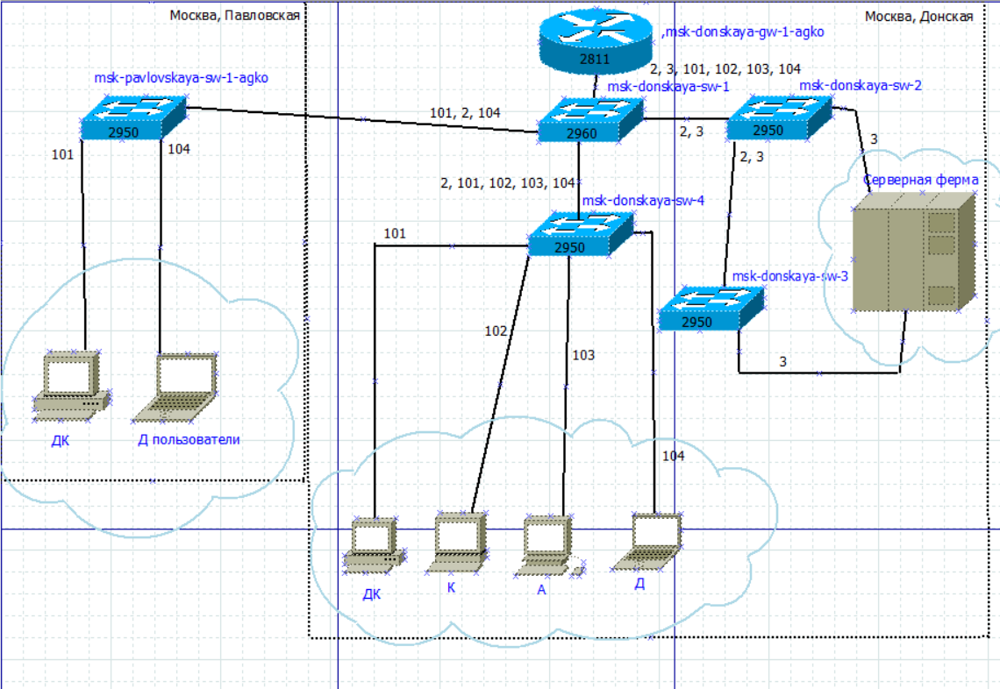
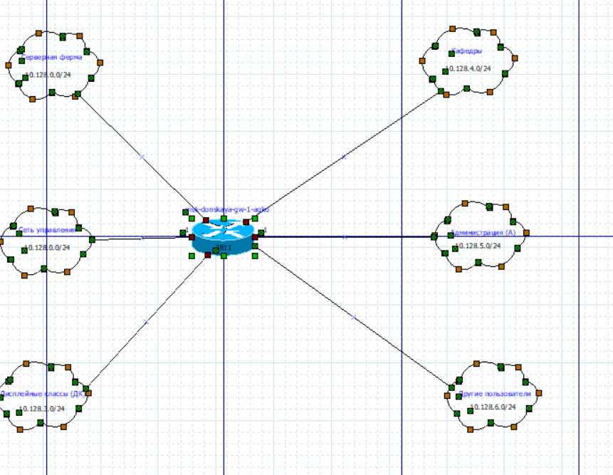
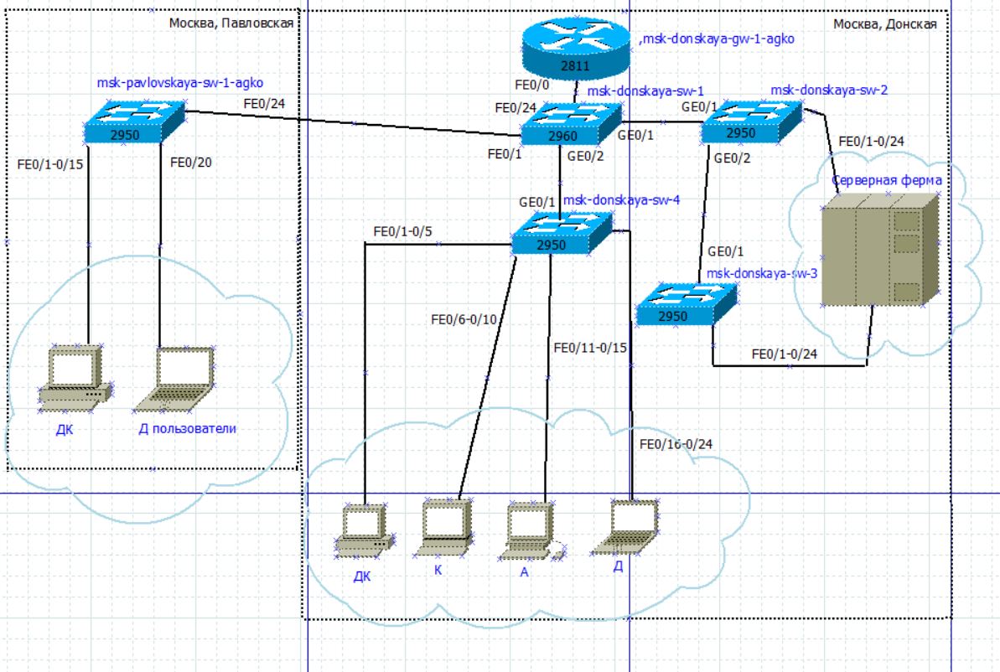
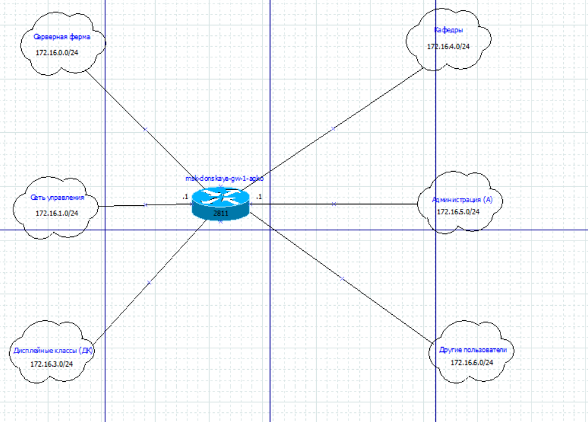

---
## Author
author:
  name: Ко Антон Геннадьевич
  degrees: DSc
  orcid: 0000-0002-0877-7063
  email: antonkosakh@gmail.com
  affiliation:
    - name: Российский университет дружбы народов
      country: Российская Федерация
      postal-code: 117198
      city: Москва
      address: ул. Миклухо-Маклая, д. 6
## Title
title: Лабораторная работа №3
subtitle: Планирование локальной сети организации
license: CC BY
date: today
date-format: "YYYY-MM-DD" # Example: 2026-09-04
---

# Информация

## Докладчик

:::::::::::::: {.columns align=center}
::: {.column width="70%"}

  * Ко Антон Геннадьевич
  * студент
  * Российский университет дружбы народов им. П. Лумумбы
  * [1132221551@rudn.ru](mailto:1132221551@rudn.ru)
  * <https://SenDerMen04.github.io/ru/>

:::
::: {.column width="30%"}

:::
::::::::::::::

---

## Цель работы

Познакомиться с принципами планирования локальной сети организации.

---

## Выполнение работы

{#fig:001 width=100%}

---

{#fig:002 width=100%}

---

{#fig:003 width=100%}

---

{#fig:006 width=100%}

---

Теперь сделаем аналогичный план адресного пространства для сетей **172.16.0.0/12** (рис. #fig:007 – #fig:011) и **192.168.0.0/16** (рис. #fig:012 – #fig:016) с соответствующими схемами сети (L1, L2, L3) и сопутствующими таблицами VLAN, IP-адресов и портов подключения оборудования:

{#fig:007 width=100%}

---

{#fig:008 width=100%}

---

{#fig:009 width=100%}

---

{#fig:012 width=100%}

---

{#fig:013 width=100%}

---

{#fig:014 width=100%}

---

## Вывод

В ходе выполнения лабораторной работы мы познакомились с принципами планирования локальной сети организации.

---