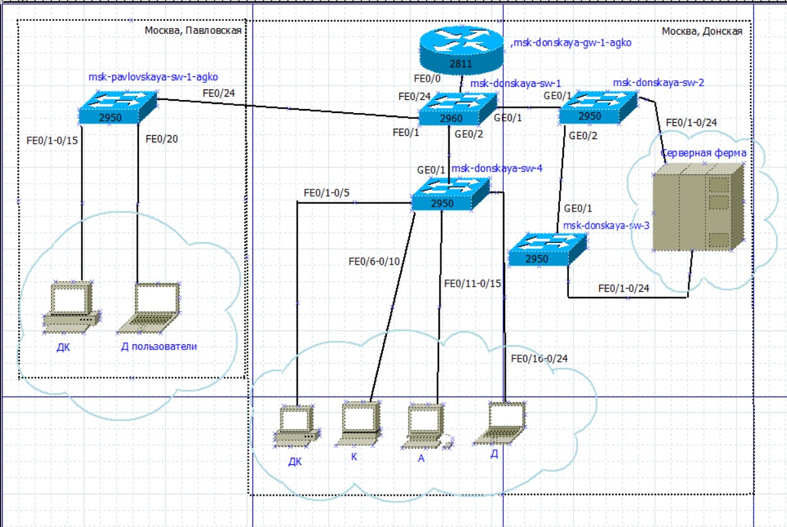
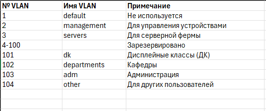
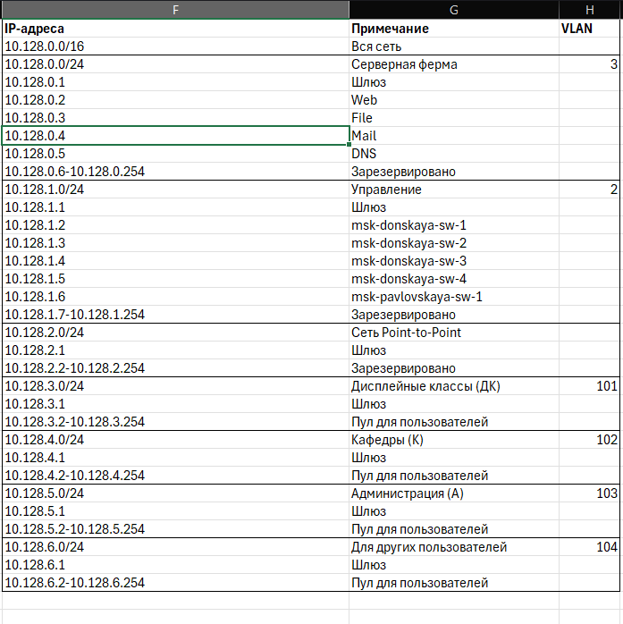
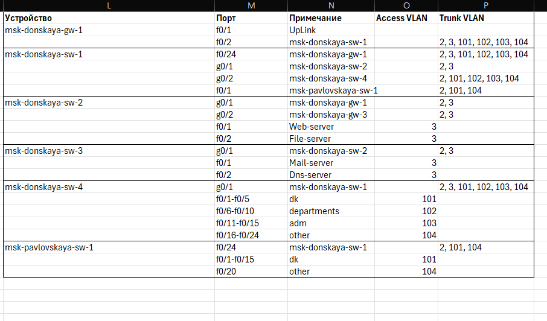
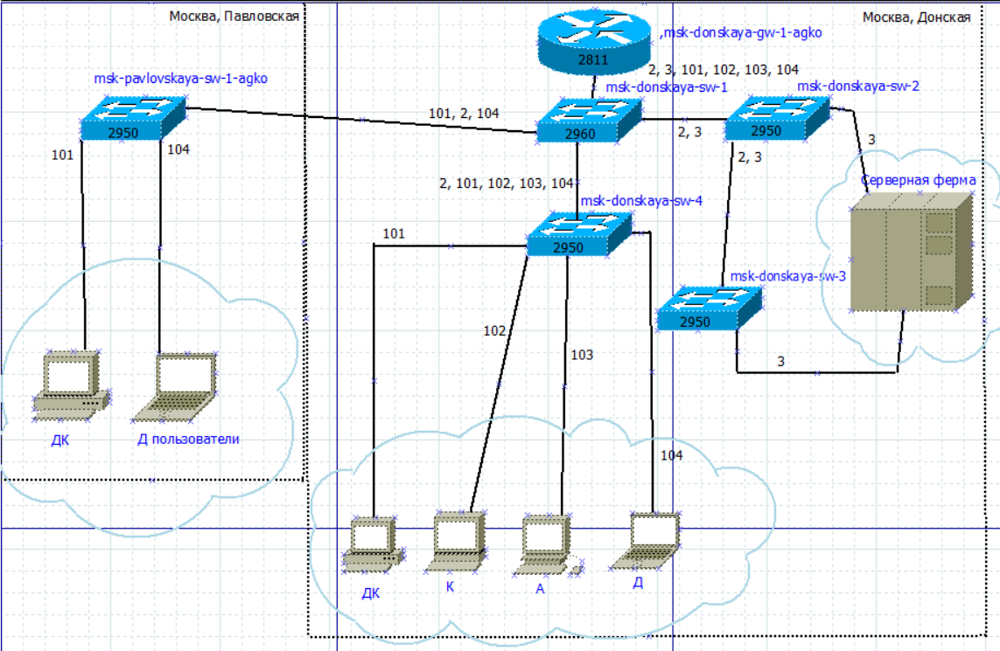
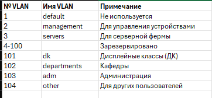

---
## Author
author:
  name: Ко Антон Геннадьевич
  degrees: DSc
  orcid: 0000-0002-0877-7063
  email: antonkosakh@gmail.com
  affiliation:
    - name: Российский университет дружбы народов
      country: Российская Федерация
      postal-code: 117198
      city: Москва
      address: ул. Миклухо-Маклая, д. 6

## Title
title: "Лабораторная работа №3"
subtitle: "Планирование локальной сети организации"
license: "CC BY"
---

## Цель работы

Познакомиться с принципами планирования локальной сети организации.

---

## Выполнение работы

Используя графический редактор (Dia), повторим схемы L1 (рис. #fig:001), L2 (рис. #fig:002), L3 (рис. #fig:003), а также сопутствующие им таблицы VLAN (рис. #fig:004), IP-адресов (рис. #fig:005) и портов подключения оборудования планируемой сети (рис. #fig:006):

{#fig:001 width=100%}

{#fig:002 width=100%}

{#fig:003 width=100%}

**Таблица VLAN**

| № VLAN | Имя VLAN | Примечание |
|--------|----------|------------|
| 1 | default | Не используется |
| 2 | management | Для управления устройствами |
| 3 | servers | Для серверной фермы |
| 4-100 | - | Зарезервировано |
| 101 | dk | Дисплейные классы (ДК) |
| 102 | departments | Кафедры |
| 103 | adm | Администрация |
| 104 | other | Для других пользователей |

*Рис. #fig:004. Таблица VLAN в Excel.*

**Таблица IP-адресов**

| IP-адреса | Примечание | VLAN |
|-----------|------------|------|
| 10.128.0.0/16 | Вся сеть | - |
| 10.128.0.0/24 | Серверная ферма | 3 |
| 10.128.0.1 | Шлюз | - |
| 10.128.0.2 | Web | - |
| 10.128.0.3 | File | - |
| 10.128.0.4 | Mail | - |
| 10.128.0.5 | Dns | - |
| 10.128.0.6-10.128.0.254 | Зарезервировано | - |
| 10.128.1.0/24 | Управление | 2 |
| 10.128.1.1 | Шлюз | - |
| 10.128.1.2 | msk-donskaya-sw-1 | - |
| 10.128.1.3 | msk-donskaya-sw-2 | - |
| 10.128.1.4 | msk-donskaya-sw-3 | - |
| 10.128.1.5 | msk-donskaya-sw-4 | - |
| 10.128.1.6 | msk-pavlovskaya-sw-1 | - |
| 10.128.1.7-10.128.1.254 | Зарезервировано | - |
| 10.128.2.0/24 | Сеть Point-to-Point | - |
| 10.128.2.1 | Шлюз | - |
| 10.128.2.2-10.128.2.254 | Зарезервировано | - |
| 10.128.3.0/24 | Дисплейные классы (ДК) | 101 |
| 10.128.3.1 | Шлюз | - |
| 10.128.3.2-10.128.3.254 | Пул для пользователей | - |
| 10.128.4.0/24 | Кафедры (К) | 102 |
| 10.128.4.1 | Шлюз | - |
| 10.128.4.2-10.128.4.254 | Пул для пользователей | - |
| 10.128.5.0/24 | Администрация (А) | 103 |
| 10.128.5.1 | Шлюз | - |
| 10.128.5.2-10.128.5.254 | Пул для пользователей | - |
| 10.128.6.0/24 | Другие пользователи (Д) | 104 |
| 10.128.6.1 | Шлюз | - |
| 10.128.6.2-10.128.6.254 | Пул для пользователей | - |

*Рис. #fig:005. Таблица IP в Excel.*

{#fig:006 width=100%}

Теперь сделаем аналогичный план адресного пространства для сетей **172.16.0.0/12** (рис. #fig:007 – #fig:011) и **192.168.0.0/16** (рис. #fig:012 – #fig:016) с соответствующими схемами сети (L1, L2, L3) и сопутствующими таблицами VLAN, IP-адресов и портов подключения оборудования:

{#fig:007 width=100%}

{#fig:008 width=100%}

{#fig:009 width=100%}

**Таблица VLAN для сети 172.16.0.0/12**

| № VLAN | Имя VLAN | Примечание |
|--------|----------|------------|
| 1 | default | Не используется |
| 2 | management | Для управления устройствами |
| 3 | servers | Для серверной фермы |
| 4-100 | - | Зарезервировано |
| 101 | dk | Дисплейные классы (ДК) |
| 102 | departments | Кафедры |
| 103 | adm | Администрация |
| 104 | other | Для других пользователей |

*Рис. #fig:010. Таблица VLAN в Excel для сети 172.16.0.0/12.*

**Таблица IP-адресов для сети 172.16.0.0/12**

| IP-адреса | Примечание | VLAN |
|-----------|------------|------|
| 172.16.0.0/16 | Вся сеть | - |
| 172.16.0.0/24 | Серверная ферма | 3 |
| 172.16.0.1 | Шлюз | - |
| 172.16.0.2 | Web | - |
| 172.16.0.3 | File | - |
| 172.16.0.4 | Mail | - |
| 172.16.0.5 | Dns | - |
| 172.16.0.6-172.16.0.254 | Зарезервировано | - |
| 172.16.1.0/24 | Управление | 2 |
| 172.16.1.1 | Шлюз | - |
| 172.16.1.2 | msk-donskaya-sw-1 | - |
| 172.16.1.3 | msk-donskaya-sw-2 | - |
| 172.16.1.4 | msk-donskaya-sw-3 | - |
| 172.16.1.5 | msk-donskaya-sw-4 | - |
| 172.16.1.6 | msk-pavlovskaya-sw-1 | - |
| 172.16.1.7-172.16.1.254 | Зарезервировано | - |
| 172.16.2.0/24 | Сеть Point-to-Point | - |
| 172.16.2.1 | Шлюз | - |
| 172.16.2.2-172.16.2.254 | Зарезервировано | - |
| 172.16.3.0/24 | Дисплейные классы (ДК) | 101 |
| 172.16.3.1 | Шлюз | - |
| 172.16.3.2-172.16.3.254 | Пул для пользователей | - |
| 172.16.4.0/24 | Кафедры (К) | 102 |
| 172.16.4.1 | Шлюз | - |
| 172.16.4.2-172.16.4.254 | Пул для пользователей | - |
| 172.16.5.0/24 | Администрация (А) | 103 |
| 172.16.5.1 | Шлюз | - |
| 172.16.5.2-172.16.5.254 | Пул для пользователей | - |
| 172.16.6.0/24 | Другие пользователи (Д) | 104 |
| 172.16.6.1 | Шлюз | - |
| 172.16.6.2-172.16.6.254 | Пул для пользователей | - |

*Рис. #fig:011. Таблица IP в Excel для сети 172.16.0.0/12.*

{#fig:012 width=100%}

{#fig:013 width=100%}

{#fig:014 width=100%}

**Таблица VLAN для сети 192.168.0.0/16**

| № VLAN | Имя VLAN | Примечание |
|--------|----------|------------|
| 1 | default | Не используется |
| 2 | management | Для управления устройствами |
| 3 | servers | Для серверной фермы |
| 4-100 | - | Зарезервировано |
| 101 | dk | Дисплейные классы (ДК) |
| 102 | departments | Кафедры |
| 103 | adm | Администрация |
| 104 | other | Для других пользователей |

*Рис. #fig:015. Таблица VLAN в Excel для сети 192.168.0.0/16.*

**Таблица IP-адресов для сети 192.168.0.0/16**

| IP-адреса | Примечание | VLAN |
|-----------|------------|------|
| 192.168.0.0/16 | Вся сеть | - |
| 192.168.0.0/24 | Серверная ферма | 3 |
| 192.168.0.1 | Шлюз | - |
| 192.168.0.2 | Web | - |
| 192.168.0.3 | File | - |
| 192.168.0.4 | Mail | - |
| 192.168.0.5 | Dns | - |
| 192.168.0.6-192.168.0.254 | Зарезервировано | - |
| 192.168.1.0/24 | Управление | 2 |
| 192.168.1.1 | Шлюз | - |
| 192.168.1.2 | msk-donskaya-sw-1 | - |
| 192.168.1.3 | msk-donskaya-sw-2 | - |
| 192.168.1.4 | msk-donskaya-sw-3 | - |
| 192.168.1.5 | msk-donskaya-sw-4 | - |
| 192.168.1.6 | msk-pavlovskaya-sw-1 | - |
| 192.168.1.7-192.168.1.254 | Зарезервировано | - |
| 192.168.2.0/24 | Сеть Point-to-Point | - |
| 192.168.2.1 | Шлюз | - |
| 192.168.2.2-192.168.2.254 | Зарезервировано | - |
| 192.168.3.0/24 | Дисплейные классы (ДК) | 101 |
| 192.168.3.1 | Шлюз | - |
| 192.168.3.2-192.168.3.254 | Пул для пользователей | - |
| 192.168.4.0/24 | Кафедры (К) | 102 |
| 192.168.4.1 | Шлюз | - |
| 192.168.4.2-192.168.4.254 | Пул для пользователей | - |
| 192.168.5.0/24 | Администрация (А) | 103 |
| 192.168.5.1 | Шлюз | - |
| 192.168.5.2-192.168.5.254 | Пул для пользователей | - |
| 192.168.6.0/24 | Другие пользователи (Д) | 104 |
| 192.168.6.1 | Шлюз | - |
| 192.168.6.2-192.168.6.254 | Пул для пользователей | - |

*Рис. #fig:016. Таблица IP в Excel для сети 192.168.0.0/16.*

**Таблица портов для сети 192.168.0.0/16**

| Устройство | Порт | Примечание | Access VLAN | Trunk VLAN |
|------------|------|------------|-------------|------------|
| msk-donskaya-gw-1 | f0/1 | UpLink | - | - |
| msk-donskaya-gw-1 | f0/0 | - | - | - |
| msk-donskaya-sw-1 | f0/24 | msk-donskaya-gw-1 | - | 2, 3, 101, 102, 103, 104 |
| msk-donskaya-sw-1 | g0/1 | msk-donskaya-sw-2 | - | 2, 3 |
| msk-donskaya-sw-1 | g0/2 | msk-donskaya-sw-4 | - | 2, 101, 102, 103, 104 |
| msk-donskaya-sw-2 | f0/1 | msk-pavlovskaya-sw-1 | - | 2, 101, 104 |
| msk-donskaya-sw-2 | g0/1 | msk-donskaya-sw-1 | - | 2, 3 |
| msk-donskaya-sw-2 | g0/2 | msk-donskaya-sw-3 | - | 2, 3 |
| msk-donskaya-sw-3 | f0/1 | Web-server | 3 | - |
| msk-donskaya-sw-3 | f0/2 | File-server | 3 | - |
| msk-donskaya-sw-3 | g0/1 | msk-donskaya-sw-2 | - | 2, 3 |
| msk-donskaya-sw-4 | f0/1 | Mail-server | 3 | - |
| msk-donskaya-sw-4 | f0/2 | Dns-server | 3 | - |
| msk-donskaya-sw-4 | g0/1 | msk-donskaya-sw-1 | - | 2, 101, 102, 103, 104 |
| msk-donskaya-sw-4 | f0/1-f0/5 | dk | 101 | - |
| msk-donskaya-sw-4 | f0/6-f0/10 | departments | 102 | - |
| msk-donskaya-sw-4 | f0/11-f0/15 | adm | 103 | - |
| msk-donskaya-sw-4 | f0/16-f0/24 | other | 104 | - |
| msk-pavlovskaya-sw-1 | f0/24 | msk-donskaya-sw-1 | - | 2, 101, 104 |
| msk-pavlovskaya-sw-1 | f0/1-f0/15 | dk | 101 | - |
| msk-pavlovskaya-sw-1 | f0/20 | other | 104 | - |

*Рис. #fig:017. Таблица портов в Excel для сети 192.168.0.0/16.*

---

## Вывод

В ходе выполнения лабораторной работы мы познакомились с принципами планирования локальной сети организации.

---

## Ответы на контрольные вопросы

### 1. Что такое модель взаимодействия открытых систем (OSI)? Какие уровни в ней есть? Какие функции закреплены за каждым уровнем модели OSI?

Модель взаимодействия открытых систем (Open Systems Interconnection, OSI) — это стандартная модель, предложенная Международной организацией по стандартизации (ISO), которая описывает, как компьютерные системы должны взаимодействовать друг с другом. Она разделяет процесс коммуникации на семь уровней, каждый из которых отвечает за определенные функции:

| Уровень | Название | Функции |
|---------|----------|---------|
| 7 | Прикладной (Application) | Предоставляет интерфейс для прикладных программ |
| 6 | Представительный (Presentation) | Обеспечивает структурирование и кодирование данных перед их передачей |
| 5 | Сеансовый (Session) | Устанавливает, поддерживает и завершает соединения между двумя узлами |
| 4 | Транспортный (Transport) | Обеспечивает надежную передачу данных между узлами в сети |
| 3 | Сетевой (Network) | Занимается маршрутизацией и пересылкой пакетов данных через несколько сетей |
| 2 | Канальный (Data Link) | Обеспечивает безошибочную передачу данных между соседними устройствами |
| 1 | Физический (Physical) | Передача битов по физической среде |

Модель OSI помогает стандартизировать процесс взаимодействия между различными системами, что упрощает разработку сетевых приложений и обеспечивает их совместимость.

### 2. Какие функции выполняет коммутатор?

Коммутатор (switch) — это сетевое устройство, которое играет важную роль в локальной компьютерной сети (LAN). Его основная функция заключается в пересылке данных между устройствами в сети, обеспечивая эффективную и надежную передачу информации. Основные функции коммутатора:

- **Пересылка кадров (Frame forwarding):** передача данных между портами на основе MAC-адресов.
- **Фильтрация и обучение (Filtering and Learning):** построение таблицы MAC-адресов для определения, на какой порт отправлять данные.
- **Управление коллизиями (Collision Management):** разделение доменов коллизий, каждый порт — отдельный домен.
- **Управление потоком (Flow Control):** регулирование скорости передачи данных.
- **Дуплексный режим (Duplex Mode Management):** поддержка полнодуплексного режима работы.

### 3. Какие функции выполняет маршрутизатор?

Маршрутизатор (router) — это сетевое устройство, которое работает на сетевом уровне модели OSI и обеспечивает передачу данных между различными сегментами сети, используя информацию о маршрутах. Основные функции маршрутизатора:

- **Маршрутизация (Routing):** определение оптимального пути для передачи данных.
- **Перенаправление (Forwarding):** пересылка пакетов между сетями.
- **Фильтрация трафика (Traffic Filtering):** управление доступом на основе IP-адресов и портов.
- **Адресация (Addressing):** работа с IP-адресами и таблицами маршрутизации.
- **Управление полосой пропускания (Bandwidth Management):** контроль и распределение пропускной способности.
- **Сегментация сети (Network Segmentation):** разделение сети на логические сегменты.

### 4. В чём отличие коммутаторов третьего уровня от коммутаторов второго уровня?

Отличие между коммутаторами второго и третьего уровня связано с уровнем, на котором они работают в сетевой модели OSI:

| Характеристика | Коммутатор 2-го уровня (L2) | Коммутатор 3-го уровня (L3) |
|----------------|-----------------------------|-----------------------------|
| **Уровень OSI** | Канальный (L2) | Сетевой (L3) |
| **Работает с** | MAC-адресами | IP-адресами |
| **Маршрутизация** | Не поддерживает | Поддерживает межсетевую маршрутизацию |
| **VLAN** | Поддерживает | Поддерживает и маршрутизирует между VLAN |
| **Протоколы** | STP, VLAN | OSPF, RIP, EIGRP, статическая маршрутизация |

Коммутаторы третьего уровня сочетают функции коммутатора (пересылка кадров на канальном уровне) и маршрутизатора (маршрутизация пакетов на сетевом уровне), что позволяет им маршрутизировать трафик между VLAN без использования внешнего маршрутизатора.

### 5. Что такое сетевой интерфейс?

Сетевой интерфейс (Network Interface) представляет собой физическое или логическое устройство, которое позволяет компьютеру или другому сетевому устройству подключаться к сети для обмена данными. Сетевой интерфейс обеспечивает связь между устройством и сетью, позволяя передавать данные внутри и между сетями. Примерами сетевых интерфейсов являются сетевые адаптеры (NIC), Wi-Fi адаптеры и логические интерфейсы (loopback, VLAN-интерфейсы).

### 6. Что такое сетевой порт?

Сетевой порт (Network port) — это числовая адресная точка в компьютерной сети, которая используется для идентификации конкретного процесса или службы на устройстве в сети. Порты позволяют множеству приложений и служб работать параллельно на одном устройстве, обеспечивая таким образом многопроцессорный и многопользовательский доступ к ресурсам сети. Номера портов находятся в диапазоне от 0 до 65535 (например, 80 — HTTP, 443 — HTTPS, 22 — SSH, 25 — SMTP).

### 7. Кратко охарактеризуйте технологии Ethernet, Fast Ethernet, Gigabit Ethernet.

- **Ethernet:** стандартная технология локальных сетей (LAN), предоставляющая возможность передачи данных по сетевым кабелям. Работает на скоростях до 10 Мбит/с и использует различные типы кабелей, такие как коаксиальный кабель (10BASE5), витая пара (10BASE-T) и оптоволокно (10BASE-F). Ethernet был первоначально стандартизирован в IEEE 802.3 и стал доминирующим стандартом для проводных локальных сетей.

- **Fast Ethernet:** улучшенная версия технологии Ethernet, поддерживающая скорости передачи данных до 100 Мбит/с. Использует те же типы кабелей, что и Ethernet, но с повышенной скоростью передачи данных. Fast Ethernet был стандартизирован в IEEE 802.3u и быстро стал популярным выбором для более быстрых сетей в домашних и офисных средах.

- **Gigabit Ethernet:** следующий этап развития Ethernet, предоставляющий скорости передачи данных до 1 Гбит/с. Использует высокоскоростные варианты витой пары (1000BASE-T) или оптоволокна (1000BASE-X) для обеспечения более высокой пропускной способности. Gigabit Ethernet часто используется в корпоративных сетях и дата-центрах для обеспечения высокой производительности и скорости обмена данными между устройствами.

### 8. Что такое IP-адрес (IPv4-адрес)? Определите понятия сеть, подсеть, маска подсети. Охарактеризуйте служебные IP-адреса. Приведите пример с пояснениями разбиения сети на две или более подсетей с указанием числа узлов в каждой подсети.

**IP-адрес (Internet Protocol Address):** числовой идентификатор, присваиваемый каждому устройству в компьютерной сети, подключенной к сети, использующей протокол IPv4. IPv4-адрес состоит из четырех октетов (байтов), разделенных точками, каждый из которых может принимать значения от 0 до 255 (например, 192.168.1.1).

**Сеть:** группа компьютеров и других устройств, соединенных между собой для обмена данными и ресурсами. Каждое устройство в сети имеет свой собственный IP-адрес, который позволяет ему уникально идентифицироваться в сети.

**Подсеть (Subnet):** логический сегмент сети, который образуется путем разделения основной сети на более мелкие части для управления трафиком и повышения безопасности сети.

**Маска подсети (Subnet Mask):** 32-битовое значение, используемое для определения размера сети и подсети. Маска подсети указывает, какая часть IP-адреса относится к сети, а какая — к узлам в этой сети. Она состоит из последовательности единиц, за которыми следуют нули (например, 255.255.255.0).

**Служебные IP-адреса:** специальные адреса, зарезервированные для определенных целей в сети. Они не используются для назначения устройствам в сети и предназначены для определенных служб или целей, таких как тестирование, маршрутизация, широковещательные и многоадресные коммуникации:
- **Сетевой адрес** (Network Address) — адрес подсети, где все биты хоста равны 0 (например, 192.168.1.0).
- **Широковещательный адрес** (Broadcast Address) — адрес для отправки данных всем узлам подсети, где все биты хоста равны 1 (например, 192.168.1.255).
- **Адрес шлюза** (Gateway Address) — обычно первый или последний адрес в подсети (например, 192.168.1.1).

**Пример разбиения сети на две подсети:**

Исходная сеть: 192.168.1.0/24 (256 адресов, 254 доступных хоста)

Для разбиения на две подсети возьмем маску /25 (255.255.255.128):
- **Подсеть 1:** 192.168.1.0/25
  - Диапазон адресов: 192.168.1.0 — 192.168.1.127
  - Доступные хосты: 192.168.1.1 — 192.168.1.126 (126 адресов)
  - Широковещательный адрес: 192.168.1.127

- **Подсеть 2:** 192.168.1.128/25
  - Диапазон адресов: 192.168.1.128 — 192.168.1.255
  - Доступные хосты: 192.168.1.129 — 192.168.1.254 (126 адресов)
  - Широковещательный адрес: 192.168.1.255

### 9. Что такое VLAN? Для чего применяется VLAN в сети организации? Какие преимущества даёт применение VLAN? Приведите примеры ситуаций применения VLAN.

**VLAN (Virtual Local Area Network)** — это логическая группа устройств в сети, которые могут обмениваться данными так, как если бы они были подключены к одному физическому сегменту, независимо от их физического расположения. VLAN работают на канальном уровне модели OSI и позволяют разделять трафик между различными группами пользователей или устройств.

**Применение VLAN в сети организации:**
- **Сегментация сети:** позволяет разделить сеть на логические сегменты согласно функциональным, безопасностным или организационным потребностям.
- **Управление трафиком:** позволяет администраторам сети управлять трафиком, применяя политики безопасности, качества обслуживания (QoS) и т. д.
- **Улучшенная безопасность:** позволяет разделить чувствительные данные и сервисы от общего трафика в сети, улучшая безопасность и предотвращая несанкционированный доступ к данным.
- **Оптимизация ресурсов:** позволяет оптимизировать использование сетевых ресурсов, направляя трафик только туда, где он необходим, и уменьшая перегрузку сети.

**Преимущества применения VLAN в сети организации:**
- **Гибкость и масштабируемость:** возможность быстро изменять конфигурацию сети, добавлять или удалять VLAN в зависимости от потребностей организации.
- **Улучшенная безопасность:** возможность физической и логической изоляции сетевых сегментов, что усиливает безопасность и защищает от атак.
- **Эффективное использование ресурсов:** возможность оптимизации сетевых ресурсов и уменьшения нагрузки на сеть за счет лучшего управления трафиком.
- **Улучшенное управление:** централизованное управление и настройка VLAN облегчает администрирование сети и обеспечивает более гибкие возможности управления сетью.

**Примеры ситуаций применения VLAN:**
- **Разделение отделов:** создание VLAN для разных отделов организации (например, финансового, маркетингового, технического) для логического разделения сетевых ресурсов и безопасности данных.
- **Гостевая сеть:** создание VLAN для гостевого Wi-Fi, чтобы отделить трафик гостевых пользователей от внутренней сети компании.
- **Группировка устройств:** группировка сетевых устройств с общими потребностями (например, серверов, IP-телефонов, видеокамер) в отдельные VLAN для оптимизации трафика и улучшения производительности.
- **Сегментация по безопасности:** создание отдельной VLAN для сегментации трафика с целью улучшения безопасности и защиты критически важных сетевых ресурсов.

### 10. В чём отличие Trunk Port от Access Port?

Trunk Port и Access Port — это два типа портов на коммутаторах, используемых в сетевых конфигурациях. Они имеют разные функции и настройки.

**Access Port** предназначен для подключения устройств конечных пользователей, таких как компьютеры, принтеры или IP-телефоны.

**Trunk Port** используется для соединения между коммутаторами или между коммутатором и маршрутизатором.

| Характеристика | Access Port | Trunk Port |
|----------------|-------------|------------|
| **Трафик** | Передает трафик только одной VLAN | Передает трафик с нескольких VLAN через один порт |
| **Назначение** | Подключение конечных устройств пользователей | Соединение коммутаторов и передача трафика между ними, подключение к маршрутизаторам |
| **Настройка** | Принадлежность к определенной VLAN | Настройка для передачи трафика с нескольких VLAN (всех или выбранных) |
| **Тегирование** | Не использует теги VLAN | Использует теги VLAN (802.1Q) для идентификации принадлежности кадра |
| **Примеры** | Компьютеры, принтеры, телефоны | Соединения между коммутаторами, подключение к маршрутизатору (Router-on-a-stick) |