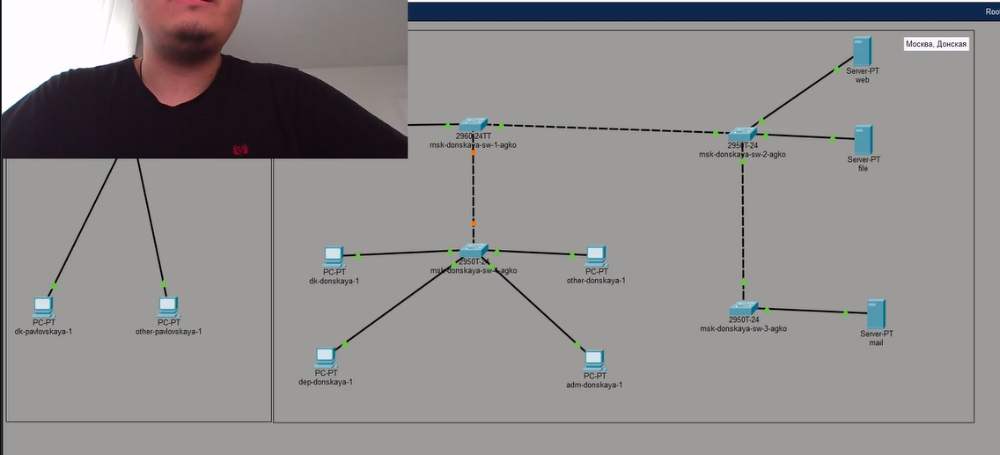
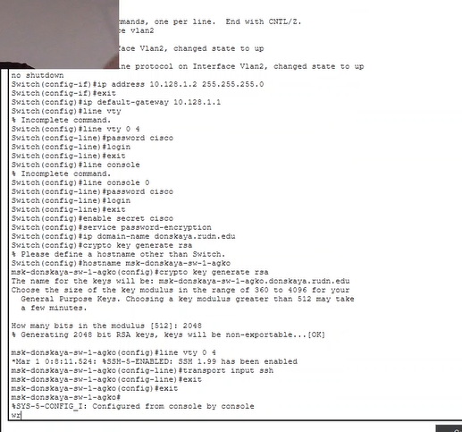
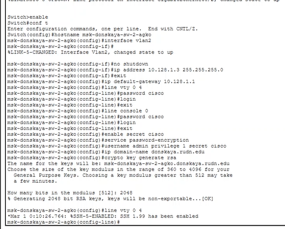
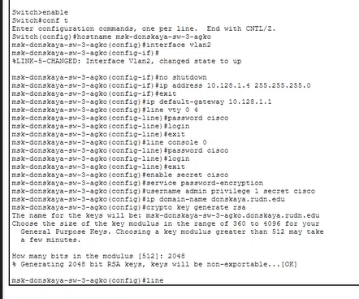
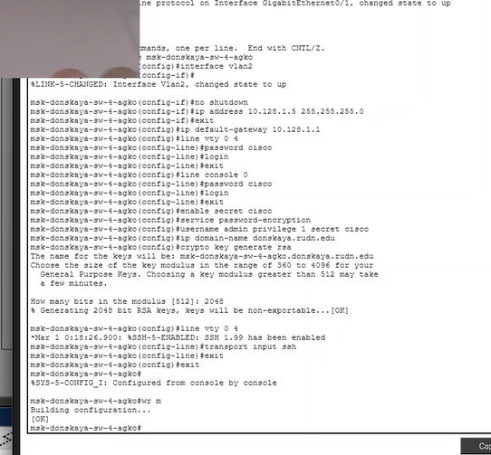
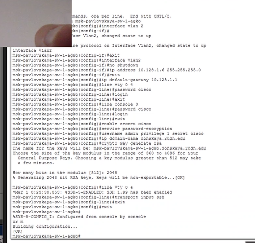

---
## Author
author:
  name: Ко Антон Геннадьевич
  degrees: DSc
  orcid: 0000-0002-0877-7063
  email: antonkosakh@gmail.com
  affiliation:
    - name: Российский университет дружбы народов
      country: Российская Федерация
      postal-code: 117198
      city: Москва
      address: ул. Миклухо-Маклая, д. 6
## Title
title: Лабораторная работа №4
subtitle: Первоначальное конфигурирование сети
license: CC BY
date: today
date-format: "YYYY-MM-DD" # Example: 2026-09-04
---

# Информация

## Докладчик

:::::::::::::: {.columns align=center}
::: {.column width="70%"}

  * Ко Антон Геннадьевич
  * студент
  * Российский университет дружбы народов им. П. Лумумбы
  * [1132221551@rudn.ru](mailto:1132221551@rudn.ru)
  * <https://SenDerMen04.github.io/ru/>

:::
::: {.column width="30%"}

:::
::::::::::::::

---

## Цель работы

Провести подготовительную работу по первоначальной настройке коммутаторов сети.

---

## Выполнение работы

В логической рабочей области Packet Tracer разместим коммутаторы и оконечные устройства согласно схеме сети L1 (схема приведена в лабораторной работе) и соединим их через соответствующие интерфейсы (рис. #fig:002):

{#fig:002 width=100%}

---

Используя типовую конфигурацию коммутатора, настроим все коммутаторы, изменяя название устройства и его IP-адрес согласно плану IP (рис. #fig:003 – #fig:007):

{#fig:003 width=100%}

---

{#fig:004 width=100%}

---

{#fig:005 width=100%}

---

{#fig:006 width=100%}

---

{#fig:007 width=100%}

---

## Вывод

В ходе выполнения лабораторной работы мы научились проводить подготовительную работу по первоначальной настройке коммутаторов сети.

---