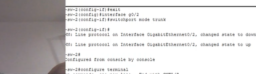
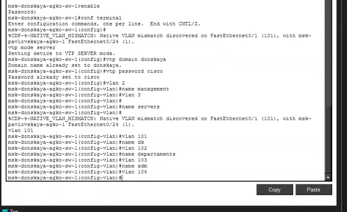
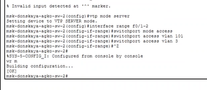
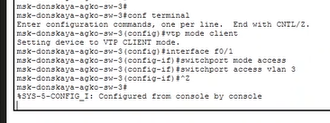
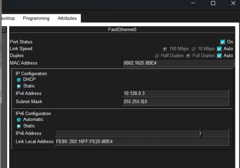

---
## Author
author:
  name: Ко Антон Геннадьевич
  degrees: DSc
  orcid: 0000-0002-0877-7063
  email: antonkosakh@gmail.com
  affiliation:
    - name: Российский университет дружбы народов
      country: Российская Федерация
      postal-code: 117198
      city: Москва
      address: ул. Миклухо-Маклая, д. 6
## Title
title: Лабораторная работа №5
subtitle: Конфигурация VLAN
license: CC BY
date: today
date-format: "YYYY-MM-DD" # Example: 2026-09-04
---

# Информация

## Докладчик

:::::::::::::: {.columns align=center}
::: {.column width="70%"}

  * Ко Антон Геннадьевич
  * студент
  * Российский университет дружбы народов им. П. Лумумбы
  * [1132221551@rudn.ru](mailto:1132221551@rudn.ru)
  * <https://SenDerMen04.github.io/ru/>

:::
::: {.column width="30%"}

:::
::::::::::::::

---

## Цель работы

Получить основные навыки по настройке VLAN на коммутаторах сети.

---

## Выполнение работы

Используя приведённую в лабораторной работе последовательность команд из примера по конфигурации Trunk-порта на интерфейсе g0/1 коммутатора `msk-donskaya-sw-1`, настроим Trunk-порты на соответствующих интерфейсах всех коммутаторов (рис. #fig:002 – #fig:006):

{#fig:003 width=100%}

---

{#fig:004 width=100%}

---

{#fig:005 width=100%}

---

{#fig:006 width=100%}

---

Далее настроим коммутатор `msk-donskaya-agko-sw-1` как VTP-сервер и пропишем на нём номера и названия VLAN (рис. #fig:007):

{#fig:007 width=100%}

---

Теперь настроим коммутаторы `msk-donskaya-agko-sw-2`, `msk-donskaya-agko-sw-3`, `msk-donskaya-agko-sw-4` и `msk-pavlovskaya-agko-sw-1` как VTP-клиенты и на интерфейсах укажем принадлежность к VLAN (рис. #fig:008 – #fig:011):

{#fig:008 width=100%}

---

{#fig:009 width=100%}

---

{#fig:010 width=100%}

---

{#fig:011 width=100%}

---

Затем требуется указать статические IP-адреса на оконечных устройствах (рис. #fig:012 – #fig:013):

{#fig:012 width=100%}

---

{#fig:013 width=100%}

---

После указания статических IP-адресов на оконечных устройствах проверим с помощью команды `ping` доступность устройств, принадлежащих одному VLAN, и недоступность устройств, принадлежащих разным VLAN (рис. #fig:014):

{#fig:014 width=100%}

---

## Вывод

В ходе выполнения лабораторной работы мы получили основные навыки по настройке VLAN на коммутаторах сети.

---
