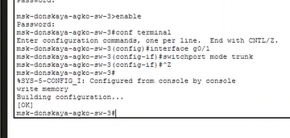
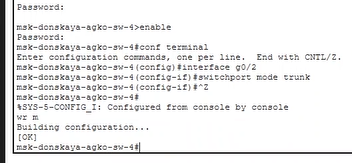
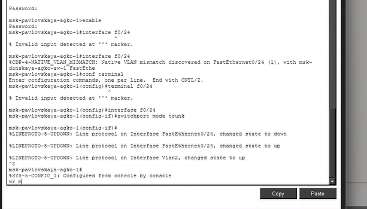
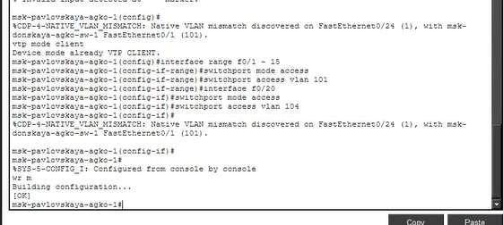
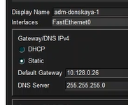
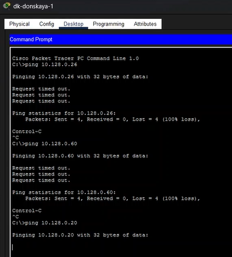

---
## Author
author:
  name: Ко Антон Геннадьевич
  degrees: DSc
  orcid: 0000-0002-0877-7063
  email: antonkosakh@gmail.com
  affiliation:
    - name: Российский университет дружбы народов
      country: Российская Федерация
      postal-code: 117198
      city: Москва
      address: ул. Миклухо-Маклая, д. 6

## Title
title: "Лабораторная работа №5"
subtitle: "Конфигурация VLAN"
license: "CC BY"
---

## Цель работы

Получить основные навыки по настройке VLAN на коммутаторах сети.

---

## Выполнение работы

Используя приведённую в лабораторной работе последовательность команд из примера по конфигурации Trunk-порта на интерфейсе g0/1 коммутатора `msk-donskaya-sw-1`, настроим Trunk-порты на соответствующих интерфейсах всех коммутаторов (рис. #fig:002 – #fig:006):

{#fig:003 width=100%}

{#fig:004 width=100%}

{#fig:005 width=100%}

{#fig:006 width=100%}

Далее настроим коммутатор `msk-donskaya-agko-sw-1` как VTP-сервер и пропишем на нём номера и названия VLAN (рис. #fig:007):

{#fig:007 width=100%}

Теперь настроим коммутаторы `msk-donskaya-agko-sw-2`, `msk-donskaya-agko-sw-3`, `msk-donskaya-agko-sw-4` и `msk-pavlovskaya-agko-sw-1` как VTP-клиенты и на интерфейсах укажем принадлежность к VLAN (рис. #fig:008 – #fig:011):

{#fig:008 width=100%}

{#fig:009 width=100%}

{#fig:010 width=100%}

{#fig:011 width=100%}

Затем требуется указать статические IP-адреса на оконечных устройствах (рис. #fig:012 – #fig:013):

{#fig:012 width=100%}

{#fig:013 width=100%}

После указания статических IP-адресов на оконечных устройствах проверим с помощью команды `ping` доступность устройств, принадлежащих одному VLAN, и недоступность устройств, принадлежащих разным VLAN (рис. #fig:014):

{#fig:014 width=100%}

---

## Вывод

В ходе выполнения лабораторной работы мы получили основные навыки по настройке VLAN на коммутаторах сети.

---

## Ответы на контрольные вопросы

### 1. Охарактеризуйте следующие команды: switchport mode access, switchport access vlan, vtp mode, vtp domain, vtp password, vlan, name.

- **switchport mode access:** устанавливает порт в режим доступа (access), который предназначен для работы с одним определённым VLAN.
- **switchport access vlan <номер_VLAN>:** назначает определённый VLAN для порта в режиме доступа.
- **vtp mode server/client:**
  - **vtp mode server:** устанавливает коммутатор в режим сервера VTP, позволяя ему рассылать информацию о VLAN другим коммутаторам в сети.
  - **vtp mode client:** устанавливает коммутатор в режим клиента VTP, что позволяет ему принимать информацию о VLAN от серверов VTP.
- **vtp domain <имя_домена>:** устанавливает домен VTP, в котором находится коммутатор. Для синхронизации информации о VLAN все коммутаторы в сети должны находиться в одном домене VTP с одинаковым именем.
- **vtp password <пароль>:** устанавливает пароль VTP для доступа к домену VTP. Это помогает обеспечить безопасность и предотвратить несанкционированные изменения конфигурации VLAN.
- **vlan <номер_VLAN>:** создаёт новый VLAN с указанным номером.
- **name <имя_VLAN>:** присваивает имя VLAN, что делает его более понятным для администраторов сети.

### 2. Охарактеризуйте Internet Control Message Protocol (ICMP). Опишите формат пакета ICMP.

**ICMP (Internet Control Message Protocol)** — это протокол в семействе протоколов Интернета, который используется для передачи сообщений об ошибках и других исключительных ситуациях, возникших при передаче данных в компьютерных сетях. ICMP также выполняет некоторые сервисные функции, такие как проверка доступности хостов и диагностика сетевых проблем.

**Формат пакета ICMP** обычно состоит из заголовка и поля данных, которое может включать в себя различные поля в зависимости от типа сообщения ICMP. Основные поля заголовка ICMP включают:

| Поле | Описание |
|------|----------|
| **Тип (Type)** | Определяет тип сообщения ICMP (например, сообщение об ошибках, запрос эхо и т. д.) |
| **Код (Code)** | Подтип сообщения, который позволяет уточнить тип сообщения (например, для сообщения об ошибке код может указывать на конкретный тип ошибки) |
| **Контрольная сумма (Checksum)** | Используется для обеспечения целостности пакета ICMP |
| **Дополнительные данные** | В зависимости от типа и кода сообщения, может содержать дополнительные поля с информацией о сетевой проблеме или другой полезной информации |

### 3. Охарактеризуйте Address Resolution Protocol (ARP). Опишите формат пакета ARP.

**ARP (Address Resolution Protocol)** — это протокол, используемый в компьютерных сетях для связи IP-адресов с физическими MAC-адресами устройств в локальной сети. Он позволяет устройствам в сети определить MAC-адрес другого устройства на основе его IP-адреса.

Когда устройству требуется отправить пакет данных другому устройству в сети, оно сначала проверяет свою локальную таблицу ARP, чтобы узнать MAC-адрес получателя. Если необходимый MAC-адрес отсутствует в таблице ARP, устройство отправляет ARP-запрос на всю сеть, запрашивая MAC-адрес соответствующего IP-адреса. Устройство, которое имеет этот IP-адрес, отвечает на запрос, предоставляя свой MAC-адрес.

**Формат пакета ARP** обычно состоит из следующих полей:

| Поле | Описание |
|------|----------|
| **Тип аппаратного адреса** | Определяет тип физического аппаратного адреса в сети (например, Ethernet — значение 1) |
| **Тип протокола** | Указывает на протокол сетевого уровня, для которого запрашивается соответствие адресов (обычно IPv4 — значение 0x0800) |
| **Длина аппаратного адреса** | Указывает размер физического адреса (обычно 6 байт для MAC-адресов Ethernet) |
| **Длина адреса протокола** | Указывает размер адреса протокола (обычно 4 байта для IPv4) |
| **Код операции** | Определяет тип операции ARP (запрос — значение 1, ответ — значение 2) |
| **MAC-адрес отправителя** | Физический адрес отправителя |
| **IP-адрес отправителя** | IP-адрес отправителя |
| **MAC-адрес получателя** | Физический адрес получателя (обычно пустой в ARP-запросах) |
| **IP-адрес получателя** | IP-адрес получателя |