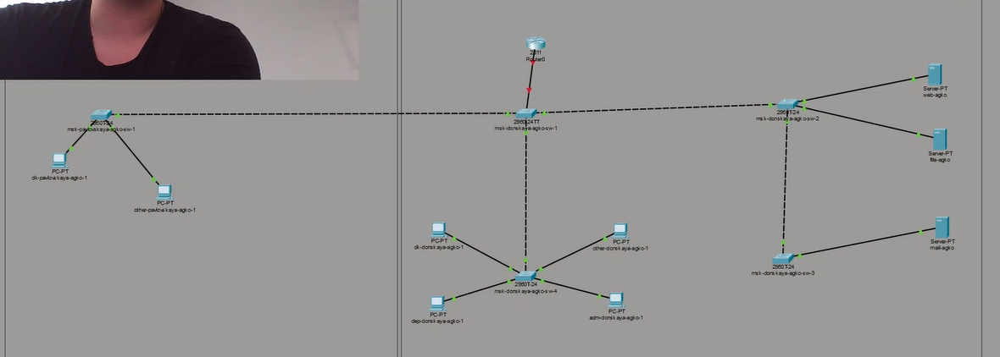
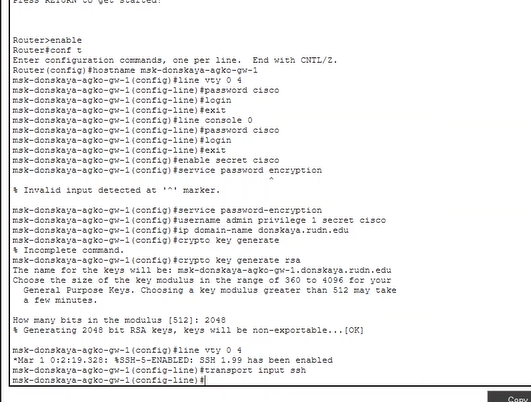
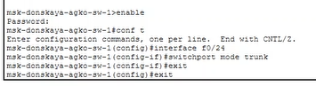
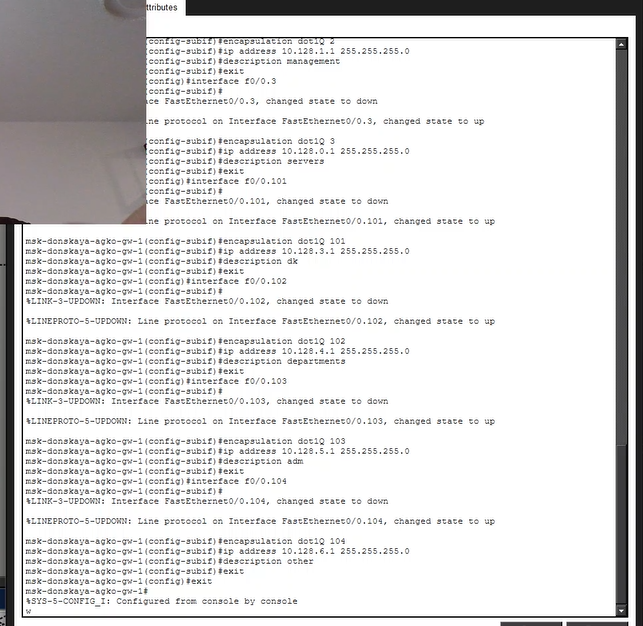
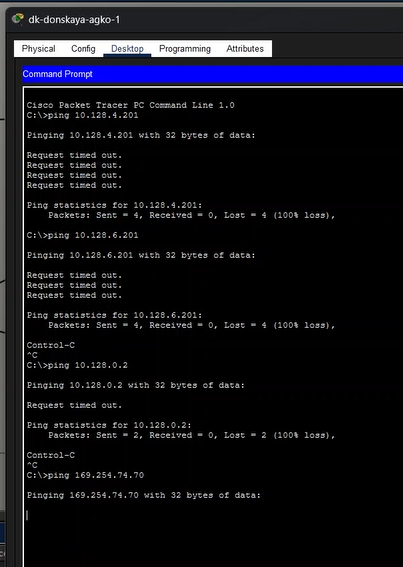

---
## Author
author:
  name: Ко Антон Геннадьевич
  degrees: DSc
  orcid: 0000-0002-0877-7063
  email: antonkosakh@gmail.com
  affiliation:
    - name: Российский университет дружбы народов
      country: Российская Федерация
      postal-code: 117198
      city: Москва
      address: ул. Миклухо-Маклая, д. 6
## Title
title: Лабораторная работа №6
subtitle: Статическая маршрутизация VLAN
license: CC BY
date: today
date-format: "YYYY-MM-DD" # Example: 2026-09-04
---

# Информация

## Докладчик

:::::::::::::: {.columns align=center}
::: {.column width="70%"}

  * Ко Антон Геннадьевич
  * студент
  * Российский университет дружбы народов им. П. Лумумбы
  * [1132221551@rudn.ru](mailto:1132221551@rudn.ru)
  * <https://SenDerMen04.github.io/ru/>

:::
::: {.column width="30%"}

:::
::::::::::::::

---

## Цель работы

Настроить статическую маршрутизацию VLAN в сети.

---

## Выполнение работы

В логической области проекта разместим маршрутизатор Cisco 2811, подключим его к порту 24 коммутатора `msk-donskaya-agko-sw-1` в соответствии с таблицей портов (рис. #fig:002):

{#fig:002 width=100%}

---

Используя приведённую последовательность команд в лабораторной работе по первоначальной настройке маршрутизатора, сконфигурируем маршрутизатор, задав на нём имя, пароль для доступа к консоли и настроим удалённое подключение к нему по SSH (рис. #fig:003):

{#fig:003 width=100%}

---

Теперь настроим порт 24 коммутатора `msk-donskaya-agko-sw-1` как trunk-порт (рис. #fig:004):

{#fig:004 width=100%}

---

На интерфейсе f0/0 маршрутизатора `msk-donskaya-agko-gw-1` настроим виртуальные интерфейсы, соответствующие номерам VLAN. Согласно таблице IP-адресов зададим соответствующие IP-адреса на виртуальных интерфейсах (рис. #fig:006):

{#fig:006 width=100%}

---

Изучим процесс передвижения пакета ICMP по сети в режиме симуляции в Packet Tracer (рис. #fig:007):

{#fig:007 width=100%}

---

## Вывод

В ходе выполнения лабораторной работы мы научились настраивать статическую маршрутизацию VLAN в сети.