---
## Author
author:
  name: Ко Антон Геннадьевич
  degrees: DSc
  orcid: 0000-0002-0877-7063
  email: antonkosakh@gmail.com
  affiliation:
    - name: Российский университет дружбы народов
      country: Российская Федерация
      postal-code: 117198
      city: Москва
      address: ул. Миклухо-Маклая, д. 6
## Title
title: Лабораторная работа №7
subtitle: Учёт физических параметров сети
license: CC BY
date: today
date-format: "YYYY-MM-DD" # Example: 2026-04-11
---

# Информация

## Докладчик

:::::::::::::: {.columns align=center}
::: {.column width="70%"}

  * Ко Антон Геннадьевич
  * студент
  * Российский университет дружбы народов им. П. Лумумбы
  * [1132221551@rudn.ru](mailto:1132221551@rudn.ru)
  * <https://SenDerMen04.github.io/ru/>

:::
::: {.column width="30%"}

:::
::::::::::::::

---

## Цель работы

Получить навыки работы с физической рабочей областью Packet Tracer, а также учесть физические параметры сети.

---

## Выполнение работы

Перейдём в физическую рабочую область Packet Tracer и присвоим название городу — Moscow (рис. #fig:002):

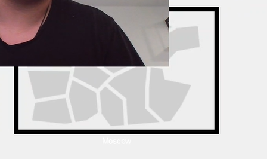{#fig:002 width=100%}

---

Щёлкнув на изображение города, мы видим изображение здания. Присвоим ему название Donskaya и добавим здание для территории Pavlovskaya (рис. #fig:003):

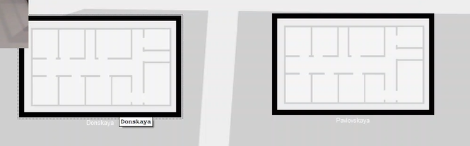{#fig:003 width=100%}

---

Щёлкнув на изображение здания Donskaya, переместим изображение, обозначающее серверное помещение, в него (рис. #fig:004):

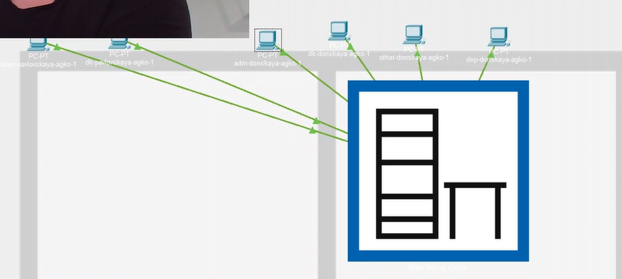{#fig:004 width=100%}

---

Затем, щёлкнув на изображение серверной, мы видим отображение серверных стоек. Переместим коммутатор `msk-pavlovskaya-agko-sw-1` (рис. #fig:005) и два оконечных устройства `dk-pavlovskaya-1` и `other-pavlovskaya-1` (рис. #fig:006) на территорию Pavlovskaya, используя меню "Move" физической рабочей области Packet Tracer.

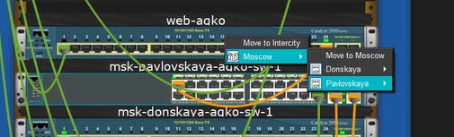{#fig:005 width=100%}

---

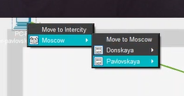{#fig:006 width=100%}

---

Вернувшись в логическую рабочую область Packet Tracer, выполним ping с коммутатора `msk-donskaya-agko-sw-1` на коммутатор `msk-pavlovskaya-agko-sw-1` и убедимся в работоспособности соединения (рис. #fig:007):

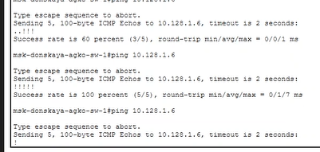{#fig:007 width=100%}

---

Далее в меню "Options" → "Preferences" во вкладке "Interface" активируем разрешение на учёт физических характеристик среды передачи (Enable Cable Length Effects) (рис. #fig:008):

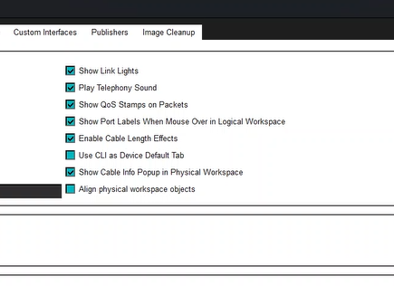{#fig:008 width=100%}

---

Теперь в физической рабочей области Packet Tracer разместим две территории на расстоянии более 100 м друг от друга (рис. #fig:009):

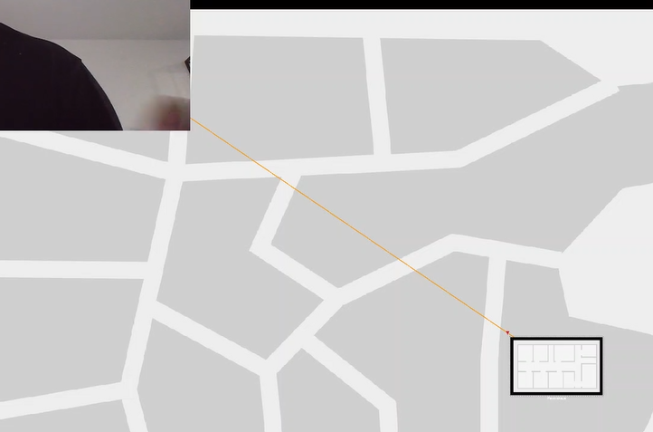{#fig:009 width=100%}

---

Вернувшись в логическую рабочую область Packet Tracer, выполним ping с коммутатора `msk-donskaya-agko-sw-1` на коммутатор `msk-pavlovskaya-agko-sw-1` и убедимся в неработоспособности соединения (рис. #fig:010):

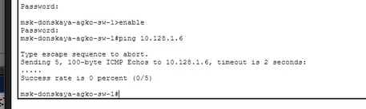{#fig:010 width=100%}

---

Далее удалим соединение между `msk-donskaya-agko-sw-1` и `msk-pavlovskaya-agko-sw-1` и добавим в логическую рабочую область два повторителя (Repeater-PT). Присвоим им соответствующие названия `msk-donskaya-agko-mc-1` и `msk-pavlovskaya-agko-mc-1` (рис. #fig:011). Внутри повторителей заменим имеющиеся модули на `PT-REPEATERNM-1FFE` и `PT-REPEATER-NM-1CFE` для подключения оптоволокна и витой пары по технологии Fast Ethernet (рис. #fig:012):

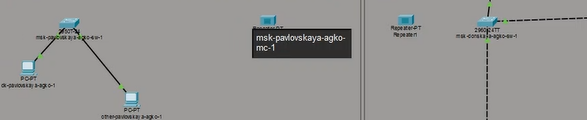{#fig:011 width=100%}

---

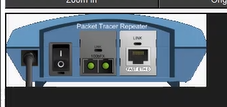{#fig:012 width=100%}

---

Переместим `msk-pavlovskaya-agko-mc-1` на территорию Pavlovskaya (в физической рабочей области Packet Tracer) (рис. #fig:013):

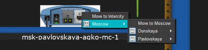{#fig:013 width=100%}

---

Теперь подключим коммутатор `msk-donskaya-agko-sw-1` к `msk-donskaya-agko-mc-1` по витой паре, `msk-donskaya-agko-mc-1` и `msk-pavlovskaya-agko-mc-1` — по оптоволокну, `msk-pavlovskaya-agko-sw-1` к `msk-pavlovskaya-agko-mc-1` — по витой паре (рис. #fig:014):

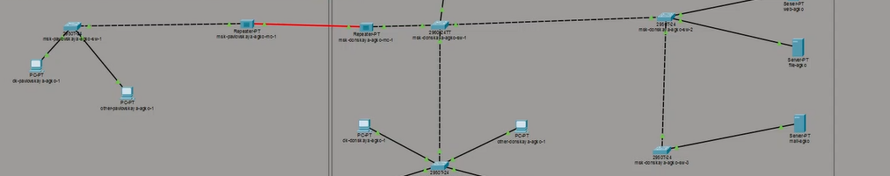{#fig:014 width=100%}

---

Убедимся в работоспособности соединения между `msk-donskaya-agko-sw-1` и `msk-pavlovskaya-agko-sw-1` (рис. #fig:015):

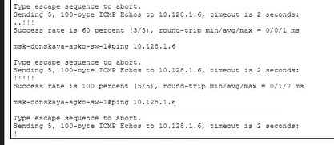{#fig:015 width=100%}

---

## Вывод

В ходе выполнения лабораторной работы мы получили навыки работы с физической рабочей областью Packet Tracer, а также научились учитывать физические параметры сети (расстояние между устройствами, типы кабелей) с использованием повторителей для увеличения дальности передачи сигнала.

---