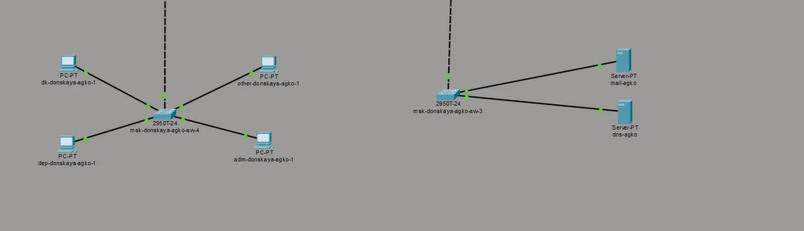
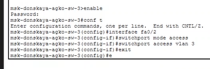
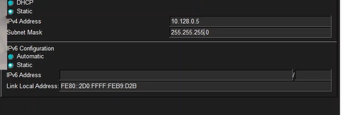
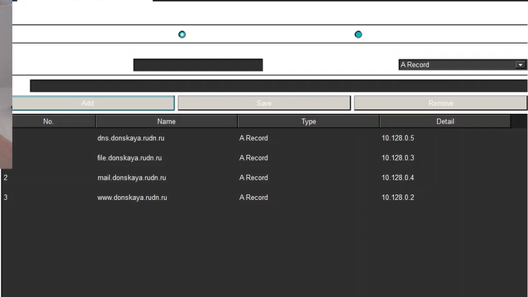
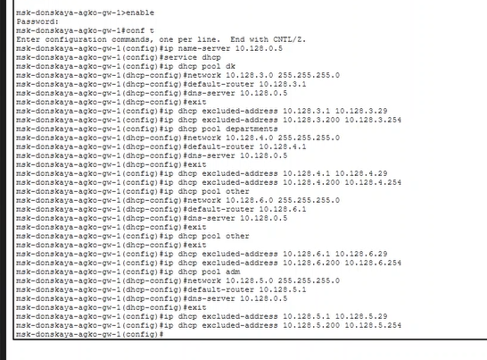
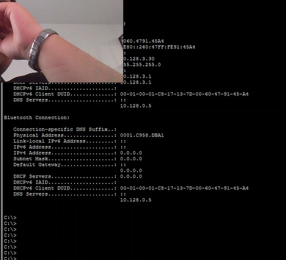
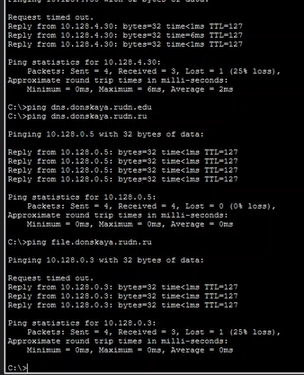
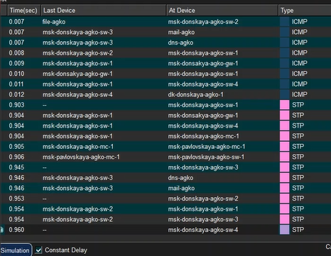

---
## Author
author:
  name: Ко Антон Геннадьевич
  degrees: DSc
  orcid: 0000-0002-0877-7063
  email: antonkosakh@gmail.com
  affiliation:
    - name: Российский университет дружбы народов
      country: Российская Федерация
      postal-code: 117198
      city: Москва
      address: ул. Миклухо-Маклая, д. 6

## Title
title: "Лабораторная работа №8"
subtitle: "Настройка сетевых сервисов. DHCP"
license: "CC BY"
---

## Цель работы

Приобрести практические навыки по настройке динамического распределения IP-адресов посредством протокола DHCP (Dynamic Host Configuration Protocol) в локальной сети.

---

## Выполнение работы

В логическую рабочую область проекта добавим сервер dns и подключим его к коммутатору `msk-donskaya-agko-sw-3` через порт Fa0/2 (рис. #fig:002):

{#fig:002 width=100%}

Далее активируем порт при помощи соответствующих команд на коммутаторе (рис. #fig:003):

{#fig:003 width=100%}

Настроим конфигурацию сервера: адрес шлюза — 10.128.0.1, адрес сервера — 10.128.0.5, маска 255.255.255.0 (рис. #fig:004):

{#fig:004 width=100%}

Далее настроим сервис DNS (рис. #fig:005):

- в конфигурации сервера выберем службу DNS, активируем её (выбрав флаг On);
- в поле Type в качестве типа записи DNS выберем записи типа A (A Record);
- в поле Name укажем доменное имя, по которому можно обратиться к web-серверу — `www.donskaya.rudn.ru`, затем укажем его IP-адрес в соответствующем поле (10.128.0.2);
- нажав на кнопку Add, добавим DNS-запись на сервер;
- аналогичным образом добавим DNS-записи для серверов mail, file, dns;
- сохраним конфигурацию сервера.

{#fig:005 width=100%}

Настроим DHCP-сервис на маршрутизаторе, используя команды из лабораторной работы для каждой выделенной сети (рис. #fig:006):

- укажем IP-адрес DNS-сервера;
- перейдём к настройке DHCP;
- зададим название конфигурируемому диапазону адресов (пулу адресов), укажем адрес сети, а также адреса шлюза и DNS-сервера;
- зададим пулы адресов, исключаемых из динамического распределения.

{#fig:006 width=100%}

Заменим статическое распределение адресов на динамическое на оконечных устройствах (рис. #fig:007):

{#fig:007 width=100%}

Затем проверим, какие адреса выделяются оконечным устройствам (рис. #fig:008):

{#fig:008 width=100%}

Проверим доступность устройств из разных подсетей (рис. #fig:009):

{#fig:009 width=100%}

В режиме симуляции изучим, каким образом происходит запрос адреса по протоколу DHCP (рис. #fig:010):

{#fig:010 width=100%}

---

## Вывод

В ходе выполнения лабораторной работы мы приобрели практические навыки по настройке динамического распределения IP-адресов посредством протокола DHCP (Dynamic Host Configuration Protocol) в локальной сети.

---

## Ответы на контрольные вопросы

### 1. За что отвечает протокол DHCP?

За автоматическое получение IP-адреса и других параметров сети (маска подсети, адрес шлюза, адрес DNS-сервера и т.д.) устройствами в сети.

### 2. Какие типы DHCP-сообщений передаются по сети?

| Тип сообщения | Направление | Описание |
|---------------|-------------|----------|
| **DHCPDISCOVER** | Клиент → Сервер | Начальное сообщение для поиска DHCP-сервера |
| **DHCPOFFER** | Сервер → Клиент | Ответ на начальное сообщение с сетевыми настройками |
| **DHCPREQUEST** | Клиент → Сервер | Запрос на использование предложенных настроек |
| **DHCPACK** | Сервер → Клиент | Авторизация клиента, настройки приняты |
| **DHCPNAK** | Сервер → Клиент | Авторизация невозможна |
| **DHCPDECLINE** | Клиент → Сервер | IP-адрес уже используется в сети |
| **DHCPINFORM** | Клиент → Сервер | Присвоен статический IP, но нужен динамический |
| **DHCPRELEASE** | Клиент → Сервер | Завершение использования IP-адреса |

### 3. Какие параметры могут быть переданы в сообщениях DHCP?

По умолчанию запросы от клиента отправляются на сервер на порт 67, сервер в свою очередь отвечает клиенту на порт 68, выдавая IP-адрес и другую необходимую информацию, такую как сетевая маска, адрес маршрутизатора (шлюза) и адреса DNS-серверов.

### 4. Что такое DNS?

DNS (Domain Name System) — система, ставящая в соответствие доменному имени хоста IP-адрес и наоборот.

### 5. Какие типы записи описания ресурсов есть в DNS и для чего они используются?

| Тип записи | Назначение |
|------------|------------|
| **RR** | Resource Records — описывают все узлы сети в зоне и помечают делегирование поддоменов |
| **SOA** | Start of Authority — указывает на авторитативность для зоны |
| **NS** | Name Server — перечисляет DNS-серверы зоны |
| **A** | Address — задаёт отображение имени узла в IP-адрес |
| **PTR** | Pointer — задаёт отображение IP-адреса в имя узла |
| **CNAME** | Canonical Name — псевдоним для другого имени |
| **MX** | Mail Exchange — указывает почтовые серверы для домена |