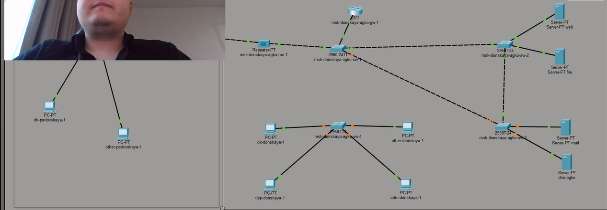
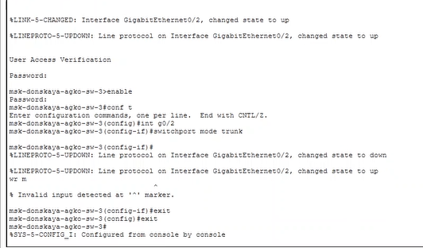
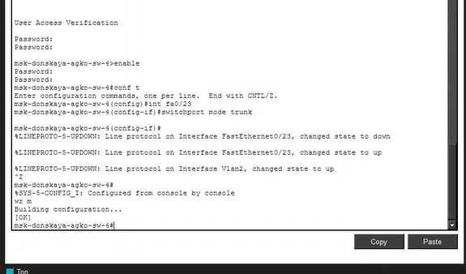
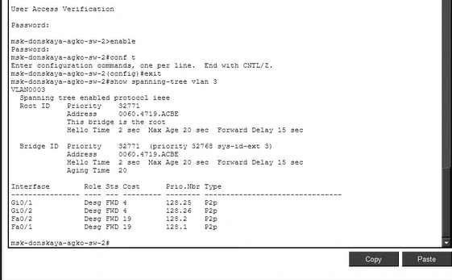
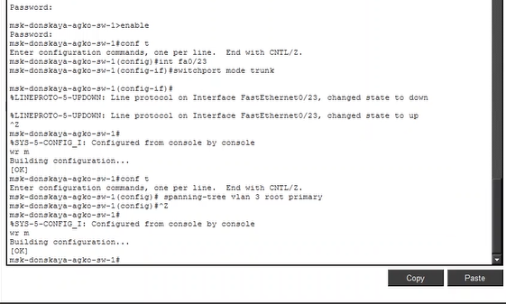
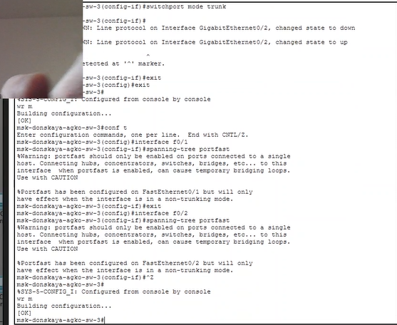
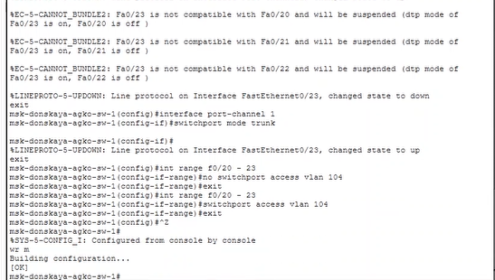
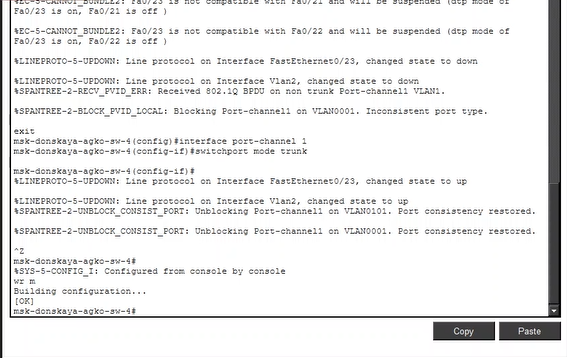

---
## Author
author:
  name: Ко Антон Геннадьевич
  degrees: DSc
  orcid: 0000-0002-0877-7063
  email: antonkosakh@gmail.com
  affiliation:
    - name: Российский университет дружбы народов
      country: Российская Федерация
      postal-code: 117198
      city: Москва
      address: ул. Миклухо-Маклая, д. 6
## Title
title: Лабораторная работа №9
subtitle: Использование протокола STP. Агрегирование каналов
license: CC BY
date: today
date-format: "YYYY-MM-DD" # Example: 2026-04-11
---

# Информация

## Докладчик

:::::::::::::: {.columns align=center}
::: {.column width="70%"}

  * Ко Антон Геннадьевич
  * студент
  * Российский университет дружбы народов им. П. Лумумбы
  * [1132221551@rudn.ru](mailto:1132221551@rudn.ru)
  * <https://SenDerMen04.github.io/ru/>

:::
::: {.column width="30%"}

:::
::::::::::::::

---

## Протокол STP

Основное назначение протокола STP (*Spanning Tree Protocol*, протокол остовного дерева) — устранение петель в топологии сети на базе технологии Ethernet при наличии избыточных соединений.

---

## Формирование резервного соединения

Формирование резервного соединения между коммутаторами  
`msk-donskaya-agko-sw-1` и `msk-donskaya-agko-sw-3` (замена соединения между коммутаторами).

{#fig:001 width=70%}

---

## Резервное соединение

Настройка порта на интерфейсе `Gig0/2` коммутатора  
`msk-donskaya-agko-sw-3` как транковый.

{#fig:002 width=70%}

---

## Настройка порта

Соединение между коммутаторами  
`msk-donskaya-agko-sw-1` и `msk-donskaya-agko-sw-4` через интерфейсы `Fa0/23`.

{#fig:003 width=70%}

---

## Соединение

Активация в транковом режиме интерфейса `Fa0/23` на коммутаторе  
`msk-donskaya-agko-sw-1`.

{#fig:004 width=70%}

---

## Активация (транковый режим)

Активация в транковом режиме интерфейса `Fa0/23` на коммутаторе  
`msk-donskaya-agko-sw-4`.

{#fig:005 width=70%}

---

## Просмотр состояния STP

Просмотр на коммутаторе `msk-donskaya-agko-sw-2` состояния протокола STP для VLAN 3 (указывается, что данное устройство является корневым — *This bridge is the root*).

{#fig:006 width=70%}

---

## Настройка корневого коммутатора STP

Настройка в качестве корневого коммутатора STP коммутатора  
`msk-donskaya-agko-sw-1`.

{#fig:007 width=70%}

---

## Настройка режима Portfast

Настройка режима `Portfast` на интерфейсах коммутатора  
`msk-donskaya-agko-sw-2`.

{#fig:008 width=70%}

Настройка режима `Portfast` на интерфейсах коммутатора  
`msk-donskaya-agko-sw-3`.

{#fig:009 width=70%}

---

## Переключение в Rapid PVST+

Переключение коммутаторов в режим работы по протоколу Rapid PVST+ (на примере `msk-donskaya-agko-sw-1`).

{#fig:010 width=70%}

---

## Агрегированное соединение

Формирование агрегированного соединения интерфейсов `Fa0/20 – Fa0/23` между коммутаторами  
`msk-donskaya-agko-sw-1` и `msk-agko-donskaya-sw-4`.

{#fig:011 width=70%}

Формирование агрегированного соединения интерфейсов `Fa0/20 – Fa0/23` между коммутаторами  
`msk-donskaya-agko-sw-1` и `msk-agko-donskaya-sw-4`.

{#fig:012 width=70%}

Формирование агрегированного соединения интерфейсов `Fa0/20 – Fa0/23` между коммутаторами  
`msk-donskaya-agko-sw-1` и `msk-agko-donskaya-sw-4`.

{#fig:013 width=70%}

---

## Вывод

В ходе выполнения лабораторной работы мы изучили возможности протокола STP и его модификаций по обеспечению отказоустойчивости сети, агрегированию интерфейсов и перераспределению нагрузки между ними.

---