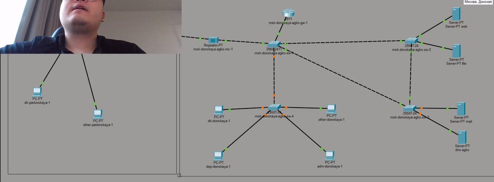
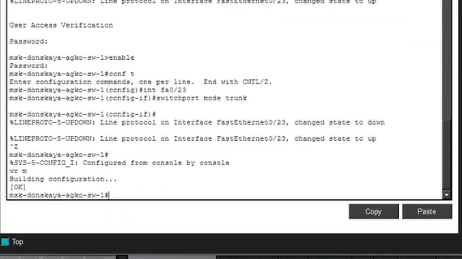
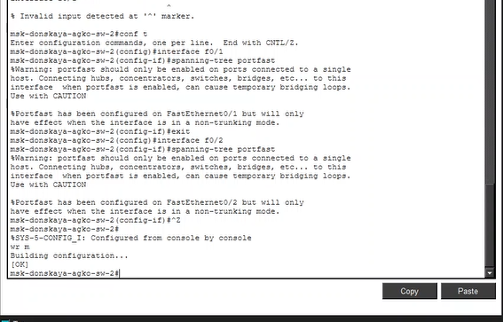
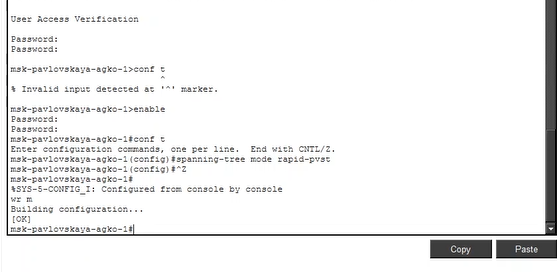
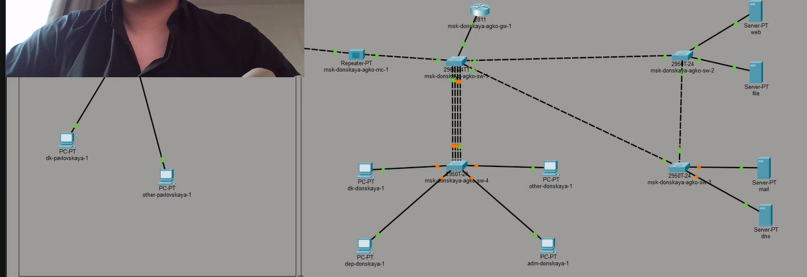

---
## Author
author:
  name: Ко Антон Геннадьевич
  degrees: DSc
  orcid: 0000-0002-0877-7063
  email: antonkosakh@gmail.com
  affiliation:
    - name: Российский университет дружбы народов
      country: Российская Федерация
      postal-code: 117198
      city: Москва
      address: ул. Миклухо-Маклая, д. 6

## Title
title: "Лабораторная работа №9"
subtitle: "Использование протокола STP. Агрегирование каналов"
license: "CC BY"
---

# Цель работы:

Изучить возможности протокола STP и его модификаций по обеспечению отказоустойчивости сети, агрегированию интерфейсов и перераспределению нагрузки между ними.

# Выполнение работы:

Cформируем резервное соединение между коммутаторами msk-donskaya-agko-sw-1 и msk-donskaya-agko-sw-3. Для этого заменим соединение между коммутаторами msk-donskaya-agko-sw-1 (Gig0/2) и msk-donskaya-agko-sw-4 (Gig0/1) на соединение между коммутаторами msk-donskaya-agko-sw-1 (Gig0/2) и msk-donskaya-agko-sw-3 (Gig0/2) (рис. #fig:001):

{#fig:001 width=70%}

После чего сделаем порт на интерфейсе Gig0/2 коммутатора msk-donskaya-agko-sw-3 транковым (рис. #fig:002):

{#fig:002 width=70%}

Теперь соединение между коммутаторами msk-donskaya-agko-sw-1 и msk-donskaya-agko-sw-4 сделаем через интерфейсы Fa0/23 (рис. #fig:003), не забыв активировать их в транковом режиме (рис. #fig:004, #fig:005):

{#fig:003 width=70%}

{#fig:004 width=70%}

{#fig:005 width=70%}

На коммутаторе msk-donskaya-agko-sw-2 посмотрим состояние протокола STP для vlan 3 (указывается, что данное устройство является корневым (строка This bridge is the root)) (рис. #fig:006):

{#fig:006 width=70%}

В качестве корневого коммутатора STP настроим коммутатор msk-donskaya-agko-sw-1 (рис. #fig:007):

{#fig:007 width=70%}

Настроим режим Portfast на тех интерфейсах коммутаторов, к которым подключены сервера (рис. #fig:008, #fig:009):

{#fig:008 width=70%}

{#fig:009 width=70%}

Далее переключим коммутаторы в режим работы по протоколу Rapid PVST+ (рис. #fig:010):

{#fig:010 width=70%}

Сформируем агрегированное соединение интерфейсов Fa0/20 – Fa0/23 между коммутаторами msk-donskaya-agko-sw-1 и msk-agko-donskaya-sw-4 (рис. #fig:011, #fig:012, #fig:013):

{#fig:011 width=70%}

{#fig:012 width=70%}

{#fig:013 width=70%}

# Вывод:

В ходе выполнения лабораторной работы мы изучили возможности протокола STP и его модификаций по обеспечению отказоустойчивости сети, агрегированию интерфейсов и перераспределению нагрузки между ними. Но к сожалению проверить это не удалось.

# Ответы на контрольные вопросы:

Какую информацию можно получить, воспользовавшись командой определения состояния протокола STP для VLAN (на корневом и не на корневом устройстве)? Приведите примеры вывода подобной информации на устройствах – 

VLAN… // Номер VLAN 

STP … // Тип протокола 

Root ID/Bridge ID // Ближайший коммутатор/Текущий коммутатор 

Priority … // Приоритет 

Address … // MAC-адрес 

Cost … // «Затраты» до этого коммутатора 

Port … // Порт 

Hello Time … Max Age … Forward Delay … Aging Time … // Время работы STP // Свойства портов

При помощи какой команды можно узнать, в каком режиме, STP или Rapid PVST+, работает устройство? Приведите примеры вывода подобной информации на устройствах - sh ru

Для чего и в каких случаях нужно настраивать режим Portfast? - Он позволяет сразу включать выделенные порты, поскольку они не подключены к коммутаторам и не участвуют во включении STP.

В чем состоит принцип работы агрегированного интерфейса? Для чего он используется? - Он объединяет параллельные каналы для увеличения пропускной способности, а также не теряет соединение при обрыве одного из каналов, перенаправляя трафик.

В чём принципиальные отличия при использовании протоколов LACP (Link Aggregation Control Protocol), PAgP (Port Aggregation Protocol) и статического агрегирования без использования протоколов? - LACP общий стандарт IEEE, PAgP — локальный протокол Cisco. Для них обязательна настройка сторон (активная, пассивная, авто). При статическом агрегировании коммутатор обрабатывает данные как с магистрали, даже если она не настроена на другой стороне.

При помощи каких команд можно узнать состояние агрегированного канала EtherChannel? - show etherchannel