---
## Author
author:
  name: Ко Антон Геннадьевич
  degrees: DSc
  orcid: 0000-0002-0877-7063
  email: antonkosakh@gmail.com
  affiliation:
    - name: Российский университет дружбы народов
      country: Российская Федерация
      postal-code: 117198
      city: Москва
      address: ул. Миклухо-Маклая, д. 6

## Title
title: "Лабораторная работа №10"
subtitle: "Настройка списков управления доступом (ACL)"
license: "CC BY"
---

## Цель работы

Освоить настройку прав доступа пользователей к ресурсам сети.

---

## Выполнение работы

В рабочей области проекта подключим ноутбук администратора с именем `admin` к сети `other-donskaya-1` с тем, чтобы разрешить ему потом любые действия, связанные с управлением сетью. Для этого подсоединим ноутбук к порту 24 коммутатора `msk-donskaya-agko-sw-4` (рис. #fig:002) и присвоим ему статический адрес 10.128.6.200, указав в качестве gateway-адреса 10.128.6.1 и адреса DNS-сервера 10.128.0.5 (рис. #fig:003). После чего выполним проверку (рис. #fig:004). Права доступа пользователей сети будем настраивать на маршрутизаторе `msk-donskaya-agko-gw-1`, поскольку именно через него проходит весь трафик сети. Ограничения можно накладывать как на входящий (in), так и на исходящий (out) трафик. По отношению к маршрутизатору накладываемые ограничения будут касаться в основном исходящего трафика. Различают стандартные (standard) и расширенные (extended) списки контроля доступа (Access Control List, ACL). Стандартные ACL проверяют только адрес источника трафика, расширенные — адрес как источника, так и получателя, тип протокола и TCP/UDP порты.

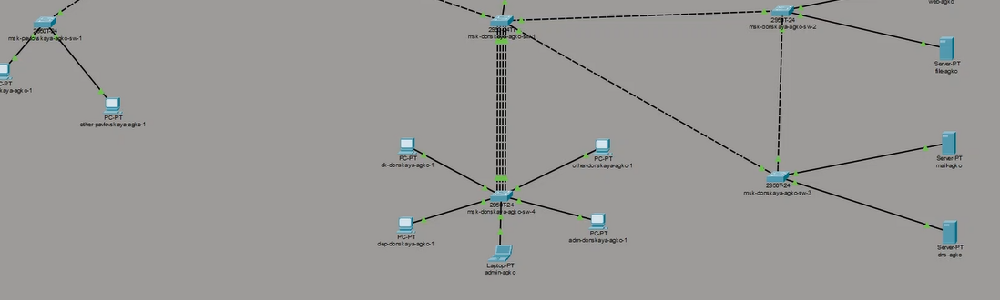{#fig:002 width=100%}

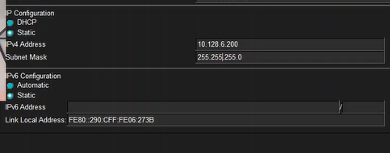{#fig:003 width=100%}

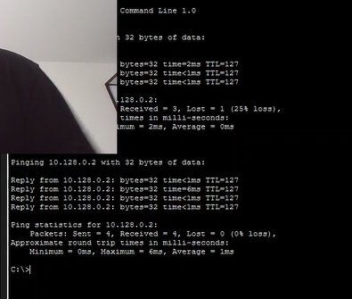{#fig:004 width=100%}

Далее настроим доступ к web-серверу по порту tcp 80 (рис. #fig:005):

1. Создадим список контроля доступа с названием `servers-out` (так как предполагается ограничить доступ в конкретные подсети и по отношению к маршрутизатору это будет исходящий трафик);
2. Укажем (в качестве комментария-напоминания `remark web`), что ограничения предназначены для работы с web-сервером;
3. Дадим разрешение доступа (`permit`) по протоколу TCP всем (`any`) пользователям сети (`host`) на доступ к web-серверу, имеющему адрес 10.128.0.2, через порт 80.

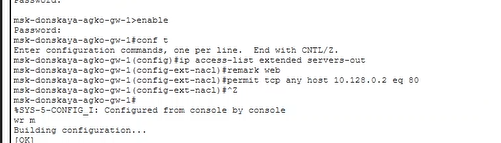{#fig:005 width=100%}

Добавим список управления доступом к интерфейсу (рис. #fig:006):

- К интерфейсу f0/0.3 подключаем список прав доступа `servers-out` и применяем к исходящему трафику (out).

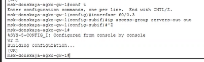{#fig:006 width=100%}

Проверим, что доступ к web-серверу есть через протокол HTTP (введя в строке браузера хоста ip-адрес web-сервера). При этом команда `ping` будет демонстрировать недоступность web-сервера (рис. #fig:007 – #fig:008):

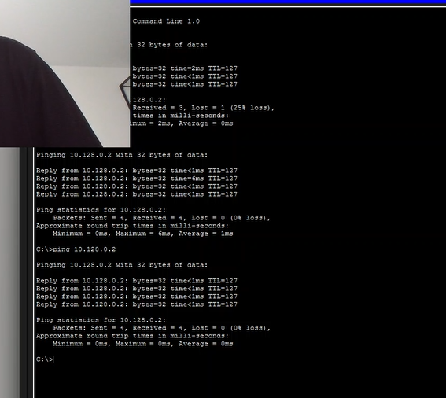{#fig:007 width=100%}

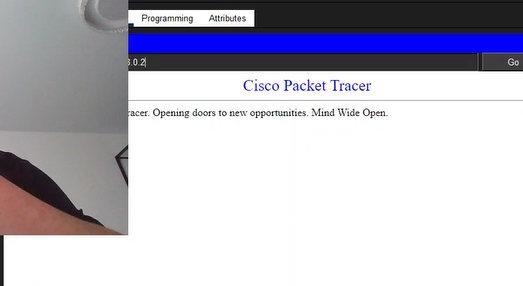{#fig:008 width=100%}

Настроим дополнительный доступ для администратора по протоколам Telnet и FTP (рис. #fig:009):

- В список контроля доступа `servers-out` добавим правило, разрешающее устройству администратора с ip-адресом 10.128.6.200 доступ на web-сервер (10.128.0.2) по протоколам FTP и telnet.

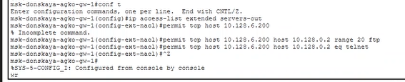{#fig:009 width=100%}

Убедимся, что с узла с ip-адресом 10.128.6.200 есть доступ по протоколу FTP. Для этого в командной строке устройства администратора введём `ftp 10.128.0.2`, а затем по запросу имя пользователя `cisco` и пароль `cisco` (рис. #fig:010):

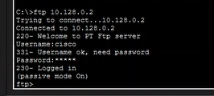{#fig:010 width=100%}

Настроим доступ к файловому серверу (рис. #fig:011):

1. В списке контроля доступа `servers-out` укажем (в качестве комментария-напоминания `remark file`), что следующие ограничения предназначены для работы с file-сервером;
2. Всем узлам внутренней сети (10.128.0.0) разрешим доступ по протоколу SMB к каталогам общего пользования;
3. Любым узлам разрешим доступ к file-серверу по протоколу FTP. Запись `0.0.255.255` — обратная маска (wildcard mask).

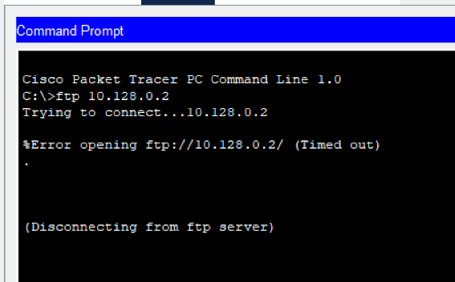{#fig:011 width=100%}

Затем настроим доступ к почтовому серверу (рис. #fig:012):

1. В списке контроля доступа `servers-out` укажем (в качестве комментария-напоминания `remark mail`), что следующие ограничения предназначены для работы с почтовым сервером;
2. Всем разрешим доступ к почтовому серверу по протоколам POP3 и SMTP.

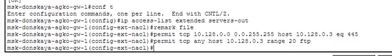{#fig:012 width=100%}

Настроим доступ к DNS-серверу (рис. #fig:013):

1. В списке контроля доступа `servers-out` укажем (в качестве комментария-напоминания `remark dns`), что следующие ограничения предназначены для работы с DNS-сервером;
2. Всем узлам внутренней сети разрешим доступ к DNS-серверу через UDP-порт 53.

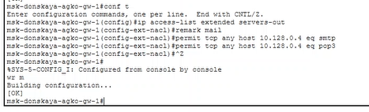{#fig:013 width=100%}

Проверим доступность web-сервера (через браузер) не только по ip-адресу, но и по имени (рис. #fig:014):

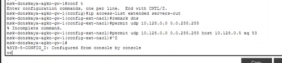{#fig:014 width=100%}

Разрешим icmp-запросы (рис. #fig:015):

- Демонстрируем явное управление порядком размещения правил — правило разрешения для icmp-запросов добавляется в начало списка контроля доступа.

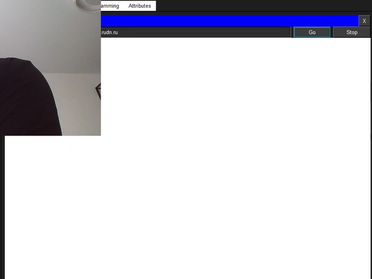{#fig:015 width=100%}

Номера строк правил в списке контроля доступа можно посмотреть с помощью команды `show access-lists` (рис. #fig:016):

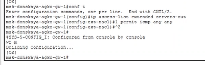{#fig:016 width=100%}

Теперь настроим доступ для сети Other (требуется наложить ограничение на исходящий из сети Other трафик, который по отношению к маршрутизатору `msk-agko-donskaya-gw-1` является входящим трафиком) (рис. #fig:017):

1. В списке контроля доступа `other-in` укажем, что следующие правила относятся к администратору сети;
2. Даём разрешение устройству с адресом 10.128.6.200 на любые действия (any);
3. К интерфейсу f0/0.104 подключаем список прав доступа `other-in` и применяем к входящему трафику (in).

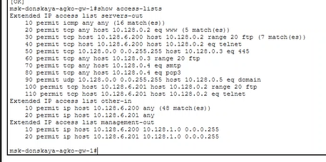{#fig:017 width=100%}

Настроим доступ администратора к сети сетевого оборудования (рис. #fig:018):

1. В списке контроля доступа `management-out` укажем (в качестве комментария-напоминания `remark admin`), что устройству администратора с адресом 10.128.6.200 разрешён доступ к сети сетевого оборудования (10.128.1.0);
2. К интерфейсу f0/0.2 подключаем список прав доступа `management-out` и применяем к исходящему трафику (out).

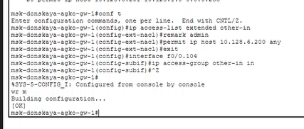{#fig:018 width=100%}

Проверим корректность установленных правил доступа с оконечного устройства `other-donskaya-1` (рис. #fig:019):

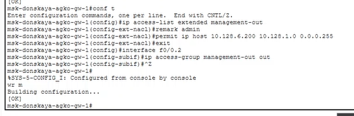{#fig:019 width=100%}

Разрешим администратору из сети Other на Павловской действия, аналогичные действиям администратора сети Other на Донской (рис. #fig:020 – #fig:021):

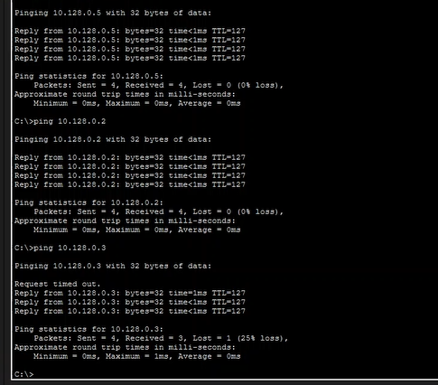{#fig:020 width=100%}

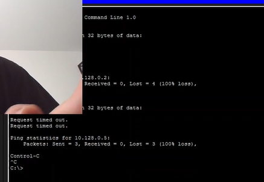{#fig:021 width=100%}

---

## Вывод

В ходе выполнения лабораторной работы мы освоили настройку прав доступа пользователей к ресурсам сети.

---

## Ответы на контрольные вопросы

1. **Как задать действие правила для конкретного протокола?**  
   Используется команда `permit` или `deny` с указанием протокола (например, `permit tcp`, `deny udp`).

2. **Как задать действие правила сразу для нескольких портов?**  
   Используется ключевое слово `range` (например, `permit tcp any host 10.128.0.2 range 20 21`).

3. **Как узнать номер правила в списке прав доступа?**  
   Команда `show access-lists` показывает все правила с их номерами строк.

4. **Каким образом можно изменить порядок применения правил в списке контроля доступа?**  
   С помощью команды `ip access-list resequence <имя> <начальный_номер> <шаг>` (например, `ip access-list resequence servers-out 10 10`).