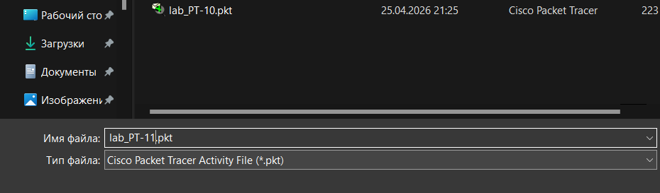
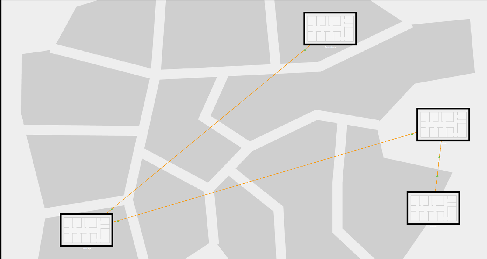
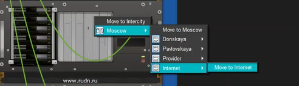
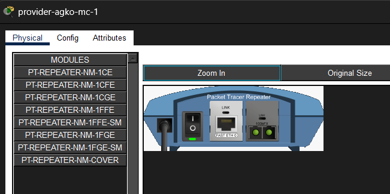
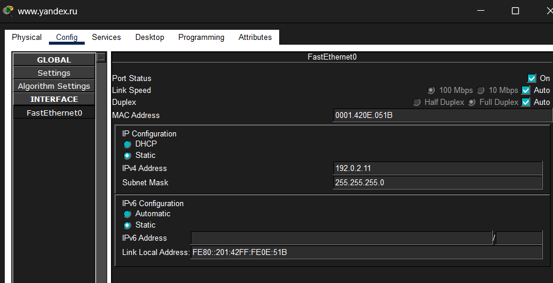
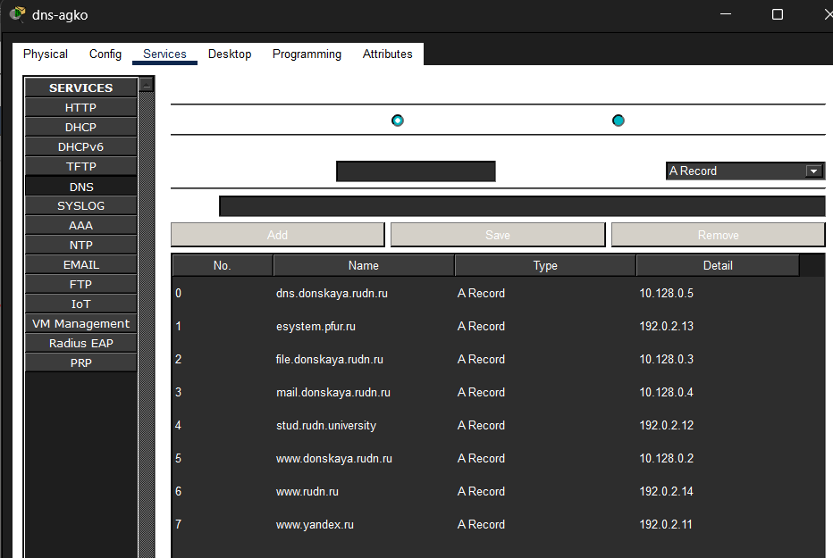

---
## Author
author:
  name: Ко Антон Геннадьевич
  degrees: DSc
  orcid: 0000-0002-0877-7063
  email: antonkosakh@gmail.com
  affiliation:
    - name: Российский университет дружбы народов
      country: Российская Федерация
      postal-code: 117198
      city: Москва
      address: ул. Миклухо-Маклая, д. 6
## Title
title: Лабораторная работа №11
subtitle: Настройка NAT. Планирование
license: CC BY
date: today
date-format: "YYYY-MM-DD" # Example: 2026-04-11
---

# Информация

---

## Докладчик

:::::::::::::: {.columns align=center}
::: {.column width="70%"}

  * Ко Антон Геннадьевич
  * студент
  * Российский университет дружбы народов им. П. Лумумбы
  * [1132221551@rudn.ru](mailto:1132221551@rudn.ru)
  * <https://SenDerMen04.github.io/ru/>

:::
::: {.column width="30%"}

:::
::::::::::::::

---

## Цель работы

Провести подготовительные мероприятия по подключению локальной сети организации к Интернету.

---

## Выполнение работы

Откроем проект с названием `lab_PT-10.pkt` и сохраним под названием `lab_PT-11.pkt`. После чего откроем его для дальнейшего редактирования (рис. #fig:001):

{#fig:001 width=100%}

---

На схеме нашего проекта разместим согласно заданию лабораторной работы необходимое оборудование для сети провайдера и сети модельного Интернета (4 медиаконвертера (Repeater-PT), 2 коммутатора типа Cisco 2960-24TT, маршрутизатор типа Cisco 2811, 4 сервера). После чего присвоим названия размещённым в сети провайдера и в сети модельного Интернета объектам согласно правилам наименования (рис. #fig:002):

{#fig:002 width=100%}

---

В физической рабочей области добавим здание провайдера и здание, имитирующее расположение серверов модельного Интернета. Присвоим им соответствующие названия (рис. #fig:003):

{#fig:003 width=100%}

---

Перенесём из сети «Донская» оборудование провайдера и модельной сети Интернета в соответствующие здания (рис. #fig:004 – #fig:006):

{#fig:004 width=100%}

---

{#fig:005 width=100%}

---

{#fig:006 width=100%}

---

На медиаконвертерах заменим имеющиеся модули на `PT-REPEATERNM-1FFE` и `PT-REPEATER-NM-1CFE` для подключения витой пары по технологии Fast Ethernet и оптоволокна соответственно (рис. #fig:007):

{#fig:007 width=100%}

---

Пропишем IP-адреса серверам согласно таблице в лабораторной работе (рис. #fig:008):

{#fig:008 width=100%}

---

После чего пропишем сведения о серверах на DNS-сервере сети «Донская» (рис. #fig:009):

{#fig:009 width=100%}

---

## Вывод

В ходе выполнения лабораторной работы мы освоили настройку прав доступа пользователей к ресурсам сети.

---