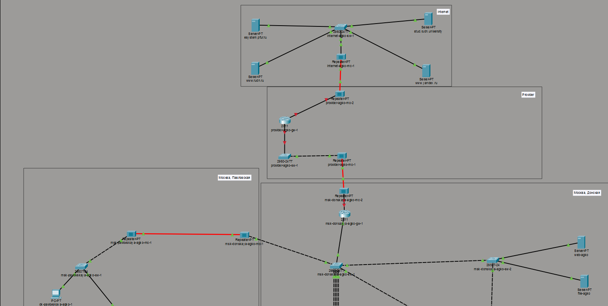
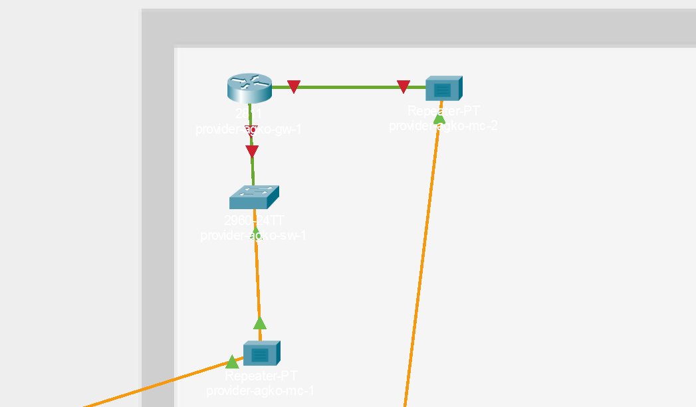
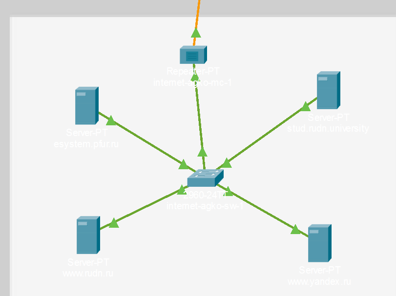

---
## Author
author:
  name: Ко Антон Геннадьевич
  degrees: DSc
  orcid: 0000-0002-0877-7063
  email: antonkosakh@gmail.com
  affiliation:
    - name: Российский университет дружбы народов
      country: Российская Федерация
      postal-code: 117198
      city: Москва
      address: ул. Миклухо-Маклая, д. 6

## Title
title: "Лабораторная работа №11"
subtitle: "Настройка NAT. Планирование"
license: "CC BY"
---

## Цель работы

Провести подготовительные мероприятия по подключению локальной сети организации к Интернету.

---

## Выполнение работы

Откроем проект с названием `lab_PT-10.pkt` и сохраним под названием `lab_PT-11.pkt`. После чего откроем его для дальнейшего редактирования (рис. #fig:001):

{#fig:001 width=100%}

На схеме нашего проекта разместим согласно заданию лабораторной работы необходимое оборудование для сети провайдера и сети модельного Интернета (4 медиаконвертера (Repeater-PT), 2 коммутатора типа Cisco 2960-24TT, маршрутизатор типа Cisco 2811, 4 сервера). После чего присвоим названия размещённым в сети провайдера и в сети модельного Интернета объектам согласно правилам наименования (рис. #fig:002):

{#fig:002 width=100%}

В физической рабочей области добавим здание провайдера и здание, имитирующее расположение серверов модельного Интернета. Присвоим им соответствующие названия (рис. #fig:003):

{#fig:003 width=100%}

Перенесём из сети «Донская» оборудование провайдера и модельной сети Интернета в соответствующие здания (рис. #fig:004 – #fig:006):

{#fig:004 width=100%}

{#fig:005 width=100%}

{#fig:006 width=100%}

На медиаконвертерах заменим имеющиеся модули на `PT-REPEATERNM-1FFE` и `PT-REPEATER-NM-1CFE` для подключения витой пары по технологии Fast Ethernet и оптоволокна соответственно (рис. #fig:007):

{#fig:007 width=100%}

Пропишем IP-адреса серверам согласно таблице в лабораторной работе (рис. #fig:008):

{#fig:008 width=100%}

После чего пропишем сведения о серверах на DNS-сервере сети «Донская» (рис. #fig:009):

{#fig:009 width=100%}

---

## Вывод

В ходе выполнения лабораторной работы мы освоили настройку прав доступа пользователей к ресурсам сети.

---

## Ответы на контрольные вопросы

1. **Что такое Network Address Translation (NAT)?**  
   NAT — механизм преобразования IP-адресов транзитных пакетов.

2. **Как определить, находится ли узел сети за NAT?**  
   - Просмотр сетевой конфигурации: если узел имеет локальный IP-адрес из диапазона `192.168.x.x`, `10.x.x.x` или `172.16.x.x`, вероятно, он находится за NAT.  
   - Проверка маршрутизации: при использовании `traceroute` (`tracert` в Windows) можно увидеть IP-адреса маршрута. Если он проходит через общедоступные IP-адреса, узел, скорее всего, за NAT.  
   - Проверка портов: если администратор сети настроил порты NAT для перенаправления трафика на устройства внутри локальной сети, подключение к определённому порту на общедоступном IP-адресе может указывать на использование NAT.  
   - Использование онлайн-инструментов: некоторые онлайн-сервисы могут анализировать IP-адрес узла и определить, используется ли NAT.

3. **Какое оборудование отвечает за преобразование адреса методом NAT?**  
   Оборудование, отвечающее за преобразование адресов методом NAT, включает в себя маршрутизаторы (роутеры), межсетевые экраны (firewalls) и прокси-серверы.

4. **В чём отличие статического, динамического и перегруженного NAT?**  
   - **Статический NAT (SNAT):** каждый локальный IP-адрес отображается на соответствующий общедоступный IP-адрес.  
   - **Динамический NAT (DNAT):** локальные IP-адреса отображаются на общедоступные IP-адреса из пула, с временным выделением адресов.  
   - **NAT с перегрузкой (Overloaded NAT или PAT):** помимо изменения IP-адресов, также происходит изменение портов, позволяя множеству устройств использовать один общедоступный IP-адрес.

5. **Охарактеризуйте типы NAT.**  
   - **Статический NAT (Static NAT, SNAT)** — осуществляет преобразование адресов по принципу 1:1 (один локальный IP-адрес преобразуется во внешний адрес, выделенный провайдером).  
   - **Динамический NAT (Dynamic NAT, DNAT)** — осуществляет преобразование адресов по принципу 1:N (один адрес устройства локальной сети преобразуется в один из адресов диапазона внешних адресов).  
   - **NAT Overload (NAT Masquerading, PAT)** — осуществляет преобразование адресов по принципу N:1 (адреса группы устройств локальной подсети преобразуются в один внешний адрес с использованием механизма адресации через номера портов).