---
## Author
author:
  name: Ко Антон Геннадьевич
  degrees: DSc
  orcid: 0000-0002-0877-7063
  email: antonkosakh@gmail.com
  affiliation:
    - name: Российский университет дружбы народов
      country: Российская Федерация
      postal-code: 117198
      city: Москва
      address: ул. Миклухо-Маклая, д. 6

## Title
title: "Лабораторная работа №12"
subtitle: "Настройка NAT"
license: "CC BY"
---

## Цель работы

Приобретение практических навыков по настройке доступа локальной сети к внешней сети посредством NAT.

---

## Выполнение работы

Для начала сделаем первоначальную настройку маршрутизатора `provider-agko-gw-1` и коммутатора `provider-agko-sw-1` провайдера (зададим имя, настроим доступ по паролю и т.п.) (рис. #fig:002 – #fig:003).

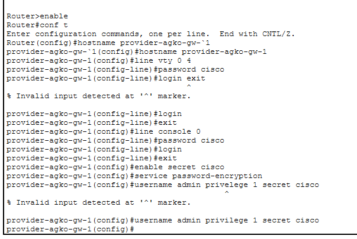{#fig:002 width=100%}

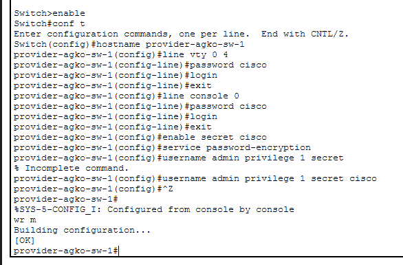{#fig:003 width=100%}

Теперь настроим интерфейсы маршрутизатора `provider-agko-gw-1` и коммутатора `provider-agko-sw-1` провайдера (рис. #fig:004 – #fig:005):

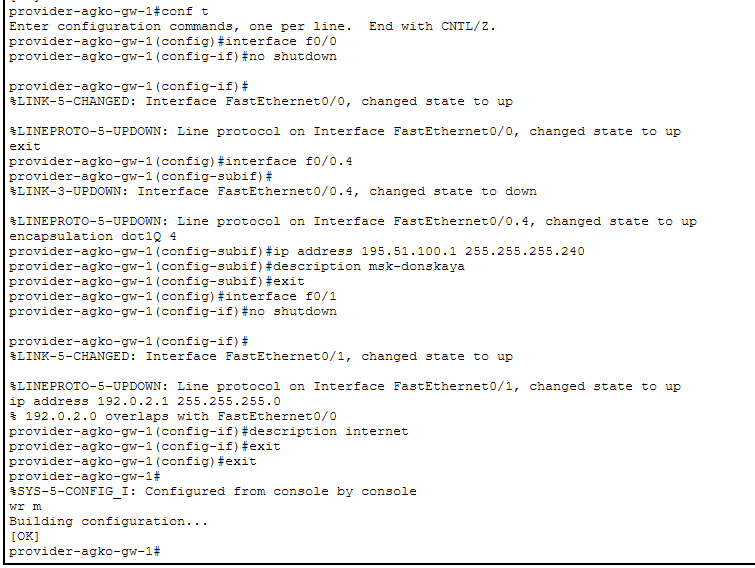{#fig:004 width=100%}

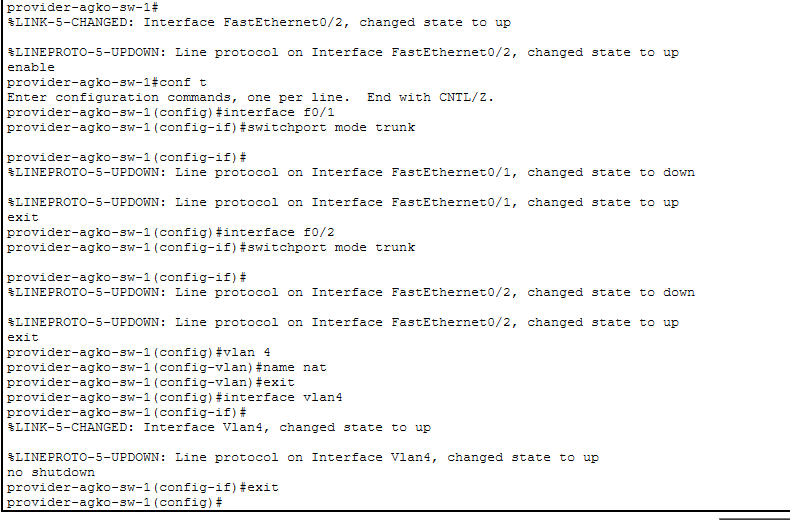{#fig:005 width=100%}

Следующим шагом настроим интерфейсы маршрутизатора сети «Донская» для доступа к сети провайдера (рис. #fig:007):

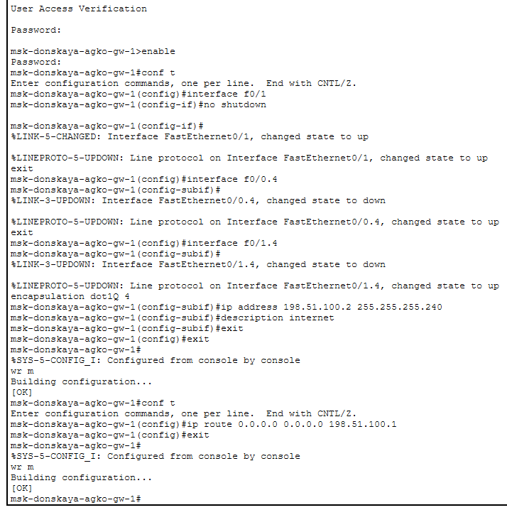{#fig:007 width=100%}

Настроим на маршрутизаторе сети «Донская» NAT с правилами, указанными в лабораторной работе (рис. #fig:009 – #fig:015):

{#fig:009 width=100%}

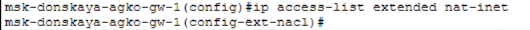{#fig:010 width=100%}

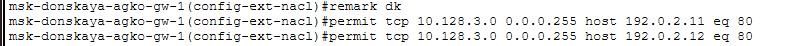{#fig:011 width=100%}

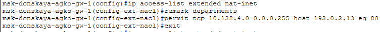{#fig:012 width=100%}

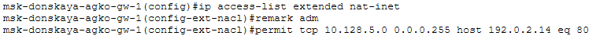{#fig:013 width=100%}

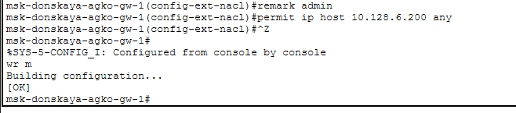{#fig:014 width=100%}

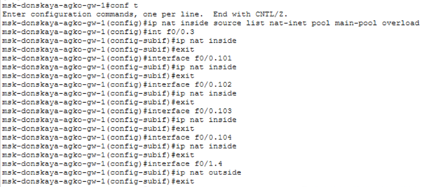{#fig:015 width=100%}

На последнем шаге настроим доступ из внешней сети в локальную сеть организации (рис. #fig:016 – #fig:019):

{#fig:016 width=100%}

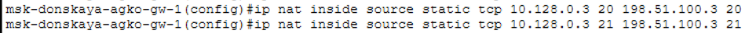{#fig:017 width=100%}

{#fig:018 width=100%}

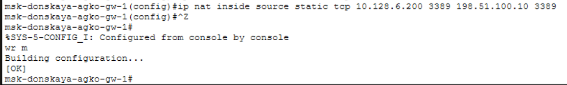{#fig:019 width=100%}

---

## Вывод

В ходе выполнения лабораторной работы мы приобрели практические навыки по настройке доступа локальной сети к внешней сети посредством NAT.

---

## Ответы на контрольные вопросы

1. **В чём состоит основной принцип работы NAT (что даёт наличие NAT в сети организации)?**  
   NAT на устройстве позволяет ему соединять публичные и частные сети между собой с помощью только одного IP-адреса для группы.

2. **В чём состоит принцип настройки NAT (на каком оборудовании и что нужно настроить для доступа из локальной сети во внешнюю сеть через NAT)?**  
   Настроить интерфейсы на внутренних и внешних маршрутизаторах, наборы правил для преобразования IP.

3. **Можно ли применить Cisco IOS NAT к субинтерфейсам?**  
   Да, поскольку они существуют в энергонезависимой памяти.

4. **Что такое пулы IP NAT?**  
   Выделяемые для трансляции NAT IP-адреса.

5. **Что такое статические преобразования NAT?**  
   Взаимно однозначное преобразование внутренних IP во внешние.