---
## Author
author:
  name: Ко Антон Геннадьевич
  degrees: DSc
  orcid: 0000-0002-0877-7063
  email: antonkosakh@gmail.com
  affiliation:
    - name: Российский университет дружбы народов
      country: Российская Федерация
      postal-code: 117198
      city: Москва
      address: ул. Миклухо-Маклая, д. 6
## Title
title: Лабораторная работа №13
subtitle: Статическая маршрутизация в Интернете. Планирование
license: CC BY
date: today
date-format: "YYYY-MM-DD" # Example: 2025-05-09
---

# Информация

---

## Докладчик

:::::::::::::: {.columns align=center}
::: {.column width="70%"}

  * Ко Антон Геннадьевич
  * студент
  * Российский университет дружбы народов им. П. Лумумбы
  * [1132221551@rudn.ru](mailto:1132221551@rudn.ru)
  * <https://SenDerMen04.github.io/ru/>

:::
::: {.column width="30%"}

:::
::::::::::::::

---

## Цель работы

Провести подготовительные мероприятия по организации взаимодействия через сеть провайдера посредством статической маршрутизации локальной сети с сетью основного здания, расположенного в 42-м квартале в Москве, и сетью филиала, расположенного в г. Сочи.

---

## Выполнение работы

На схеме нашего проекта разместим необходимое оборудование: 4 медиаконвертера (Repeater-PT), 2 маршрутизатора типа Cisco 2811, 1 маршрутизирующий коммутатор типа Cisco 3560-24PS, 2 коммутатора типа Cisco 2950-24, коммутатор Cisco 2950-24T, 3 оконечных устройства типа PC-PT. А также присвоим им названия и проведём соединение объектов согласно скорректированной нами схеме (рис. #fig:007):

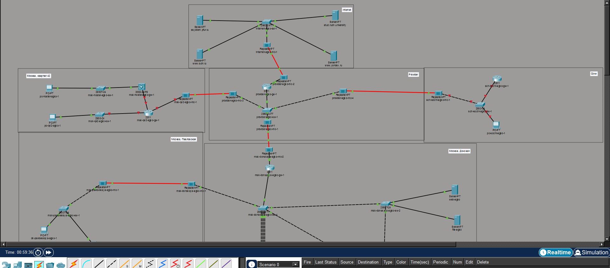{#fig:007 width=100%}

---

На медиаконвертерах заменим имеющиеся модули на `PT-REPEATERNM-1FFE` и `PT-REPEATER-NM-1CFE` для подключения витой пары по технологии Fast Ethernet и оптоволокна соответственно (рис. #fig:008):

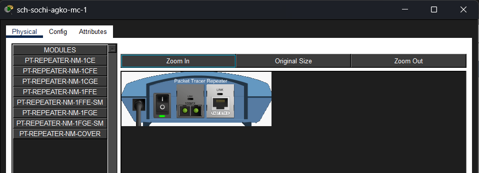{#fig:008 width=100%}

---

Далее на маршрутизаторе `msk-q42-agko-gw-1` добавим дополнительный интерфейс NM-2FE2W (рис. #fig:009):

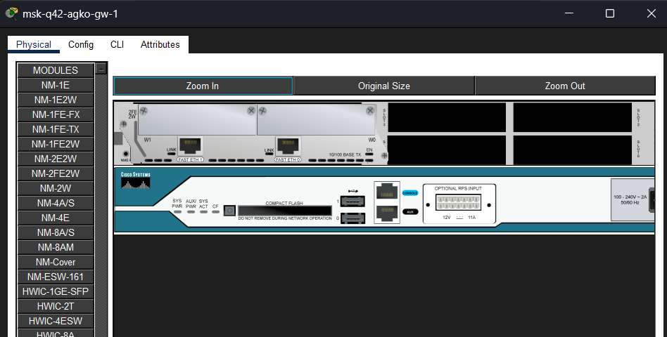{#fig:009 width=100%}

---

В физической рабочей области Packet Tracer добавим в г. Москва здание 42-го квартала и присвоим ему название (рис. #fig:010):

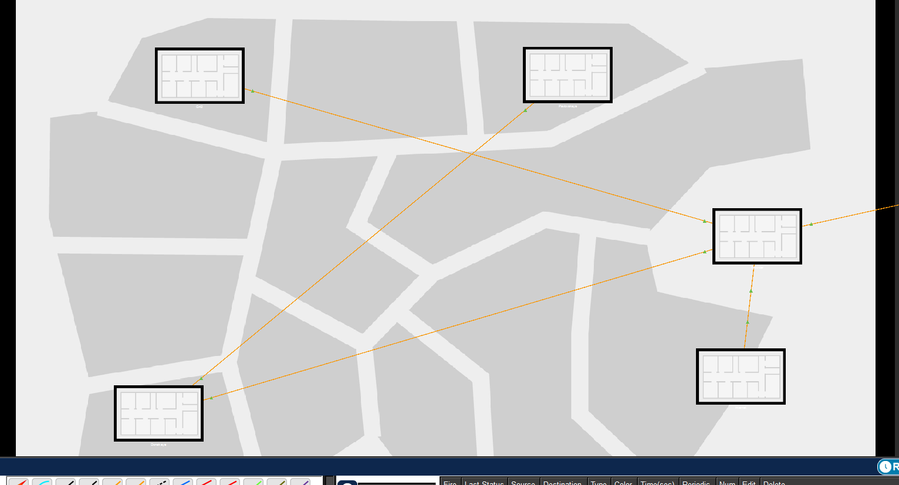{#fig:010 width=100%}

---

Затем в физической рабочей области добавим город Сочи и в нём здание филиала, присвоим ему соответствующее название (рис. #fig:011):

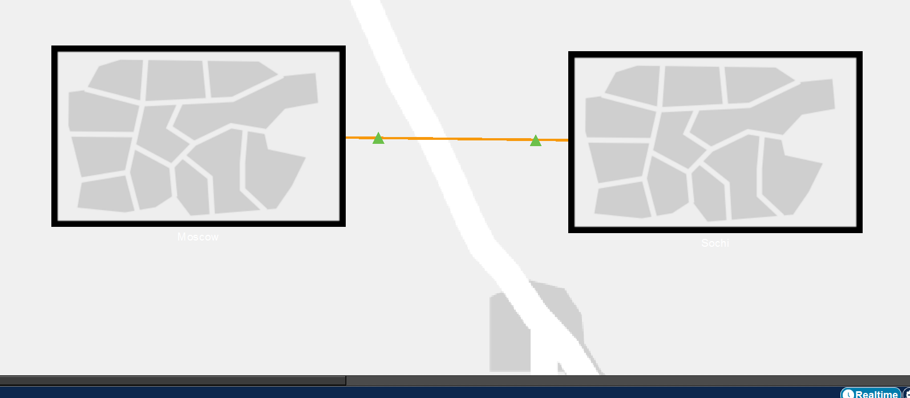{#fig:011 width=100%}

---

После чего нужно перенести из сети «Донская» оборудование сети 42-го квартала и сети филиала в соответствующие здания и выполнить расстановку (рис. #fig:012 – #fig:014):

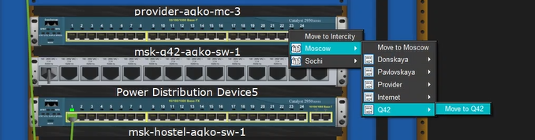{#fig:012 width=100%}

---

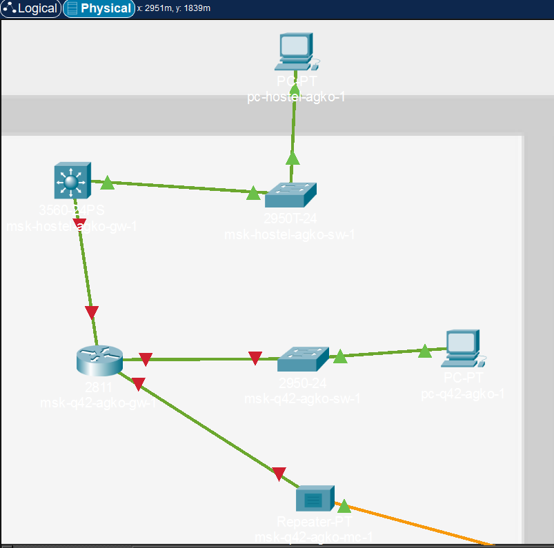{#fig:013 width=100%}

---

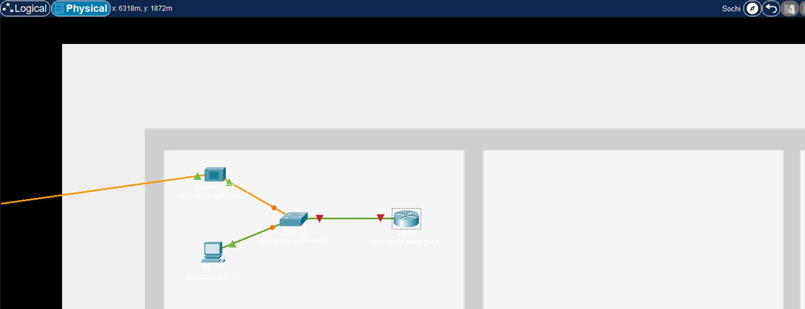{#fig:014 width=100%}

---

На последнем шаге выполним первоначальную настройку оборудования (рис. #fig:015 – #fig:020):

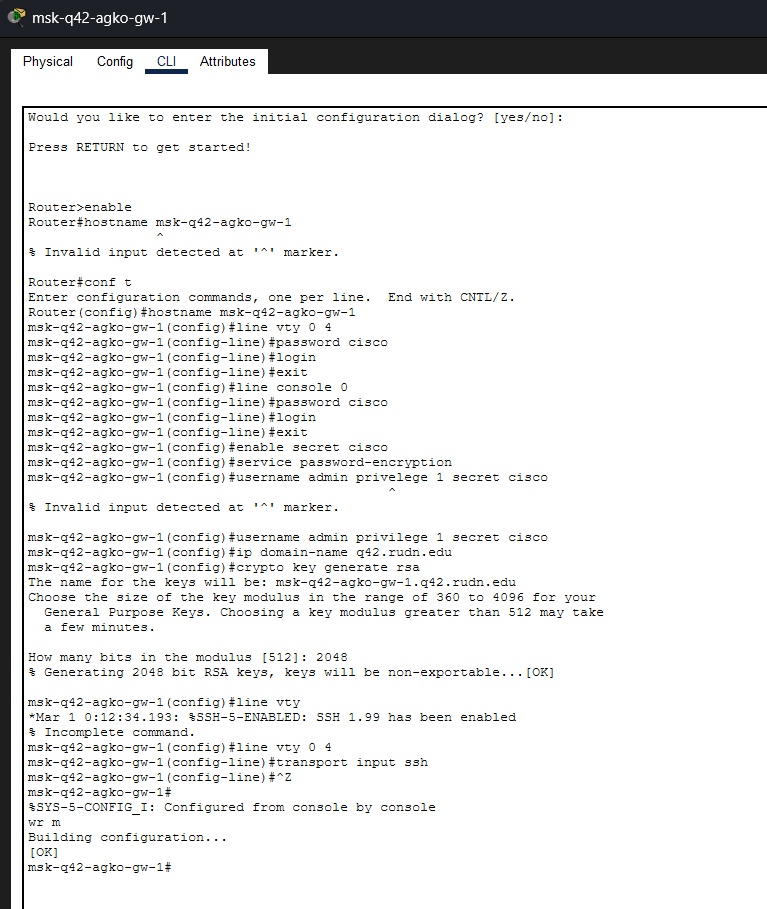{#fig:015 width=100%}

---

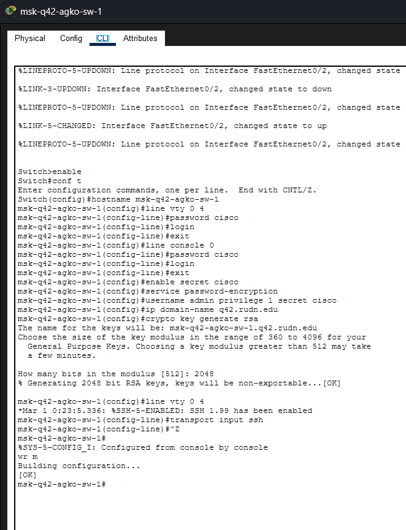{#fig:016 width=100%}

---

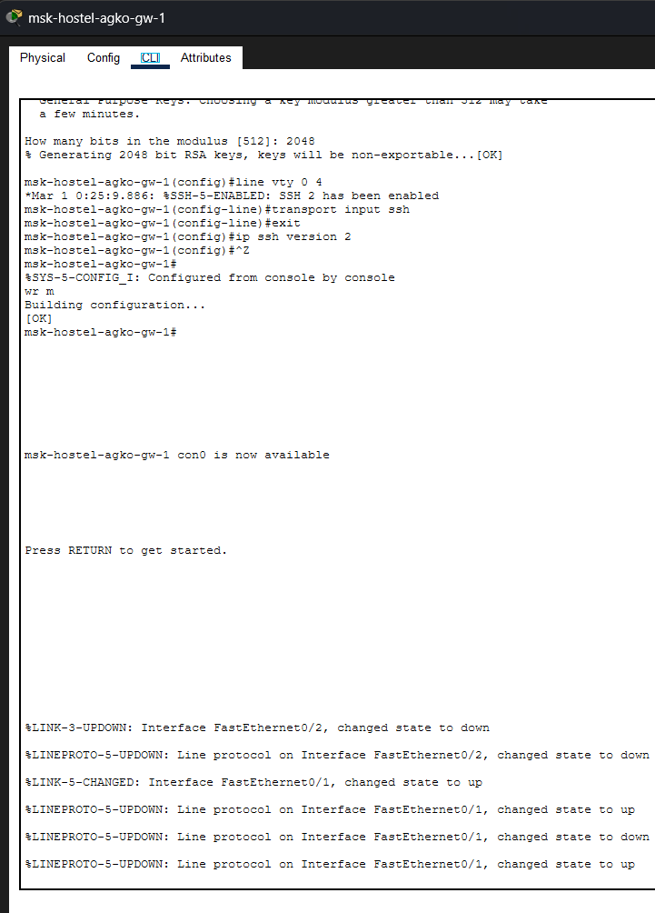{#fig:017 width=100%}

---

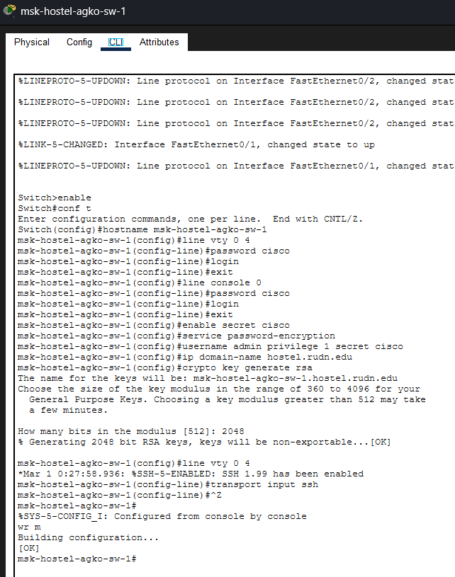{#fig:018 width=100%}

---

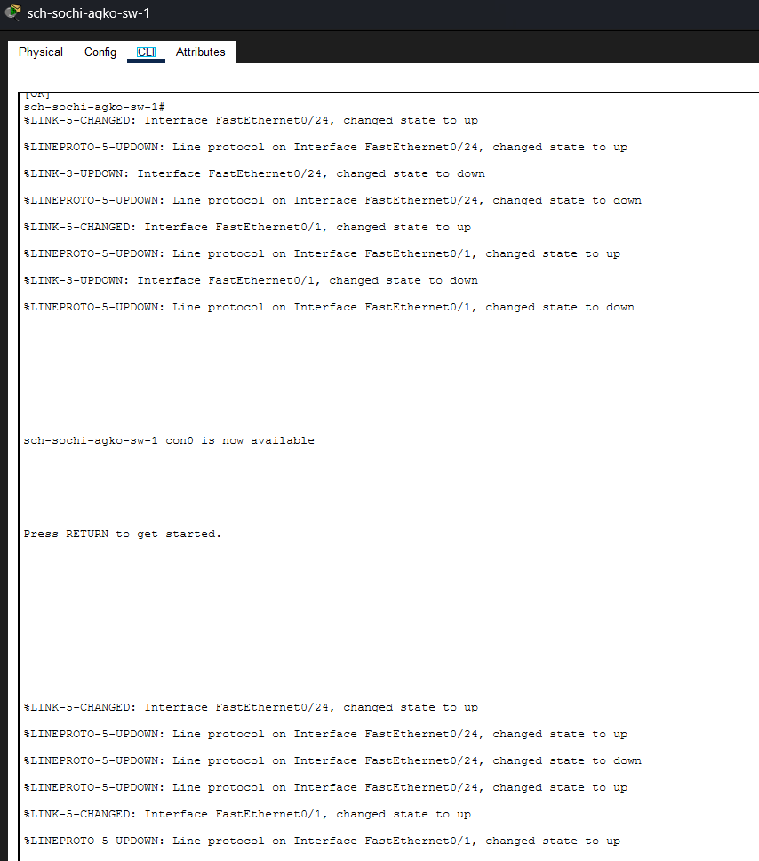{#fig:019 width=100%}

---

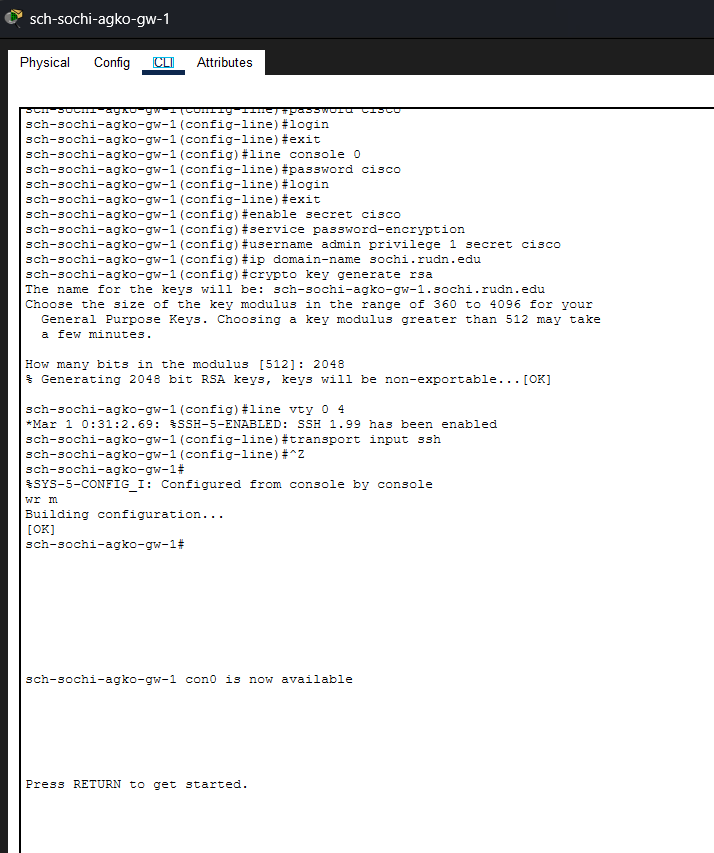{#fig:020 width=100%}

---

## Вывод

В ходе выполнения лабораторной работы мы провели подготовительные мероприятия по организации взаимодействия через сеть провайдера посредством статической маршрутизации локальной сети с сетью основного здания, расположенного в 42-м квартале в Москве, и сетью филиала, расположенного в г. Сочи.
