---
## Author
author:
  name: Ко Антон Геннадьевич
  degrees: DSc
  orcid: 0000-0002-0877-7063
  email: antonkosakh@gmail.com
  affiliation:
    - name: Российский университет дружбы народов
      country: Российская Федерация
      postal-code: 117198
      city: Москва
      address: ул. Миклухо-Маклая, д. 6

## Title
title: "Лабораторная работа №14"
subtitle: " Статическая маршрутизация в Интернете. Настройка"
license: "CC BY"
---

## Цель работы

Настроить взаимодействие через сеть провайдера посредством статической маршрутизации локальной сети организации с сетью основного здания, расположенного в 42-м квартале в Москве, и сетью филиала, расположенного в г. Сочи.

---

## Выполнение работы

Первым делом нам нужно настроить линку между площадками. Для этого настроим интерфейсы у коммутатора `provider-agko-sw-1`, маршрутизатора `msk-donskaya-agko-gw-1`, маршрутизатора `msk-q42-agko-gw-1`, коммутатора `sch-sochi-agko-sw-1` и маршрутизатора `sch-sochi-agko-gw-1` (рис. #fig:002 – #fig:008):

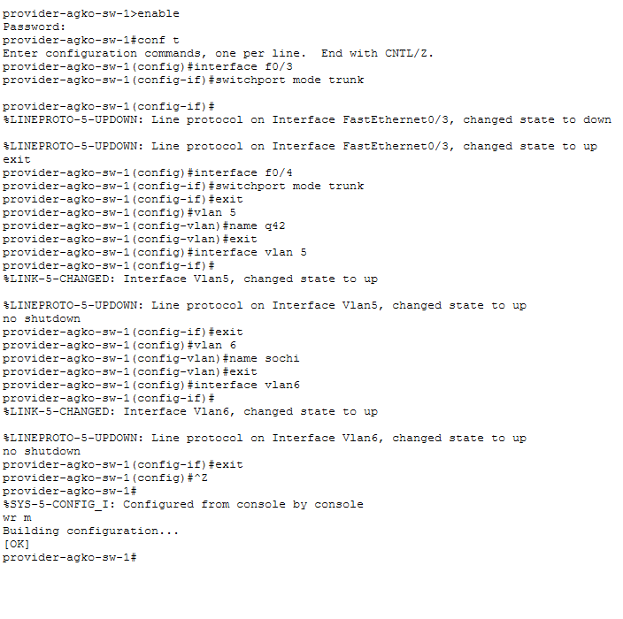{#fig:002 width=100%}

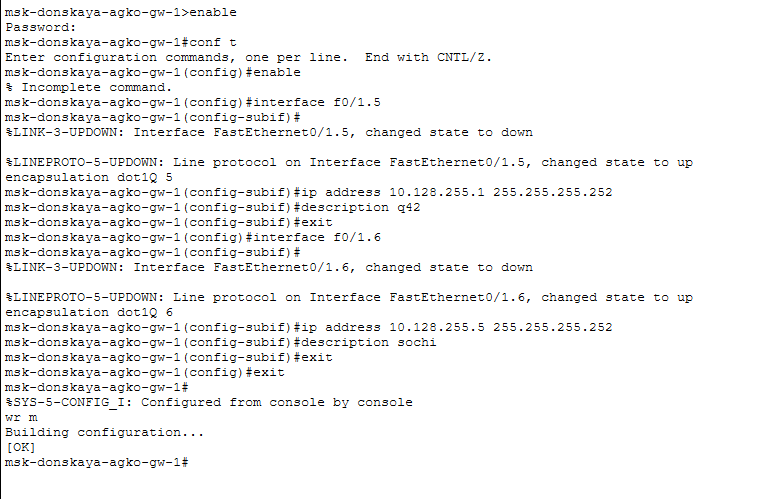{#fig:003 width=100%}

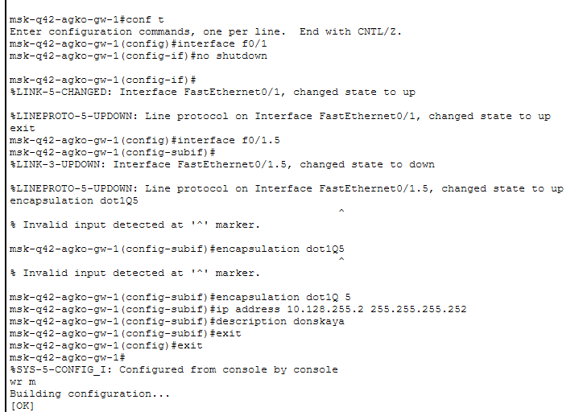{#fig:004 width=100%}

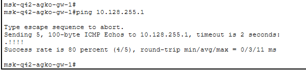{#fig:005 width=100%}

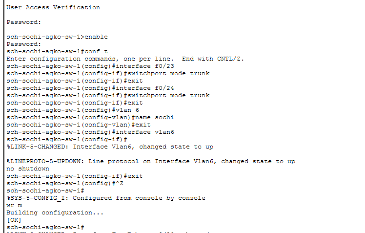{#fig:006 width=100%}

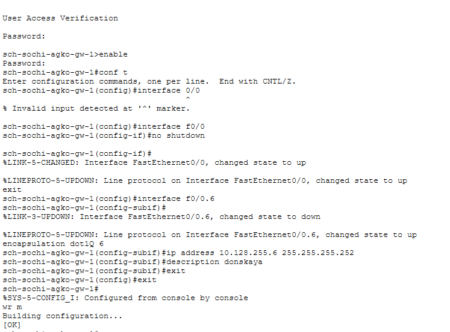{#fig:007 width=100%}

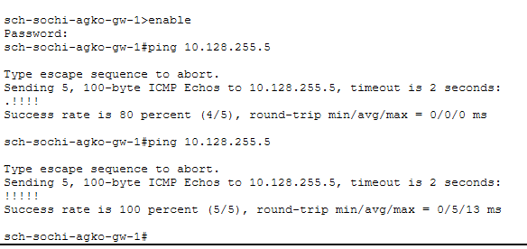{#fig:008 width=100%}

Следующим шагом настроим площадку 42-го квартала. Для этого настроим интерфейсы у маршрутизатора `msk-q42-agko-gw-1`, коммутатора `msk-q42-agko-sw-1`, маршрутизирующего коммутатора `msk-hostel-agko-gw-1` и коммутатора `msk-hostel-sw-1` (рис. #fig:009 – #fig:017):

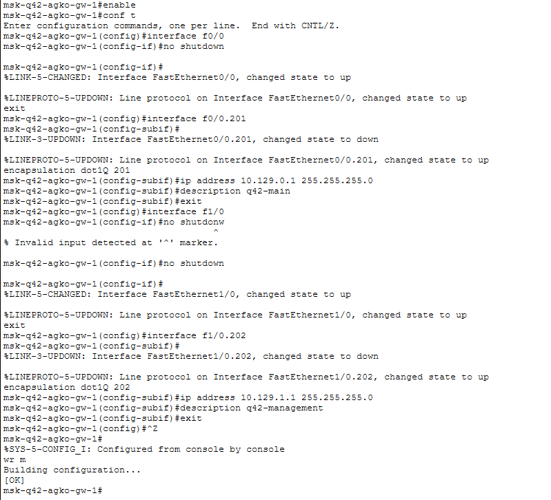{#fig:009 width=100%}

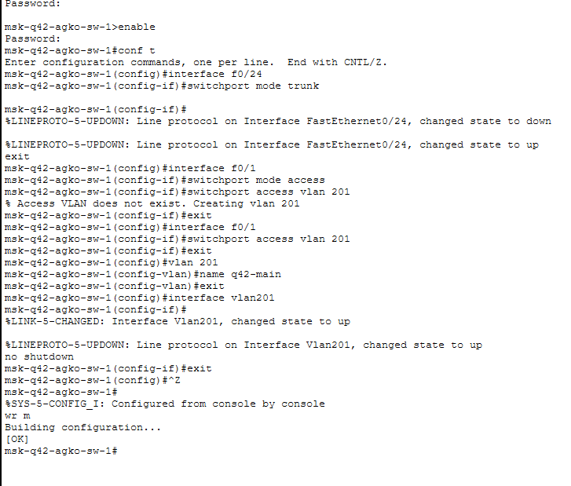{#fig:010 width=100%}

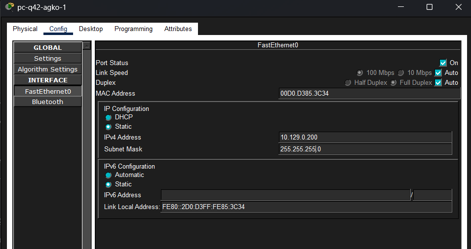{#fig:011 width=100%}

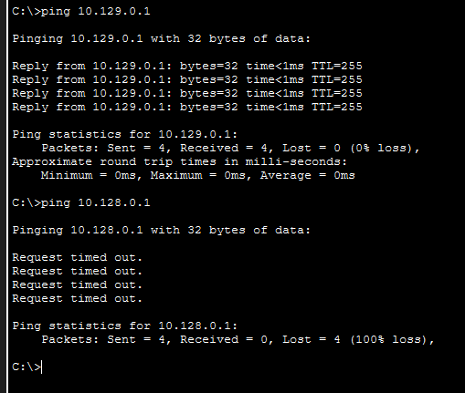{#fig:012 width=100%}

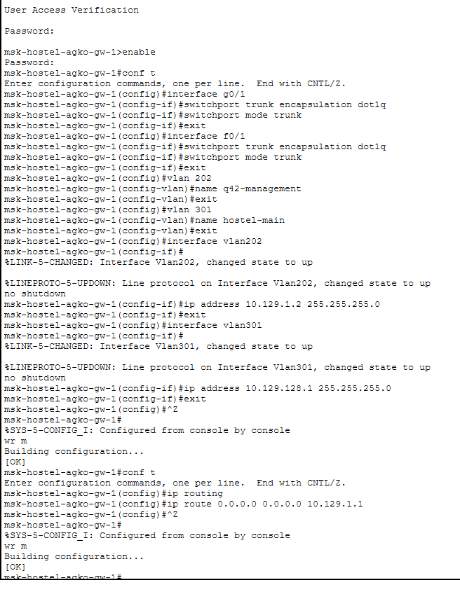{#fig:013 width=100%}

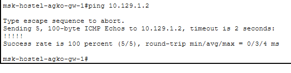{#fig:014 width=100%}

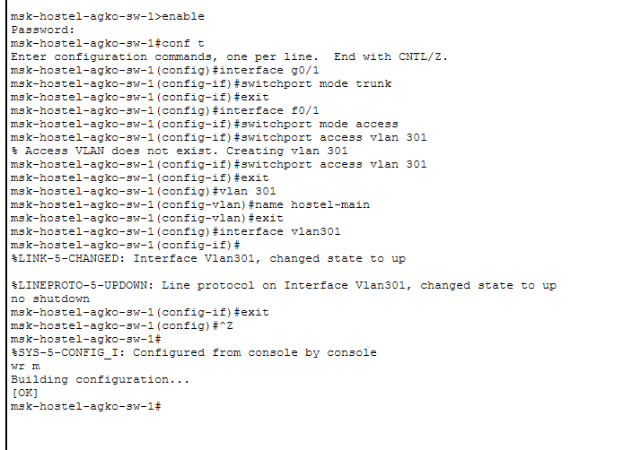{#fig:015 width=100%}

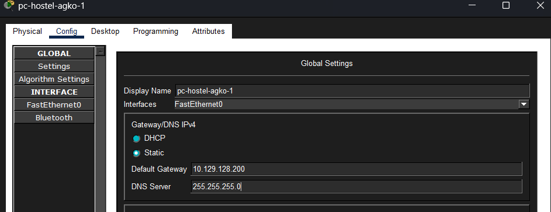{#fig:016 width=100%}

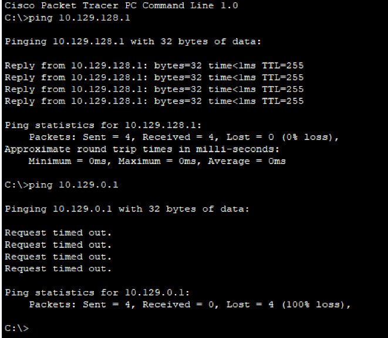{#fig:017 width=100%}

Далее настроим площадку в Сочи. Настроим интерфейсы у маршрутизатора `sch-sochi-agko-gw-1` и у коммутатора `sch-sochi-agko-sw-1` (рис. #fig:018 – #fig:020):

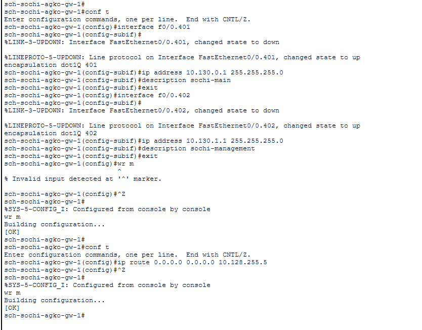{#fig:018 width=100%}

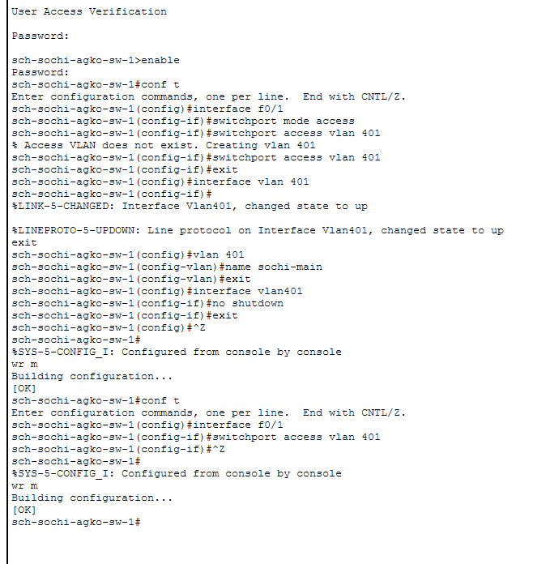{#fig:019 width=100%}

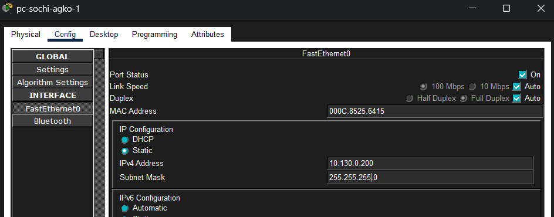{#fig:020 width=100%}

Затем настроим маршрутизацию между площадками. Настроим маршрутизатор `msk-donskaya-agko-gw-1`, маршрутизатор `msk-q42-agko-gw-1` и маршрутизатор `sch-sochi-agko-gw-1` (рис. #fig:021 – #fig:025):

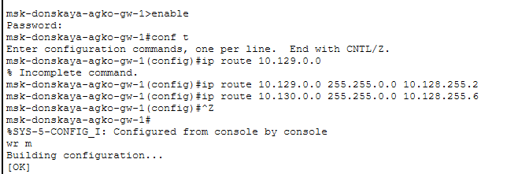{#fig:021 width=100%}

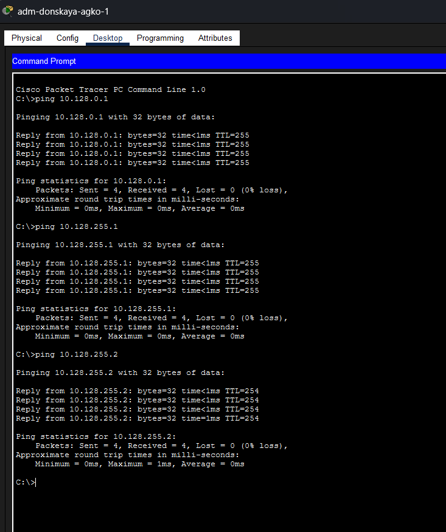{#fig:022 width=100%}

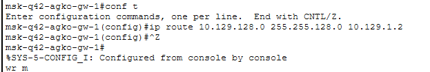{#fig:023 width=100%}

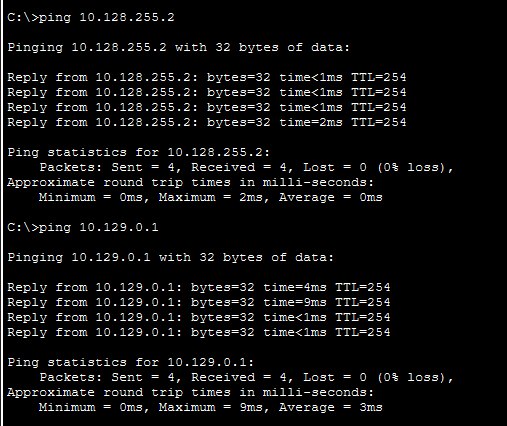{#fig:024 width=100%}

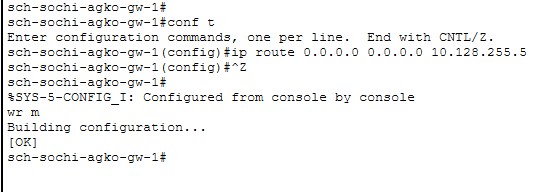{#fig:025 width=100%}

Предпоследним шагом настроим маршрутизацию на 42-м квартале. Для этого настроим маршрутизатор `msk-q42-agko-gw-1` (рис. #fig:026) и маршрутизирующий коммутатор `msk-hostel-agko-gw-1` (рис. #fig:027):

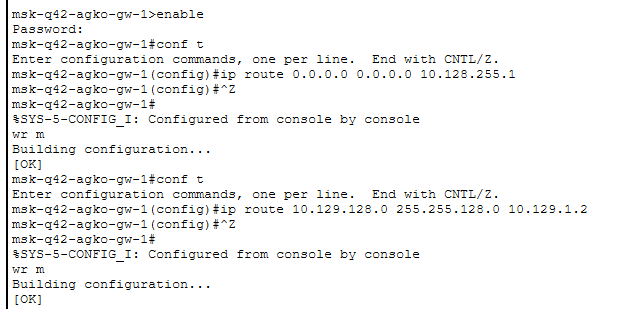{#fig:026 width=100%}

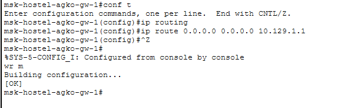{#fig:027 width=100%}

И наконец последним шагом настроим NAT на маршрутизаторе `msk-donskaya-agko-gw-1` (рис. #fig:028) и выполним контрольную проверку (рис. #fig:029):

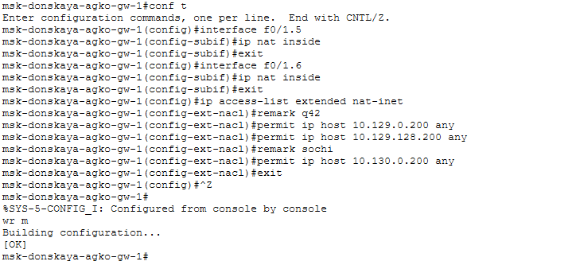{#fig:028 width=100%}

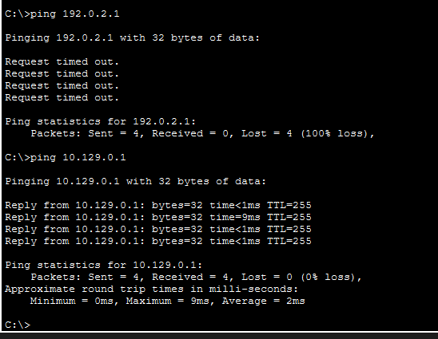{#fig:029 width=100%}

---

## Вывод

В ходе выполнения лабораторной работы мы настроили взаимодействие через сеть провайдера посредством статической маршрутизации локальной сети организации с сетью основного здания, расположенного в 42-м квартале в Москве, и сетью филиала, расположенного в г. Сочи.

---

## Ответы на контрольные вопросы

1. **Приведите пример настройки статической маршрутизации между двумя подсетями организации.**  
   Необходимо задать IP шлюзов на интерфейсах, настроить sub-интерфейсы с тегированием кадров VLAN и своими IP, затем настроить статические маршруты между сетями.

2. **Опишите процесс обращения устройства из одного VLAN к устройству из другого VLAN.**  
   1-е устройство посылает фрейм на маршрутизатор, тот меняет MAC источника на свой и перенаправляет фрейм 2-му устройству.

3. **Как проверить работоспособность маршрута?**  
   `ping` на диаметрально противоположных устройствах друг к другу.

4. **Как посмотреть таблицу маршрутизации?**  
   `show ip route`