---
## Author
author:
  name: Ко Антон Геннадьевич
  degrees: DSc
  orcid: 0000-0002-0877-7063
  email: antonkosakh@gmail.com
  affiliation:
    - name: Российский университет дружбы народов
      country: Российская Федерация
      postal-code: 117198
      city: Москва
      address: ул. Миклухо-Маклая, д. 6
## Title
title: Лабораторная работа №15
subtitle: Динамическая маршрутизация
license: CC BY
date: today
date-format: "YYYY-MM-DD" # Example: 2025-05-09
---

# Информация

---

## Докладчик

:::::::::::::: {.columns align=center}
::: {.column width="70%"}

  * Ко Антон Геннадьевич
  * студент
  * Российский университет дружбы народов им. П. Лумумбы
  * [1132221551@rudn.ru](mailto:1132221551@rudn.ru)
  * <https://SenDerMen04.github.io/ru/>

:::
::: {.column width="30%"}

:::
::::::::::::::

---

## Цель работы

Настроить динамическую маршрутизацию между территориями организации.

---

## Выполнение работы

Для начала настроим OSPF на маршрутизаторе `msk-donskaya-agko-gw-1`. Включение OSPF на маршрутизаторе предполагает, во-первых, включение процесса OSPF командой `router ospf`, во-вторых — назначение областей (зон) интерфейсам с помощью команды `network area` (рис. #fig:002).

---

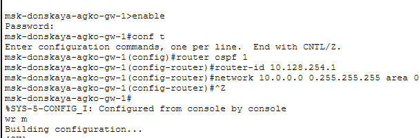{#fig:002 width=100%}

---

Проверим состояние протокола OSPF на маршрутизаторе `msk-donskaya-agko-gw-1`. Маршрутизаторы с общим сегментом являются соседями в этом сегменте. Соседи выбираются с помощью протокола Hello. Команда `show ip ospf neighbor` показывает статус всех соседей в заданном сегменте. Команда `show ip route` выводит информацию из таблицы маршрутизации (рис. #fig:003):

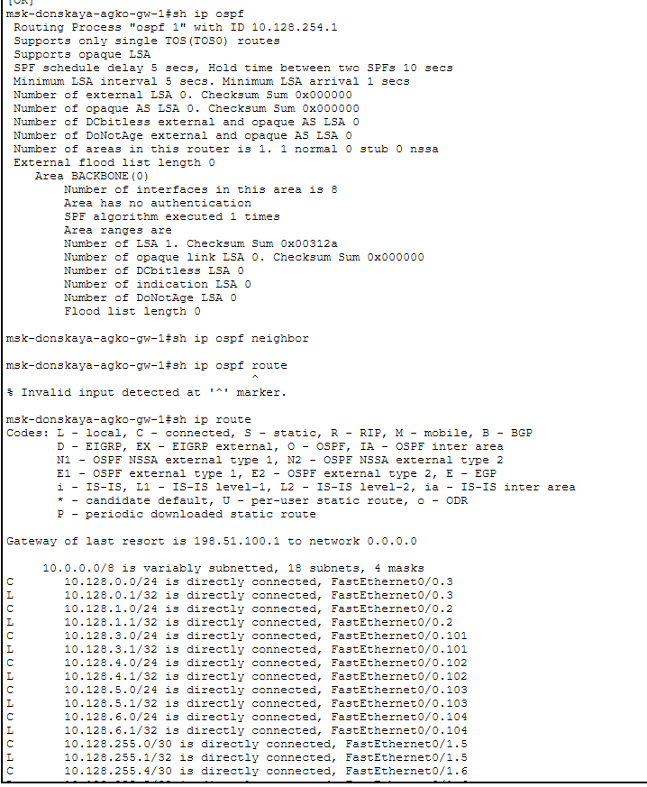{#fig:003 width=100%}

---

Далее приступим к настройке маршрутизатора `msk-q42-agko-gw-1`, маршрутизирующего коммутатора `msk-hostel-agko-gw-1` и маршрутизатора `sch-sochi-agko-gw-1` (рис. #fig:004 – #fig:006):

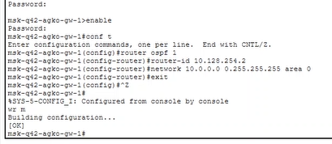{#fig:004 width=100%}

---

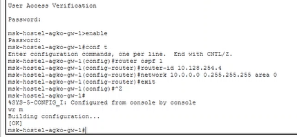{#fig:005 width=100%}

---

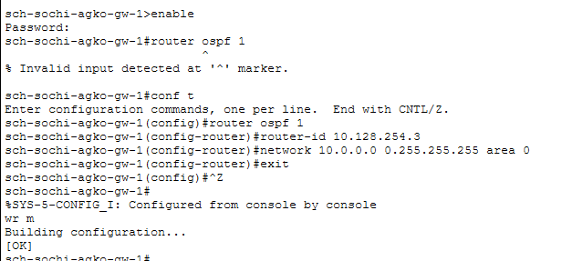{#fig:006 width=100%}

---

Теперь проверим состояние протокола OSPF на всех маршрутизаторах (рис. #fig:007 – #fig:009):

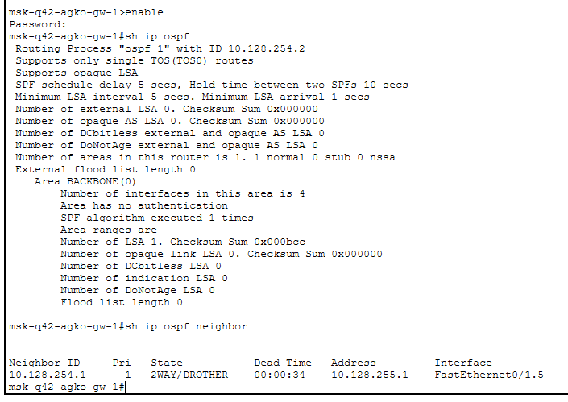{#fig:007 width=100%}

---

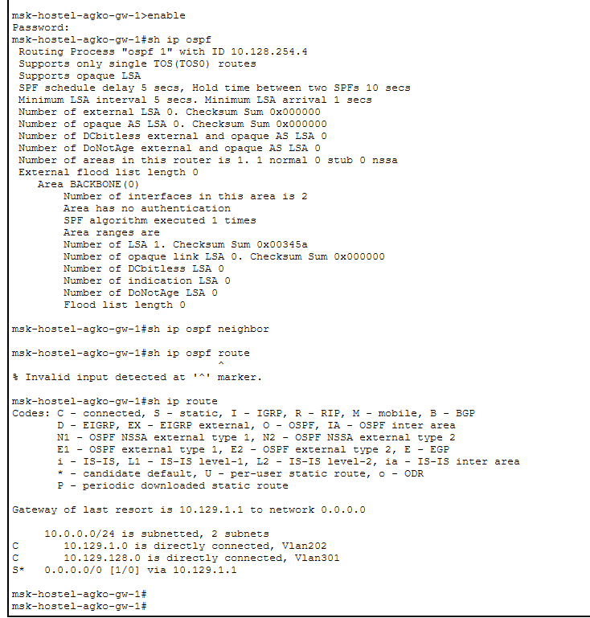{#fig:008 width=100%}

---

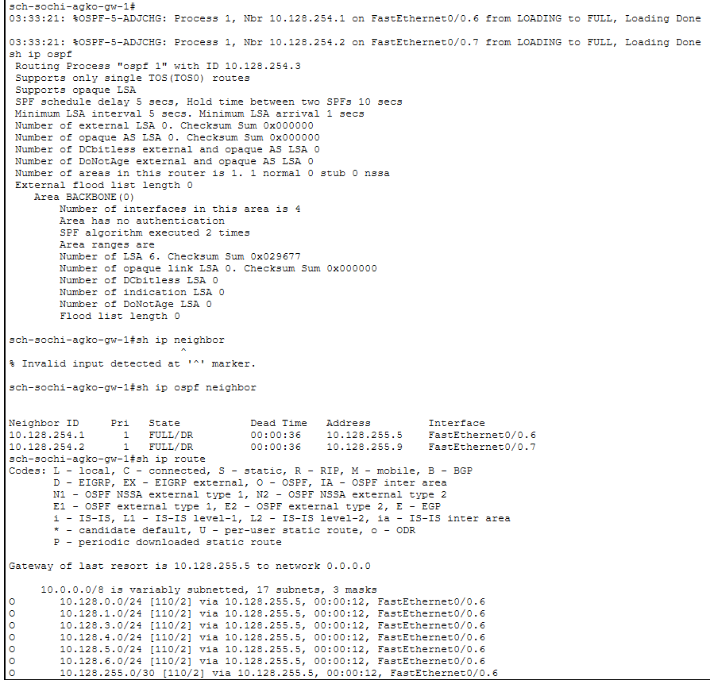{#fig:009 width=100%}

---

Следующим шагом настроим линк 42-й квартал – Сочи (рис. #fig:010 – #fig:013):

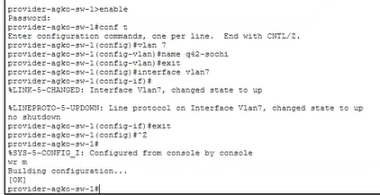{#fig:010 width=100%}

---

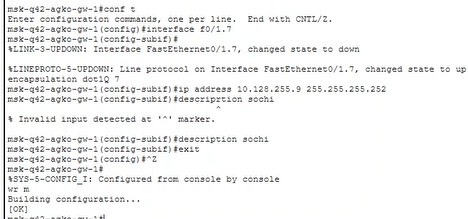{#fig:011 width=100%}

---

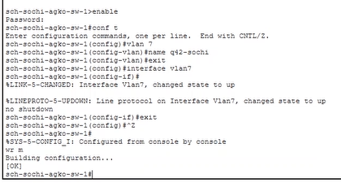{#fig:012 width=100%}

---

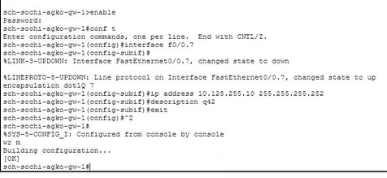{#fig:013 width=100%}

---

В режиме симуляции отследим движение пакета ICMP с ноутбука администратора сети на Донской в Москве (`admin-donskaya-agko`) до компьютера пользователя в филиале в г. Сочи (`pc-sochi-1`) (рис. #fig:014 – #fig:015):

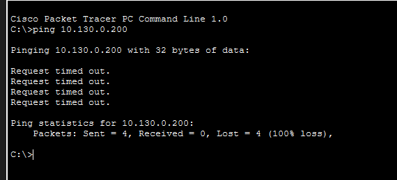{#fig:014 width=100%}

---

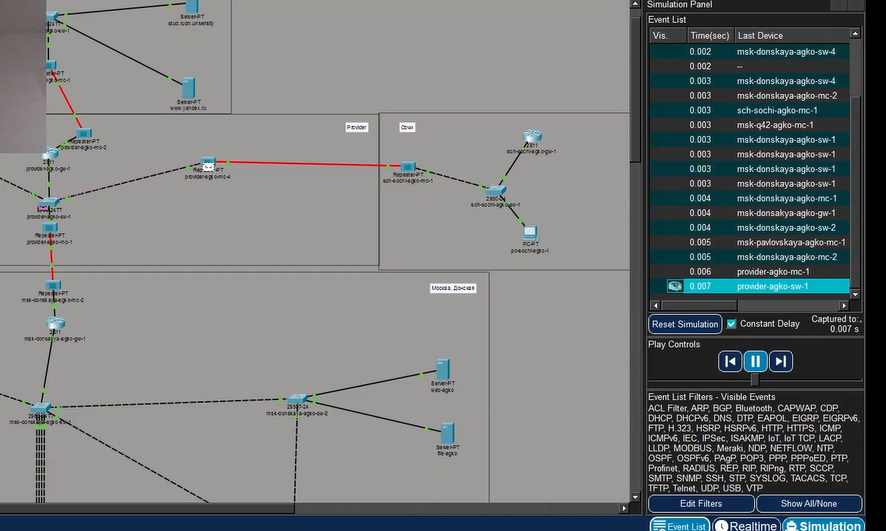{#fig:015 width=100%}

---

Следующим шагом на коммутаторе провайдера отключим временно vlan 6 и в режиме симуляции убедимся в изменении маршрута прохождения пакета ICMP (рис. #fig:016 – #fig:017):

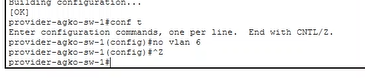{#fig:016 width=100%}

---

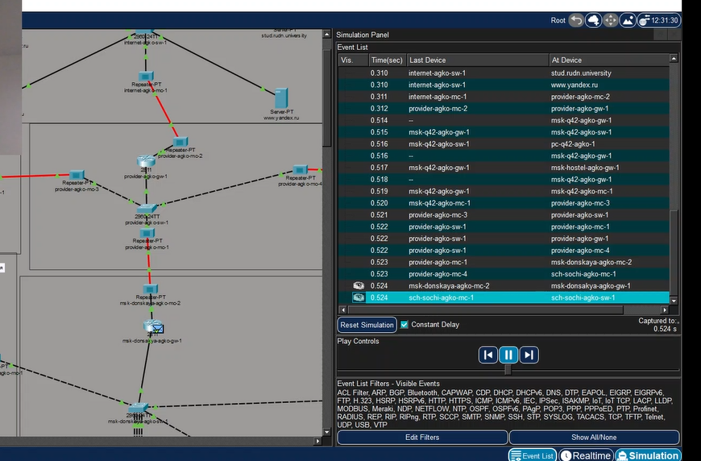{#fig:017 width=100%}

---

На коммутаторе провайдера восстановим vlan 6 и в режиме симуляции вновь убедимся в изменении маршрута прохождения пакета ICMP (рис. #fig:019):

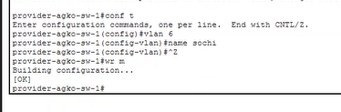{#fig:019 width=100%}

---

## Вывод

В ходе выполнения лабораторной работы мы настроили динамическую маршрутизацию OSPF между территориями организации (Донская, 42-й квартал, Сочи), проверили работу протокола в штатном режиме, а также при отключении и восстановлении линка, убедившись в автоматическом изменении маршрута.

---