---
## Author
author:
  name: Ко Антон Геннадьевич
  degrees: DSc
  orcid: 0000-0002-0877-7063
  email: antonkosakh@gmail.com
  affiliation:
    - name: Российский университет дружбы народов
      country: Российская Федерация
      postal-code: 117198
      city: Москва
      address: ул. Миклухо-Маклая, д. 6

## Title
title: "Лабораторная работа №16"
subtitle: "Настройка VPN"
license: "CC BY"

---

## Цель работы

Получить навыки настройки VPN-туннеля через незащищённое Интернет-соединение.

---

## Выполнение работы

Разместим в рабочей области проекта в соответствии с модельными предположениями оборудование для сети Университета г. Пиза (рис. #fig:002 – #fig:004):

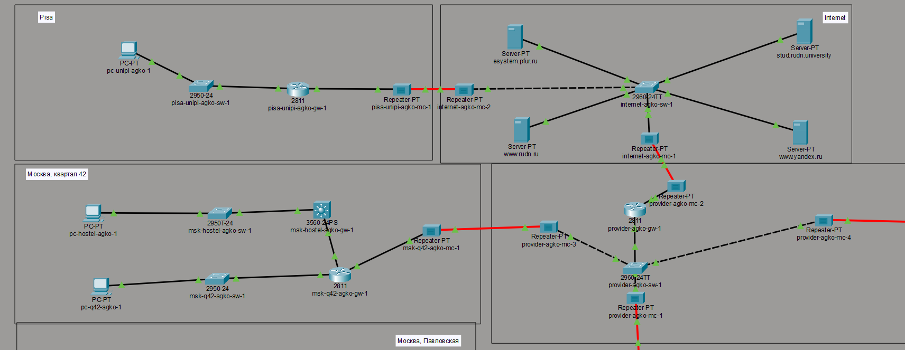{#fig:002 width=100%}

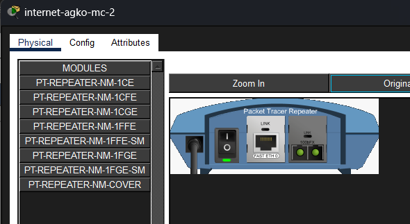{#fig:003 width=100%}

В физической рабочей области проекта создадим город Пиза, здание Университета г. Пиза. Переместим туда соответствующее оборудование (рис. #fig:004 – #fig:005):

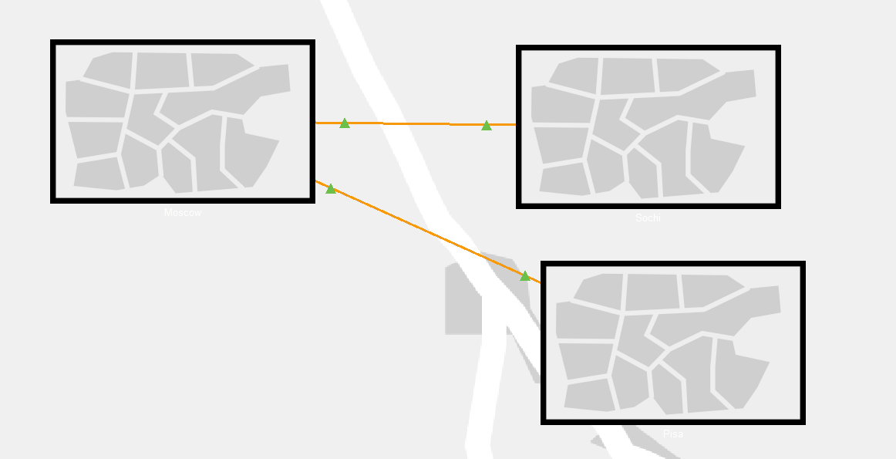{#fig:004 width=100%}

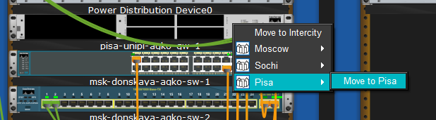{#fig:005 width=100%}

Теперь сделаем первоначальную настройку и настройку интерфейсов оборудования сети Университета г. Пиза (рис. #fig:006 – #fig:011):

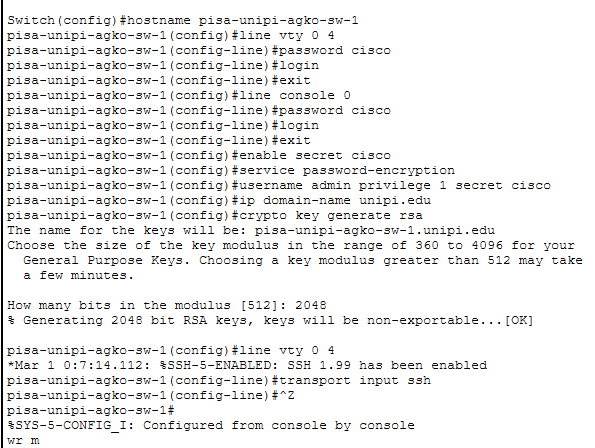{#fig:007 width=100%}

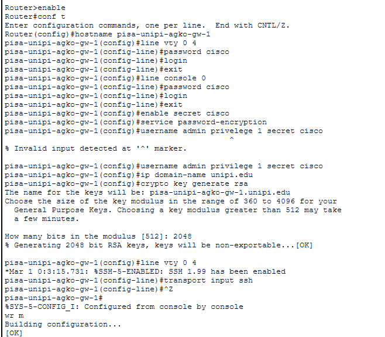{#fig:008 width=100%}

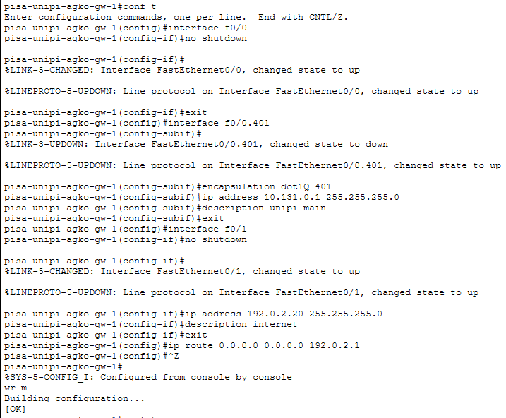{#fig:009 width=100%}

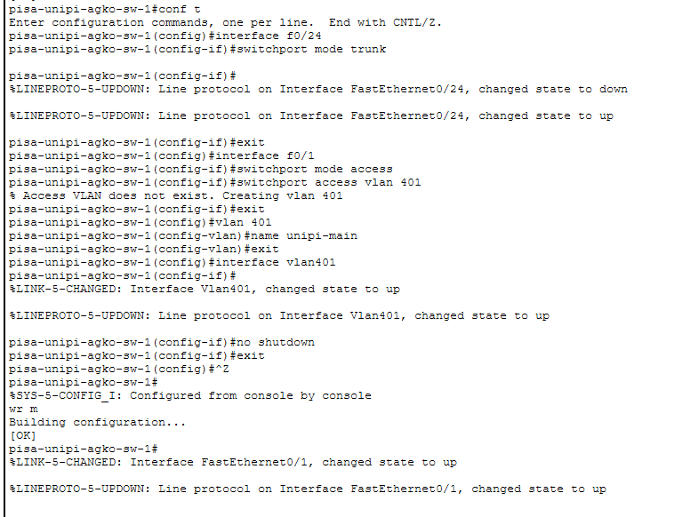{#fig:010 width=100%}

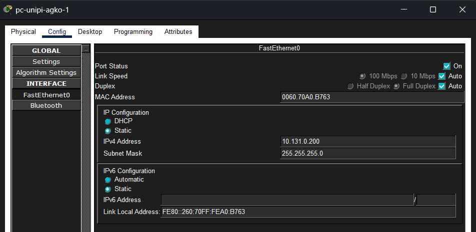{#fig:010 width=100%}

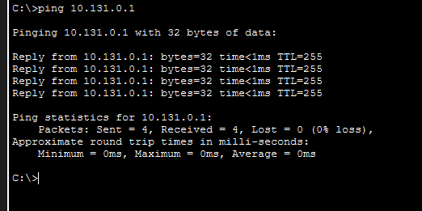{#fig:011 width=100%}

Далее настроим VPN на основе протокола GRE (рис. #fig:012 – #fig:013):

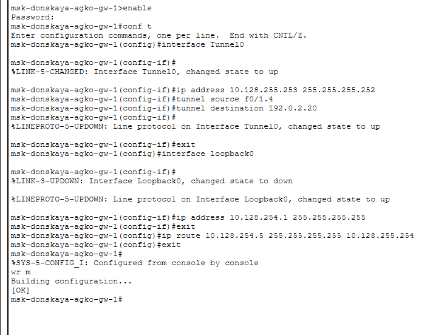{#fig:012 width=100%}

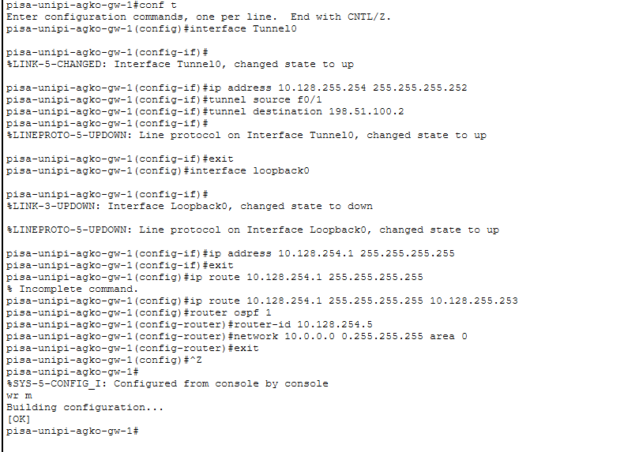{#fig:013 width=100%}

Последним шагом проверим доступность узлов сети Университета г. Пиза с ноутбука администратора сети «Донская» (рис. #fig:014):

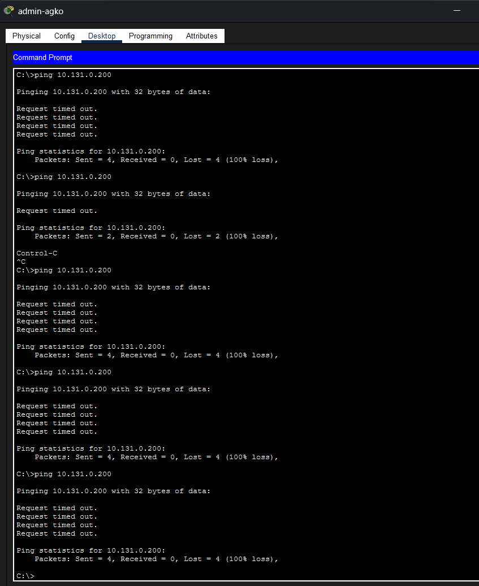{#fig:014 width=100%}

---

## Вывод

В ходе выполнения лабораторной работы мы получили навыки настройки VPN-туннеля через незащищённое Интернет-соединение.

---

## Ответы на контрольные вопросы

1. **Что такое VPN?**  
   Зашифрованное соединение, устанавливаемое через Интернет между устройством и сетью.

2. **В каких случаях следует использовать VPN?**  
   Для дополнительного шифрования в сетях, безопасного подключения к локальным сетям извне.

3. **Как с помощью VPN обойти NAT?**  
   Поднять VPN-туннель / подключить OpenVPN.