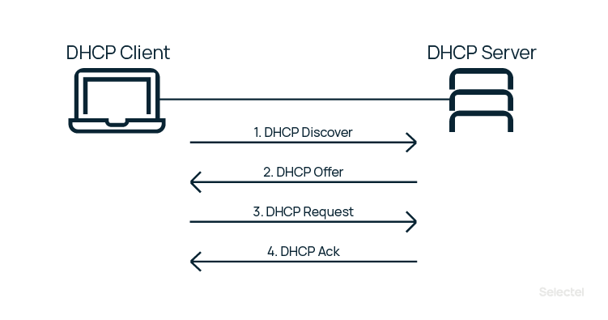
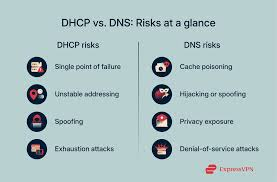
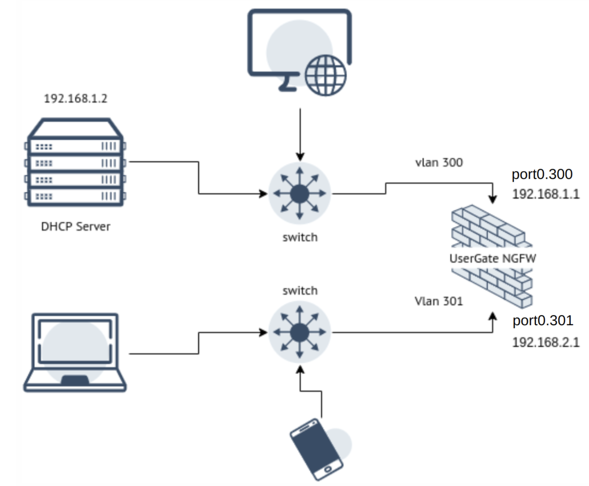
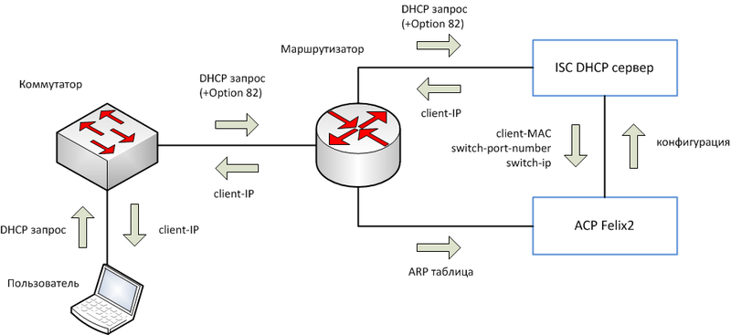
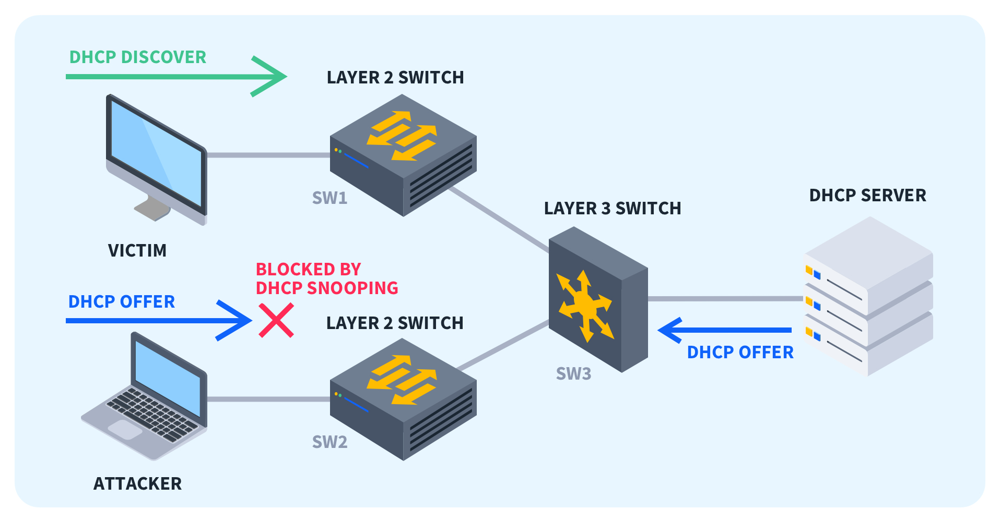
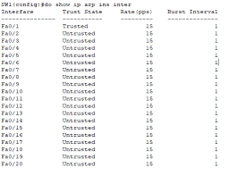

---
## Author
author:
  name: Ко Антон Геннадьевич
## Title
title: Доклад
subtitle: Настройка сетевых сервисов на сетевом оборудовании. DHCP. Безопасность DHCP (option 82)
license: CC BY
date: today
date-format: "YYYY-MM-DD" # Example: 2025-09-30
---

# Информация

## Докладчик

:::::::::::::: {.columns align=center height=70%}
::: {.column width="70%" height=70%}

  * Ко Антон Геннадьевич
  * Студент
  * Российский университет дружбы народов им. П. Лумумбы

:::
::: {.column width="30%" height=70%}


:::
::::::::::::::

## Что такое DHCP

:::::: {.columns}

::: {.column width="50%"}

**DHCP** (Dynamic Host Configuration Protocol) — протокол для автоматической выдачи:

- IP-адресов
- Масок подсети
- Шлюзов по умолчанию
- DNS-серверов

### Проблема стандартного DHCP

Разработан для доверенной среды и не знает физического местоположения клиента.

:::

::: {.column width="50%"}



:::

::::::

---

## Основные угрозы DHCP

:::::: {.columns}

::: {.column width="50%"}

### DHCP Spoofing

Поддельный DHCP-сервер раздаёт ложный шлюз.

### DHCP Starvation

Массовые запросы с поддельными MAC истощают пул адресов.

### Неавторизованный доступ

Любое устройство может получить IP-адрес.

:::

::: {.column width="50%"}



:::

::::::

---

## DHCP Relay: базовая настройка

:::::: {.columns}

::: {.column width="55%"}

### Проблема

DHCP-запрос является широковещательным и не проходит через маршрутизатор.

### Решение

DHCP Relay Agent.

### Настройка Cisco

```bash
interface Vlan100
 ip address 192.168.100.1 255.255.255.0
 ip helper-address 10.10.10.5
```

### Что сервер не видит

- Физический порт
- Идентификатор коммутатора
- Местоположение клиента

:::

::: {.column width="45%"}



:::

::::::

---

## Option 82: что это?

:::::: {.columns}

::: {.column width="50%"}

### RFC 3046

DHCP Relay Agent Information Option.

Коммутатор добавляет:

| Поле | Значение |
|---|---|
| Circuit ID | Порт (`Gi0/5`) |
| Remote ID | ID коммутатора |

### Результат

> «Запрос из VLAN 100, порт Gi0/5, коммутатор SW-1»

:::

::: {.column width="50%"}



:::

::::::

---

## Что даёт Option 82

:::::: {.columns}

::: {.column width="50%"}

### Без Option 82

- Нет информации о порте
- Нет аудита
- Нет привязки к пользователю

:::

::: {.column width="50%"}

### С Option 82

- Известен порт клиента
- Возможен аудит
- Разные политики доступа

:::

::::::

---

## Сценарий 1: DHCP Spoofing

:::::: {.columns}

::: {.column width="55%"}

### DHCP Snooping

| Тип порта | Назначение |
|---|---|
| Trust | DHCP-сервер |
| Untrust | Клиенты |

### Настройка Cisco

```bash
ip dhcp snooping
ip dhcp snooping vlan 100

interface Gi0/1
 ip dhcp snooping trust
```

Option 82 проверяет соответствие запросов и ответов.

:::

::: {.column width="45%"}



:::

::::::

---

## Сценарий 2: DHCP Starvation

:::::: {.columns}

::: {.column width="50%"}

### Защита

Ограничение скорости DHCP-запросов.

```bash
interface Gi0/5
 ip dhcp snooping limit rate 10
```

### Таблица привязки

| MAC | IP | Порт |
|---|---|---|
| aa:bb:cc:dd:ee:ff | 192.168.1.10 | Gi0/5 |

:::

::: {.column width="50%"}



:::

::::::

---

## Сценарий 3: управление доступом

:::::: {.columns}

::: {.column width="55%"}

### Политики DHCP

| Порт | Доступ |
|---|---|
| Gi1/0/10 | Интернет |
| Gi1/0/20 | ERP |
| Другой | Нет IP |

### ISC DHCP

```bash
class "conf-room" {
    match if option agent.circuit-id = "Gi1/0/10";

    subnet 10.0.0.0 netmask 255.255.255.0 {
        range 10.0.0.10 10.0.0.50;
    }
}
```

:::

::::::

---

## Полный пример конфигурации

### Коммутатор Cisco

```bash
! DHCP Snooping
ip dhcp snooping vlan 100,200
ip dhcp snooping information option
ip dhcp relay information option

! Доверенный порт
interface Gi0/1
 ip dhcp snooping trust

! Клиентский порт
interface Gi0/5
 ip dhcp snooping limit rate 15

! DHCP Relay
interface Vlan100
 ip helper-address 10.10.10.5
```

---

## Ограничения Option 82

| Ограничение | Решение |
|---|---|
| Нет шифрования | Доверенный L2-домен |
| Возможна подделка | Port Security |
| Не все серверы поддерживают | Проверка совместимости |
| Нет защиты от VLAN hopping | Дополнительные механизмы |

### Рекомендации

- DHCP Snooping + Option 82
- Один trusted-порт
- Rate limiting
- Логирование
- Port Security

---

## Сравнение методов защиты

| Характеристика | Option 82 | Snooping | Snooping + 82 | 802.1X |
|---|---|---|---|---|
| DHCP Spoofing | Нет | Да | Да | Да |
| DHCP Starvation | Частично | Частично | Да | Нет |
| Аудит порта | Да | Нет | Да | Да |
| Сложность | Низкая | Средняя | Средняя | Высокая |

---

## Выводы

:::::: {.columns}

::: {.column width="33%"}

### DHCP Relay

Решает проблему широковещательных доменов.

:::

::: {.column width="33%"}

### Option 82

Добавляет информацию о порте и коммутаторе.

:::

::: {.column width="33%"}

### Snooping + Option 82

Повышают безопасность сети.

:::

::::::

> Не доверять DHCP-запросу, пока не известен его источник.

---

## Источники

1. RFC 2131 — DHCP
2. RFC 3046 — DHCP Relay Agent Information Option
3. Cisco DHCP Snooping White Paper
4. ISC DHCP Reference Manual
5. Журнал «Системный администратор», 2020