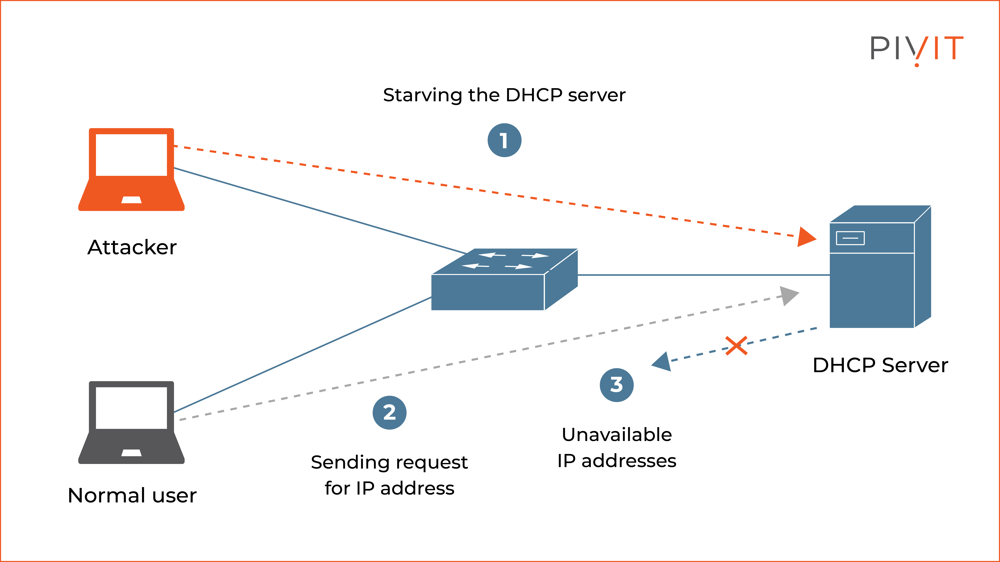

---
## Author
author:
  name: Ко Антон Геннадьевич

## Title
title: "Доклад"
subtitle: "Настройка сетевых сервисов на сетевом оборудовании. DHCP. Безопасность DHCP (option 82)"
license: "CC BY"
---

## Введение

В современных корпоративных сетях автоматическое назначение IP-адресов
является критически важной задачей. Протокол **DHCP** (Dynamic Host
Configuration Protocol) позволяет централизованно управлять выдачей
IP-адресов, масок подсети, шлюзов по умолчанию и DNS-серверов. Без DHCP
администрирование сетей среднего и крупного размера становится крайне
трудоёмким.

Однако стандартный DHCP был разработан в расчёте на доверенную среду. Он не
предусматривает механизмов для определения физического местоположения
клиента и не защищён от ряда атак, таких как подмена DHCP-сервера или
истощение пула адресов.

Настоящий доклад посвящён настройке DHCP на сетевом оборудовании, механизму
**option 82** (DHCP Relay Agent Information Option), а также способам
повышения безопасности DHCP с его использованием.

## Что такое DHCP Relay

В небольших сетях DHCP-сервер часто находится в том же широковещательном
домене, что и клиенты. В корпоративной сети сервер обычно централизован, а
клиенты распределены по разным VLAN. DHCP-запрос — это широковещательный
пакет, а широковещательные сообщения не проходят через маршрутизатор.
Поэтому требуется **DHCP Relay Agent**.

{fig-align="center"}

На коммутаторе или маршрутизаторе это настраивается одной командой.
На оборудовании Cisco:
interface Vlan100
ip address 192.168.100.1 255.255.255.0
ip helper-address 10.10.10.5

Коммутатор перехватывает широковещательный DHCP-запрос от клиента,
упаковывает его в обычный IP-пакет и отправляет на сервер с адресом
10.10.10.5. Сервер видит, что запрос пришёл от интерфейса 192.168.100.1, и
выдаёт адрес из соответствующего пула.

### Проблема базового DHCP Relay

Сервер знает только VLAN и IP-адрес релея. Он **не знает**, с какого именно
порта коммутатора пришёл клиент. Не знает, находится ли порт в переговорной
или в серверной. Не может различить доверенного и недоверенного пользователя.

| Что видит сервер | Что сервер не видит |
|---|---|
| VLAN 100 | Физический порт (Gi0/5) |
| IP-адрес релея (192.168.100.1) | Идентификатор коммутатора (SW-1) |
| MAC-адрес клиента | Местоположение клиента |

: Ограничения базового DHCP Relay

## Option 82: DHCP Relay Agent Information Option

**Option 82** описана в RFC 3046 и называется **DHCP Relay Agent Information
Option**. Коммутатор, выступающий в роли релея, **добавляет внутрь
DHCP-запроса клиента** дополнительную опцию.

{fig-align="center"}

### Структура option 82

Опция содержит два поля:

| Поле | Описание | Пример |
|---|---|---|
| **Circuit ID** | Идентификатор физического порта коммутатора | `Gi0/5` |
| **Remote ID** | Идентификатор самого коммутатора (MAC или имя) | `SW-1` |

### Что меняется для сервера

**Без option 82:**
> «Запрос из VLAN 100, source IP = 192.168.100.1»

**С option 82:**
> «Запрос из VLAN 100, порт Gi0/5, коммутатор SW-1»

Это позволяет:
- Выдавать IP-адреса на основе конкретного порта
- Вести детальный аудит подключений
- Строить безопасную инфраструктуру доступа

### Ограничения

Option 82 не шифрует данные. Метка передаётся открыто. Она защищает от
случайных нарушений, но не от профессионального злоумышленника, который
подключил свой коммутатор между клиентом и оборудованием. Однако в сочетании
с другими механизмами даёт хороший уровень защиты.

## Безопасность DHCP через option 82

### Сценарий 1: защита от DHCP Spoofing

**Угроза:** злоумышленник подключает свой ноутбук или роутер к сети и
запускает DHCP-сервер. Клиенты получают от него адреса, а в качестве шлюза
подставляется IP атакующего. Весь трафик идёт через злоумышленника.

{fig-align="center"}

**Защита:** технология **DHCP Snooping**.

Порт, смотрящий в сторону настоящего DHCP-сервера, помечается как **trust**
(доверенный). Все остальные порты — **untrust**.

| Тип порта | Роль | Разрешённые DHCP-сообщения |
|---|---|---|
| Trust | К настоящему DHCP-серверу | Offer, Ack (ответы) |
| Untrust | Клиентские порты | Discover, Request (запросы) |

: DHCP Snooping — типы портов

Коммутатор пропускает DHCP-ответы только через доверенные порты. Попытка
отправить DHCP-ответ с клиентского порта блокируется.

**Конфигурация на Cisco:**
ip dhcp snooping vlan 100
ip dhcp snooping
interface GigabitEthernet0/1
ip dhcp snooping trust

Option 82 усиливает защиту: коммутатор добавляет метку в каждый запрос от
клиента. При получении ответа проверяется соответствие метки.

### Сценарий 2: защита от DHCP Starvation

**Угроза:** злоумышленник генерирует тысячи DHCP-запросов с поддельными
MAC-адресами. За несколько минут весь пул адресов оказывается занят.
Легальные пользователи не могут подключиться.

**Защита с option 82:** коммутатор знает порт каждого запроса. Ограничивается
скорость запросов на порту.

**Конфигурация на Cisco:**
interface GigabitEthernet0/5
ip dhcp snooping limit rate 10

*(не более 10 запросов в секунду)*

**Дополнительно:** коммутатор ведёт **привязочную таблицу** (binding table),
где хранит соответствие MAC ↔ IP ↔ порт ↔ VLAN. Эта таблица используется для
других механизмов безопасности, например динамической ARP-инспекции.

| Поле привязочной таблицы | Описание |
|---|---|
| MAC-адрес | Клиентского устройства |
| IP-адрес | Выданный DHCP-сервером |
| VLAN | Клиентский VLAN |
| Порт | Физический порт коммутатора |

: Содержимое привязочной таблицы DHCP Snooping

### Сценарий 3: управление доступом на уровне порта

**Принцип:** на DHCP-сервере значение Circuit ID сопоставляется с адресным
пулом.

| Порт | Назначение | Пул адресов | Доступ |
|---|---|---|---|
| Gi1/0/10 | Конференц-зал | 10.0.0.0/24 | Только интернет |
| Gi1/0/20 | Бухгалтерия | 192.168.10.0/24 | ERP-система |
| Другой | Неизвестный | — | IP не выдаётся |

: Пример политик на основе option 82

**Конфигурация на сервере ISC DHCP:**
class "conf-room" {
match if option agent.circuit-id = "Gi1/0/10";
subnet 10.0.0.0 netmask 255.255.255.0 {
range 10.0.0.10 10.0.0.50;
}
}

class "accounting" {
match if option agent.circuit-id = "Gi1/0/20";
subnet 192.168.10.0 netmask 255.255.255.0 {
range 192.168.10.10 192.168.10.50;
}
}

Физический порт коммутатора становится фактором авторизации. Это удобно для
открытых пространств, коворкингов или учебных классов.

## Полный пример конфигурации

### Коммутатор доступа (Cisco)
! Глобальное включение DHCP Snooping
ip dhcp snooping vlan 100,200
ip dhcp snooping information option
ip dhcp relay information option

! Доверенный порт к DHCP-серверу
interface GigabitEthernet0/1
ip dhcp snooping trust

! Клиентский порт с ограничением скорости
interface GigabitEthernet0/5
ip dhcp snooping limit rate 15

! SVI для DHCP Relay
interface Vlan100
ip helper-address 10.10.10.5

### DHCP-сервер (ISC DHCP)
option agent.circuit-id code 82 = string;

subnet 192.168.100.0 netmask 255.255.255.0 {
range 192.168.100.100 192.168.100.200;
option routers 192.168.100.1;
option domain-name-servers 8.8.8.8;
}

## Ограничения option 82

| Ограничение | Риск | Решение |
|---|---|---|
| Нет шифрования | Метка передаётся открыто | Использовать в доверенных L2-доменах |
| Возможна подделка | Атакующий подключает свой коммутатор | Сочетать с Port Security |
| Совместимость | Старые DHCP-серверы отбрасывают пакеты | Проверять поддержку, настраивать ignore |
| Не защищает от VLAN hopping | Атаки на уровне 802.1Q | Дополнительные механизмы |

: Ограничения option 82 и способы их смягчения

## Рекомендации

**Что необходимо сделать:**

- Включить DHCP Snooping с option 82 на всех коммутаторах доступа
- Назначить только один доверенный порт на коммутатор — в сторону сервера
- Настроить rate limiting на клиентских портах (10–15 запросов/сек)
- Включить логирование привязочной таблицы
- Настроить мониторинг на превышение лимитов
- Использовать option 82 в комплексе с Port Security и MAC-аутентификацией

**Чего не следует делать:**

- Включать option 82 без trust-порта (создаст уязвимость)
- Игнорировать логи DHCP Snooping
- Полагаться только на option 82 как на единственную защиту

## Сравнение с другими методами защиты DHCP

| Метод защиты | Уровень | Защита от Spoofing | Защита от Starvation | Аудит порта |
|---|---|---|---|---|
| Option 82 только | L2 | Нет | Частично | Да |
| DHCP Snooping | L2 | Да | Частично | Нет |
| DHCP Snooping + option 82 | L2 | Да | Да | Да |
| 802.1X (NAC) | L2 | Да | Нет | Да |
| Port Security | L2 | Нет | Нет | Да |

: Сравнение методов защиты DHCP

## Заключение

Базовая настройка DHCP Relay решает проблему широковещательных доменов, но
не даёт безопасности и локализации. Сервер не видит физическое местоположение
клиента.

Option 82 добавляет в запрос метку о порте и коммутаторе. Это позволяет
распределять адреса, вести аудит и строить защиту.

Связка option 82 с DHCP Snooping, rate limiting и политиками на сервере
закрывает большинство типовых атак на канальном уровне:
- DHCP Spoofing (подмена сервера)
- DHCP Starvation (истощение пула)
- Неавторизованный доступ

**Основное правило:** не доверять DHCP-запросу, пока не известен его порт.

Настройка DHCP Snooping с option 82 занимает несколько минут и даёт
существенный прирост безопасности при минимальных затратах.

## Список литературы

1. Droms, R. (1997). *Dynamic Host Configuration Protocol*. RFC 2131. IETF.

2. Patrick, M. (2001). *DHCP Relay Agent Information Option*. RFC 3046. IETF.

3. Cisco Systems. (2018). *DHCP Snooping Technology White Paper*. Cisco Documentation.

4. Internet Systems Consortium. (2023). *ISC DHCP Reference Manual*. Version 4.4.

5. Конаш, С. (2020). Сетевая безопасность на уровне L2: DHCP Snooping и IP Source Guard. *Журнал "Системный администратор"*, №5 (198), стр. 24–29.

6. Requirements for IP Flow Information Export (IPFIX). (2013). RFC 7011. IETF.